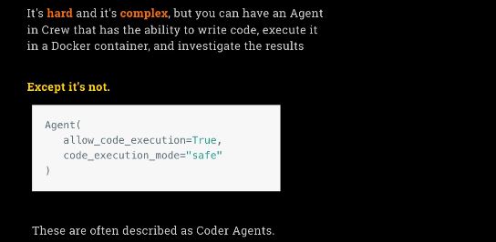
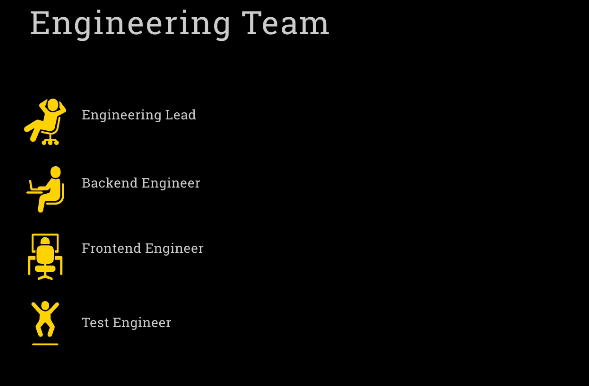
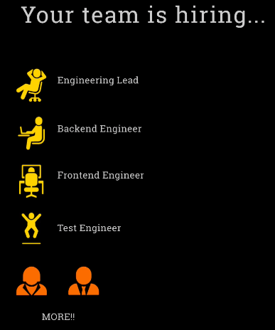
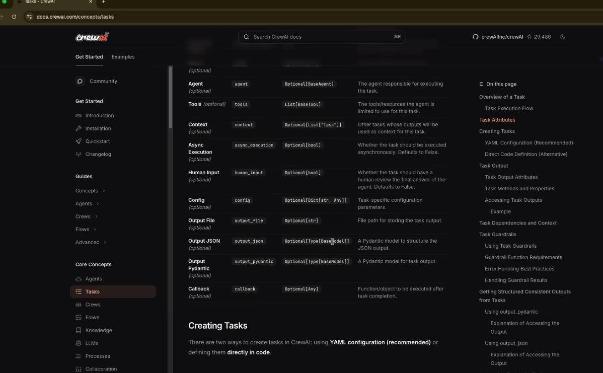

- [Crew AI](#crew-ai)
  - [Core Concepts of Crew AI](#core-concepts-of-crew-ai)
  - [LightLLM and CrewAI Project Setup](#lightllm-and-crewai-project-setup)
  - [LightLLM and Model Flexibility in CrewAI](#lightllm-and-model-flexibility-in-crewai)
  - [Structure and Workflow of a CrewAI Project](#structure-and-workflow-of-a-crewai-project)
    - [Define our files](#now-we-going-to-define-our-files)
    - [Run the project](#run-the-project)
    - [Recap: Your First Project with CrewAI](#recap-your-first-project-with-crewai)
  - [Building Crew AI Projects: Tools, Context & Google Search Integration](#building-crew-ai-projects-tools-context--google-search-integration)
    - [New project: Building Multi-Agent **Financial Research System** with Crew.ai](#introducing-the-second-project-financial-researcher)
    - [New project: **Stock Picker**](#new-project-stock-picker)
    - [Memory - more prespcriptive](#memory---more-prescriptive)
  - [Giving coding skills to an Agent](#giving-coding-skills-to-an-agent)
  - [Building AI Teams: Configure Crew AI for Collaborative Development](#building-ai-teams-configure-crew-ai-for-collaborative-development)
  - [LangGraph Explained](#langgraph-explained)
    - [Graph-Based Architecture for Robust AI Agents](#graph-based-architecture-for-robust-ai-agents)


## Crew AI

This marks a transition from the familiar **OpenAI Agents SDK** to the world of **Crew AI**. Although the shift may feel abrupt, it's part of an ongoing process of exploring different agent frameworks. Each one offers unique perspectives and tools, and each will be more or less suited depending on the project at hand.

You’re encouraged to:

* Note the similarities and differences between frameworks.
* Decide for yourself which tool best suits your needs.
* Learn something valuable from each one.


**What Is Crew AI?**

**Crew AI** refers to multiple things, depending on context. These include:

**1. Crew AI Enterprise**

Also called the **Crew AI Platform**, this is a commercial platform for:

* Deploying agents
* Monitoring agent behavior
* Managing workflows through various dashboards

You can visit it at: **crewai.com** (not **crew\.ai**)

**2. Crew AI UI Studio**

A **low-code/no-code** tool for:

* Building agent interactions visually
* Allowing end-users to create workflows without coding

**3. Crew AI Framework**

An **open-source** Python framework built for:

> “Orchestrating high-performing AI agents with ease and scale.”

This is the focus of the course: writing code and building agents from scratch using the open-source framework, not the commercial tools.


**Commercial Strategy of Crew AI**

Unlike OpenAI or Anthropic (which monetize via their LLMs), Crew AI:

* Needs a business model built around its tooling
* Offers the **free framework** as entry
* Monetizes through **hosting**, **deployment**, and **enterprise tools**

This is why the website includes heavy upselling — it aims to convert open-source users into paying enterprise customers.


**Two Modes in the Crew AI Framework**

Once inside the open-source framework, there are **two major approaches**:

**1. Crew AI Cruise**

* Teams of agents collaborating
* Roles are assigned to different agents
* Supports **autonomous**, **creative**, or **exploratory** solutions
* Suitable for agentic, unscripted workflows

“Crew” = A team of agents working together

**2. Crew AI Flows**

* Structured and linear workflows
* Tasks are broken into **deterministic steps**
* Includes decision points and expected outcomes
* Useful for **auditability**, **control**, or **predictable behavior**

This is likely a newer addition, possibly a response to concerns about the unpredictability of Cruise-style setups in production environments.


**When to Use Each Mode**

| Mode       | Best For                                                              |
| ---------- | --------------------------------------------------------------------- |
| **Cruise** | Autonomous problem-solving, creative collaboration, exploratory tasks |
| **Flows**  | Deterministic workflows, precision, audit trails                      |


## Core Concepts of Crew AI

**Agent**

An **agent** is the smallest autonomous unit in Crew AI. It is linked to an LLM and includes:

* **Role**: A description of what the agent does
* **Goal**: The purpose or objective of the agent
* **Backstory**: Context or background information for priming
* **Memory**: Optional storage for past interactions
* **Tools**: Optional tools the agent can use

Agents resemble those in OpenAI Agents SDK but are more prescriptive: instead of a single `instruction`, Crew AI uses multiple structured fields (role, goal, backstory).

**Task**

A **task** is a unit of work assigned to an agent. It includes:

* **Description**: What the task is
* **Expected Output**: The desired result
* **Agent**: The agent responsible for executing it

Tasks are a new construct, not present in OpenAI Agents SDK, and help separate logic from behavior.

**Crew**

A **crew** is a combination of:

* Multiple **agents**
* Multiple **tasks**

It defines how agents and tasks work together to solve a problem.

Crew can operate in two modes:

* **Sequential**: Tasks are executed in a defined order
* **Hierarchical**: A manager LLM dynamically assigns tasks to agents

---

**Comparison with OpenAI Agents SDK**

Crew AI is:

* **More opinionated**: Requires structured agent configuration
* **More prescriptive**: Enforces concepts like roles and backstories
* **Less transparent**: The system prompt is generated from multiple fields rather than a single `instruction`, which can make debugging more complex
* **Configurable**: Uses YAML to separate configuration from code

**Configuration via YAML**

Crew AI supports agent and task configuration via YAML files.
Advantages:

* **Separation of concerns**: Prompts and configuration are outside the main Python code
* **Easier to manage**: Especially for larger projects with many agents
* **Readable**: YAML is easy for humans to read and write

You can create agents by:

* Writing code: `Agent(...)`
* Referring to a YAML configuration: e.g. `"config.agent_config['researcher']"

**Python Structure: `crew.py`**

This is the main module where agents, tasks, and crews are defined.

**Decorators**

Crew AI uses decorators to structure the code:

| Decorator    | Purpose                                        |
| ------------ | ---------------------------------------------- |
| `@crew_base` | Marks the main class managing the crew         |
| `@agent`     | Decorates a method that defines an agent       |
| `@task`      | Decorates a method that defines a task         |
| `@crew`      | Decorates the function that assembles the crew |

These decorators:

* Register agents and tasks automatically
* Allow referencing `self.agents`, `self.tasks` in the final crew assembly
* Specify mode (`sequential` or `hierarchical`) within the `@crew` function


## LightLLM and CrewAI Project Setup

CrewAI uses **LightLLM**, a minimal and ultra-flexible framework, to connect with any LLM. Unlike heavier frameworks like LangChain, LightLLM allows you to:

* Connect instantly to hosted or local LLMs
* Use almost any provider or model
* Configure access easily in code or `.env` files

**Example usage**

```python
llm = LLM(model="openai/gpt-4o-mini")
llm = LLM(model="anthropic/claude-3-5-sonnet-latest")
llm = LLM(model="gemini/gemini-2-0-flash")
llm = LLM(model="groq/llama-3-70b-versatile")
llm = LLM(model="ollama/llama3.2", base_url="http://localhost:11434")
llm = LLM(
    model="openrouter/deepseek/deepseek-r1",
    base_url="https://openrouter.ai/api/v1",
    api_key=OPENROUTER_API_KEY
)
```

* The model format: `"provider/model"`
* Supports OpenAI, Anthropic, Gemini, Groq, Ollama, OpenRouter, etc.
* Can also run local models (e.g., via Ollama)


## LightLLM and Model Flexibility in CrewAI

One of the key advantages of CrewAI is its lightweight and flexible way of interacting with LLMs. Under the hood, it uses a framework called LightLLM. LightLLM is a very minimalistic and straightforward tool to interface with actual LLM providers. The speaker likes LightLLM a lot because of its simplicity and lack of overhead, especially compared to frameworks like LangChain, which add a lot of structure.

LightLLM allows you to connect to any LLM easily. In CrewAI, you just create an LLM by passing a model name. The naming structure follows this pattern: provider name followed by a slash, then the model name. This makes it easy to switch between different providers and models.

Examples include GPT-4 from OpenAI, Claude from Anthropic, 3.5 and 3.7 versions, Gemini, Flash, Grok (with a “Q” or a “K”), and local models using Ollama. For local models, you can configure them by providing a base URL. You can also use OpenRouter, which acts as an abstraction layer over multiple LLMs. Configuring OpenRouter involves setting a base URL and an API key.

The idea behind all of this is to provide a simple and flexible system for connecting to any model you need. The speaker believes this gives CrewAI a clear advantage over OpenAI Agents SDK, which is more tightly coupled to a specific provider.


## Structure and Workflow of a CrewAI Project

The next major topic is how CrewAI handles projects. In earlier weeks of the course, everything was done inside Python notebooks (like in Cursor), or occasionally through basic Python modules. CrewAI, however, does not work that way. It requires working with actual Python code and comes with its own project and directory structure.

The CrewAI framework has already been installed using this command:

```bash
uv tool install crewai
```

That means when you clone the repo, the framework is already available.

To create a new Crew project, you use this command:

```bash
crewai create crew my_crew
```

You can name the project whatever you want. For example, “my\_crew” or “my\_project.”

Alternatively, if you want to work with flows instead of crews (i.e., fixed workflows rather than agent-based ones), you can use:

```bash
crewai create flow my_project
```

However, in the course, the focus is on crews, not flows.

Running the `crewai create crew` command generates a full directory structure. At the top level is the project directory, such as `my_crew`. Inside that is a subdirectory called `src`. Within `src`, there is another directory with the name of your project, such as `my_crew` again.


```bash
(agents_env) ➜  my_agents git:(main) ✗ cd notebooks/week3_crew 
(agents_env) ➜  week3_crew git:(main) ✗ crewai create crew debate
Creating folder debate...
Select a provider to set up:
1. openai
2. anthropic
3. gemini
4. nvidia_nim
5. groq
6. huggingface
7. ollama
8. watson
9. bedrock
10. azure
11. cerebras
12. sambanova
13. other
q. Quit
Enter the number of your choice or 'q' to quit: 1
Select a model to use for Openai:
1. gpt-4
2. gpt-4.1
3. gpt-4.1-mini-2025-04-14
4. gpt-4.1-nano-2025-04-14
5. gpt-4o
6. gpt-4o-mini
7. o1-mini
8. o1-preview
q. Quit
Enter the number of your choice or 'q' to quit: 3
Enter your OPENAI API key (press Enter to skip): 
API keys and model saved to .env file
Selected model: gpt-4.1-mini-2025-04-14
  - Created debate/.gitignore
  - Created debate/pyproject.toml
  - Created debate/README.md
  - Created debate/knowledge/user_preference.txt
  - Created debate/src/debate/__init__.py
  - Created debate/src/debate/main.py
  - Created debate/src/debate/crew.py
  - Created debate/src/debate/tools/custom_tool.py
  - Created debate/src/debate/tools/__init__.py
  - Created debate/src/debate/config/agents.yaml
  - Created debate/src/debate/config/tasks.yaml
Crew debate created successfully!
```


```bash
(agents_env) ➜  week3_crew git:(main) ✗ cd debate
(agents_env) ➜  debate git:(main) ✗ tree
.
├── README.md
├── knowledge
│   └── user_preference.txt
├── pyproject.toml              # UV project configuration
├── src
│   └── debate
│       ├── __init__.py
│       ├── config
│       │   ├── agents.yaml     # Agent definitions
│       │   └── tasks.yaml      # Task definitions
│       ├── crew.py             # Main logic with decorators
│       ├── main.py             # Entry point for running the crew
│       └── tools
│           ├── __init__.py
│           └── custom_tool.py
└── tests

7 directories, 10 files
```

**Inside debate/:**

Contains a subfolder: `knowledge/`
* File: user_preference.yaml
* Contains user-specific background info.
* Used to pass context to the model (not used in this example).
```bash
(agents_env) ➜  week3_crew git:(main) cat debate/knowledge/user_preference.txt
User name is John Doe.
User is an AI Engineer.
User is interested in AI Agents.
User is based in San Francisco, California.
```

**source/ Folder**:

Path: `debate/source/debate/`

This nested structure exists because the project name is also **debate**.  

Subfolder: `config/` This folder contains two YAML files by default:
* `agents.yaml`, where you define agent configurations.
* `tasks.yaml`, where you define task configurations.
* Both with defeault examples.

Subfolder: `tools/`
* Empty or with placeholder code
* For adding custom tools later (not used in this example)

Python files:  
Also in the same directory are two important Python modules:
* `crew.py`, which is where you define your crew using decorators.
* `main.py`, which is the script that starts the execution of your crew.

```sh
mkdir other # ← optional dummy folder to make VS Code show tree view properly
```

#### Now we going to define our files

**`agents.yaml`** :

And this contains some default, some sort of scaffolding, some example agents that are called the Researcher and the Reporting Analyst are the two examples it's given and we're going to change these to being what we're looking to build, and of course **we're looking to build a little debate team**, and in fact we only need **two agents** for what we're looking to do. We want an agent that will be the debater. One agent is going to play both roles of being for and against the motion 

```yaml
debater:
  role: >
    A compelling debater
  goal: >
    Present a clear argument either in favor of or against the motion. The motion is: {motion}
```
So now we have a back story... you're an experienced debater with a knack for giving concise but convincing arguments. You can also specify what model to use... GPT-40 Mini... or OpenAI/GPT-40 Mini...

```yaml
  backstory: >
    You're an experienced debator with a knack for giving concise but convincing arguments.
    The motion is: {motion}
  llm: openai/gpt-4o-mini
```
> Note : the `{motion}` fields acts as a dynamic template that will in `main.py`

But now let’s define our judge... the role we will say is decide the winner of the debate.. 

```yaml
judge:
  role: >
    Decide the winner of the debate based on the arguments presented
  goal: >
    Given arguments for and against this motion: {motion}, decide which side is more convincing,
    based purely on the arguments presented.
```

You’re a fair judge with a reputation for weighing up arguments without factoring in your own views... You can just have GPT-40 Mini, or... anthropic/claude-3-7-sonnet-latest...

```yaml
  backstory: >
    You are a fair judge with a reputation for weighing up arguments without factoring in
    your own views, and making a decision based purely on the merits of the argument.
    The motion is: {motion}
  llm: anthropic/claude-3-7-sonnet-latest
```

**`tasks.yaml`**:

The first task is to propose the motion — that is, give a strong argument in favor of it.
This task is assigned to the debater agent. 

```yaml
propose:
  description: >
    You are proposing the motion: {motion}.
    Come up with a clear argument in favor of the motion.
    Be very convincing.
  expected_output: >
    Your clear argument in favor of the motion, in a concise manner.
  agent: debater
  output_file: output/propose.md
```

The second task is to oppose the motion — that is, produce a strong argument against it.
Again, the same debater agent is used, but now in oposición.

```yaml
oppose:
  description: >
    You are in opposition to the motion: {motion}.
    Come up with a clear argument against the motion.
    Be very convincing.
  expected_output: >
    Your clear argument against the motion, in a concise manner.
  agent: debater
  output_file: output/oppose.md
```
Finally, the judge reviews the arguments and makes a decision about which side is more convincing.

```yaml
decide:
  description: >
    Review the arguments presented by the debaters and decide which side is more convincing.
  expected_output: >
    Your decision on which side is more convincing, and why.
  agent: judge
  output_file: output/decide.md
```

final result:

```yaml
propose  →  debater  →  output/propose.md
oppose   →  debater  →  output/oppose.md
decide   →  judge    →  output/decide.md
```

**`crew.py`**:

So this is the default module crew.py and you can see it's got some stuff in here based on the standard scaffolding.
It has created a class and it's got this crew base decorator around it and this class is named the same as the name of our project: Debate. 

It brings in the agents config and the tasks config from the config folder. You can see how it refers directly to our configuration...

```py
@CrewBase
class Debate():
    """Debate crew"""

    agents_config = 'config/agents.yaml'
    tasks_config = 'config/tasks.yaml'

```
We don’t have an agent called researcher, we have debater. The @agent decorator tells CrewAI this method defines an agent.

```py
    @agent
    def debater(self) -> Agent:
        return Agent(
            config=self.agents_config['debater'],
            verbose=True
        )
    @agent
    def judge(self) -> Agent:
        return Agent(
            config=self.agents_config['judge'],
            verbose=True
        )
```
And now we’re going to define our tasks.
First propose, then oppose, and finally decide.

```py
    @task
    def propose(self) -> Task:
        return Task(
            config=self.tasks_config['propose'],
        )

    @task
    def oppose(self) -> Task:
        return Task(
            config=self.tasks_config['oppose'],
        )

    @task
    def decide(self) -> Task:
        return Task(
            config=self.tasks_config['decide'],
        )
```

So those are our two agents and three tasks...
And now we define the Crew object that puts it all together.

```py
    @crew
    def crew(self) -> Crew:
        """Creates the Debate crew"""

        return Crew(
            agents=self.agents,  # autogenerado por los métodos @agent
            tasks=self.tasks,    # autogenerado por los métodos @task
            process=Process.sequential,
            verbose=True,
        )
```

**`main.py`**

This main file is intended to run your crew locally, so refrain from adding unnecessary logic.

So inputs, when we’re running the crew, this is where we choose those template values that we put in our YAML file.

```py
inputs = {
    'motion': 'There needs to be strict laws to regulate LLMs',
}
```
We should now be ready to run our first crew just based on that.

```py
result = Debate().crew().kickoff(inputs=inputs)
print(result.raw)
```
--- 

#### Run the project

```bash
crewai run
```

Internally, this runs:

```bash
uv run main.py
```

```bash
agents_env➜  AI_agents git:(main) ✗ cd my_agents/notebooks/week3_crew/debate && crewai run                 cd my_agents/notebooks/week3_crew/debate && crewai run
Running the Crew
warning: `VIRTUAL_ENV=/Users/alex/Desktop/00_projects/AI_agents/my_agents/agents_env` does not match the project environment path `.venv` and will be ignored; use `--active` to target the active environment instead
╭───────────────────────────────────────── Crew Execution Started ─────────────────────────────────────────╮
│                                                                                                          │
│  Crew Execution Started                                                                                  │
│  Name: crew                                                                                              │
│  ID: ee72804e-3821-4941-baea-118091fed1f6                                                                │
│  Tool Args:                                                                                              │
│                                                                                                          │
│                                                                                                          │
╰──────────────────────────────────────────────────────────────────────────────────────────────────────────╯

🚀 Crew: crew
└── 📋 Task: ccadd796-a54e-4084-a6b2-cfa64c2af9a7
    Status: Executing Task...
╭──────────────────────────────────────────── 🤖 Agent Started ────────────────────────────────────────────╮
│                                                                                                          │
│  Agent: A compelling debater                                                                             │
│                                                                                                          │
│  Task: You are proposing the motion: There needs to be strict laws to regulate LLMs. Come up with a      │
│  clear argument in favor of the motion. Be very convincing.                                              │
│                                                                                                          │
│                                                                                                          │
╰──────────────────────────────────────────────────────────────────────────────────────────────────────────╯

🚀 Crew: crew
└── 📋 Task: ccadd796-a54e-4084-a6b2-cfa64c2af9a7
    Status: Executing Task...
╭───────────────────────────────────────── ✅ Agent Final Answer ──────────────────────────────────────────╮
│                                                                                                          │
│  Agent: A compelling debater                                                                             │
│                                                                                                          │
│  Final Answer:                                                                                           │
│  There needs to be strict laws to regulate LLMs because, without proper oversight, these technologies    │
│  pose significant risks to society. Firstly, LLMs can generate misleading or false information, which    │
│  can undermine trust in factual communication and exacerbate misinformation. The absence of regulations  │
│  allows the spread of harmful narratives, potentially influencing public opinion and creating societal   │
│  divisions.                                                                                              │
│                                                                                                          │
│  Secondly, LLMs can inadvertently learn and perpetuate biases present in their training data, leading    │
│  to unethical outcomes that can affect marginalized communities. By establishing strict laws, we create  │
│  accountability and enforce standards that ensure the responsible development and deployment of these    │
│  models.                                                                                                 │
│                                                                                                          │
│  Furthermore, LLMs pose privacy concerns, as they can potentially generate personal or sensitive         │
│  information without consent. Regulations can help define the boundaries of acceptable use, thus         │
│  protecting individuals’ rights and privacy.                                                             │
│                                                                                                          │
│  Finally, the rapid advancement of LLMs outpaces our understanding of their full implications. Clear,    │
│  enforceable laws are necessary to adapt to evolving technology while ensuring safety and ethical use.   │
│  In conclusion, strict laws to regulate LLMs are essential to safeguard truth, protect the vulnerable,   │
│  uphold privacy, and maintain societal trust in these emerging technologies.                             │
│                                                                                                          │
╰──────────────────────────────────────────────────────────────────────────────────────────────────────────╯

🚀 Crew: crew
└── 📋 Task: ccadd796-a54e-4084-a6b2-cfa64c2af9a7
    Assigned to: A compelling debater
    
    Status: ✅ Completed
╭──────────────────────────────────────────── Task Completion ─────────────────────────────────────────────╮
│                                                                                                          │
│  Task Completed                                                                                          │
│  Name: ccadd796-a54e-4084-a6b2-cfa64c2af9a7                                                              │
│  Agent: A compelling debater                                                                             │
│                                                                                                          │
│  Tool Args:                                                                                              │
│                                                                                                          │
│                                                                                                          │
╰──────────────────────────────────────────────────────────────────────────────────────────────────────────╯

🚀 Crew: crew
├── 📋 Task: ccadd796-a54e-4084-a6b2-cfa64c2af9a7
│   Assigned to: A compelling debater
│   
│   Status: ✅ Completed
└── 📋 Task: 92a40bb0-8cf1-4449-8273-8c13d5a37db6
    Status: Executing Task...
╭──────────────────────────────────────────── 🤖 Agent Started ────────────────────────────────────────────╮
│                                                                                                          │
│  Agent: A compelling debater                                                                             │
│                                                                                                          │
│  Task: You are in opposition to the motion: There needs to be strict laws to regulate LLMs. Come up      │
│  with a clear argument against the motion. Be very convincing.                                           │
│                                                                                                          │
│                                                                                                          │
╰──────────────────────────────────────────────────────────────────────────────────────────────────────────╯

🚀 Crew: crew
├── 📋 Task: ccadd796-a54e-4084-a6b2-cfa64c2af9a7
│   Assigned to: A compelling debater
│   
│   Status: ✅ Completed
└── 📋 Task: 92a40bb0-8cf1-4449-8273-8c13d5a37db6
    Status: Executing Task...
╭───────────────────────────────────────── ✅ Agent Final Answer ──────────────────────────────────────────╮
│                                                                                                          │
│  Agent: A compelling debater                                                                             │
│                                                                                                          │
│  Final Answer:                                                                                           │
│  While the concerns surrounding large language models (LLMs) are valid, imposing strict laws to          │
│  regulate them can stifle innovation, impede progress, and limit their potential benefits for society.   │
│  Here are several compelling arguments against the motion:                                               │
│                                                                                                          │
│  Firstly, overregulation can hinder technological advancement. The rapid development of LLMs has led to  │
│  groundbreaking applications across various fields, including healthcare, education, and content         │
│  creation. Imposing strict laws may create barriers to innovation, preventing beneficial advancements    │
│  that could significantly improve lives and societal functions.                                          │
│                                                                                                          │
│  Secondly, the implementation of strict laws may disproportionately affect smaller companies and         │
│  startups that lack the resources to comply with extensive regulatory frameworks. This could further     │
│  entrench the dominance of larger corporations, limiting diversity and competition in the field. A more  │
│  nuanced approach that encourages responsible development while still permitting creativity and growth   │
│  is necessary.                                                                                           │
│                                                                                                          │
│  Additionally, while concerns about misinformation and bias are important, it is essential to recognize  │
│  that humans are ultimately responsible for the use of these technologies. Rather than creating rigid    │
│  laws, we should focus on developing guidelines that promote ethical use and enhance digital literacy    │
│  among users. Empowering individuals with knowledge and skills will lead to more responsible engagement  │
│  with LLMs than strict regulations ever could.                                                           │
│                                                                                                          │
│  Moreover, the technology itself is evolving rapidly. Regulations that may seem appropriate today can    │
│  quickly become outdated as the landscape changes. A flexible regulatory framework that adapts to        │
│  technological advancements is far more pragmatic than strict laws that may struggle to keep pace.       │
│                                                                                                          │
│  Lastly, collaboration between developers, ethicists, and the community can lead to better outcomes      │
│  than stringent legislation. By fostering open dialogue and shared best practices, we can mitigate       │
│  risks while still allowing for the exploration of new ideas and methodologies.                          │
│                                                                                                          │
│  In conclusion, while addressing the challenges posed by LLMs is necessary, strict laws are not the      │
│  solution. We should prioritize fostering innovation, encouraging responsible use, and adapting our      │
│  approach to regulation in line with the evolving nature of technology. An overbearing legal framework   │
│  risks stifling the significant benefits that LLMs have to offer, ultimately hindering progress and      │
│  societal advancement.                                                                                   │
│                                                                                                          │
╰──────────────────────────────────────────────────────────────────────────────────────────────────────────╯

🚀 Crew: crew
├── 📋 Task: ccadd796-a54e-4084-a6b2-cfa64c2af9a7
│   Assigned to: A compelling debater
│   
│   Status: ✅ Completed
└── 📋 Task: 92a40bb0-8cf1-4449-8273-8c13d5a37db6
    Assigned to: A compelling debater
    
    Status: ✅ Completed
╭──────────────────────────────────────────── Task Completion ─────────────────────────────────────────────╮
│                                                                                                          │
│  Task Completed                                                                                          │
│  Name: 92a40bb0-8cf1-4449-8273-8c13d5a37db6                                                              │
│  Agent: A compelling debater                                                                             │
│                                                                                                          │
│  Tool Args:                                                                                              │
│                                                                                                          │
│                                                                                                          │
╰──────────────────────────────────────────────────────────────────────────────────────────────────────────╯

🚀 Crew: crew
├── 📋 Task: ccadd796-a54e-4084-a6b2-cfa64c2af9a7
│   Assigned to: A compelling debater
│   
│   Status: ✅ Completed
├── 📋 Task: 92a40bb0-8cf1-4449-8273-8c13d5a37db6
│   Assigned to: A compelling debater
│   
│   Status: ✅ Completed
└── 📋 Task: 4a1f5600-9315-4482-9346-1e35fe02a8d3
    Status: Executing Task...
╭──────────────────────────────────────────── 🤖 Agent Started ────────────────────────────────────────────╮
│                                                                                                          │
│  Agent: Decide the winner of the debate based on the arguments presented                                 │
│                                                                                                          │
│  Task: Review the arguments presented by the debaters and decide which side is more convincing.          │
│                                                                                                          │
│                                                                                                          │
╰──────────────────────────────────────────────────────────────────────────────────────────────────────────╯

🚀 Crew: crew
├── 📋 Task: ccadd796-a54e-4084-a6b2-cfa64c2af9a7
│   Assigned to: A compelling debater
│   
│   Status: ✅ Completed
├── 📋 Task: 92a40bb0-8cf1-4449-8273-8c13d5a37db6
│   Assigned to: A compelling debater
│   
│   Status: ✅ Completed
└── 📋 Task: 4a1f5600-9315-4482-9346-1e35fe02a8d3
    Status: Executing Task...
╭───────────────────────────────────────── ✅ Agent Final Answer ──────────────────────────────────────────╮
│                                                                                                          │
│  Agent: Decide the winner of the debate based on the arguments presented                                 │
│                                                                                                          │
│  Final Answer:                                                                                           │
│  After thoroughly evaluating the arguments presented for and against the motion that strict laws need    │
│  to be established to regulate large language models (LLMs), the case for imposing such laws is          │
│  ultimately more convincing.                                                                             │
│                                                                                                          │
│  The arguments in favor highlight several critical points that underscore the necessity of regulation.   │
│  First and foremost, the proliferation of misleading and false information generated by LLMs carries     │
│  significant risks—not only to individual users but broadly to societal trust and cohesion. Without      │
│  regulation, these technologies could exacerbate misinformation and create division among communities,   │
│  potentially influencing public opinion in detrimental ways.                                             │
│                                                                                                          │
│  Moreover, the issue of bias in LLMs cannot be understated. The recognition that these models can        │
│  perpetuate existing biases present in training data raises ethical concerns that impact marginalized    │
│  populations. Establishing strict laws would foster accountability in the development and deployment of  │
│  LLM technology, ensuring a more ethical approach that protects vulnerable groups.                       │
│                                                                                                          │
│  In addition, privacy concerns are paramount. LLMs can inadvertently disclose personal data, raising     │
│  ethical issues about consent and individual rights. Regulations are critical to delineating acceptable  │
│  use, thus safeguarding personal information.                                                            │
│                                                                                                          │
│  The argument regarding the pace of advancement in LLM technology is also compelling. As innovations     │
│  develop faster than our understanding of their implications, strict and clear laws will create          │
│  frameworks for responsible usage while adapting to ongoing changes.                                     │
│                                                                                                          │
│  On the opposing side, while the desire to foster innovation and maintain competitive diversity in the   │
│  field is valid, it does not outweigh the pressing need for regulatory oversight to mitigate potential   │
│  harms. The argument that regulations may unfairly disadvantage smaller companies is addressed by the    │
│  idea that regulations can be tailored in a way that allows for innovation while protecting users and    │
│  broader societal interests.                                                                             │
│                                                                                                          │
│  Furthermore, the reliance on ethical guidelines and digital literacy, rather than stringent             │
│  regulations, does not provide a robust framework to ensure accountability, especially given the         │
│  potential for misuse and harm that has already been witnessed.                                          │
│                                                                                                          │
│  Overall, while there are valid perspectives on the importance of innovation and flexible regulatory     │
│  approaches, the weight of the arguments supporting strict laws to regulate LLMs—focused on              │
│  safeguarding trust, mitigating misinformation, addressing bias, protecting privacy, and navigating      │
│  technological advancements—makes it clear that there is a profound need for such regulations.           │
│  Therefore, the conclusion is that strict laws to regulate LLMs are essential for responsible            │
│  technological advancement and societal protection.                                                      │
│                                                                                                          │
╰──────────────────────────────────────────────────────────────────────────────────────────────────────────╯

🚀 Crew: crew
├── 📋 Task: ccadd796-a54e-4084-a6b2-cfa64c2af9a7
│   Assigned to: A compelling debater
│   
│   Status: ✅ Completed
├── 📋 Task: 92a40bb0-8cf1-4449-8273-8c13d5a37db6
│   Assigned to: A compelling debater
│   
│   Status: ✅ Completed
└── 📋 Task: 4a1f5600-9315-4482-9346-1e35fe02a8d3
    Assigned to: Decide the winner of the debate based on the arguments presented
    
    Status: ✅ Completed
╭──────────────────────────────────────────── Task Completion ─────────────────────────────────────────────╮
│                                                                                                          │
│  Task Completed                                                                                          │
│  Name: 4a1f5600-9315-4482-9346-1e35fe02a8d3                                                              │
│  Agent: Decide the winner of the debate based on the arguments presented                                 │
│                                                                                                          │
│  Tool Args:                                                                                              │
│                                                                                                          │
│                                                                                                          │
╰──────────────────────────────────────────────────────────────────────────────────────────────────────────╯

╭──────────────────────────────────────────── Crew Completion ─────────────────────────────────────────────╮
│                                                                                                          │
│  Crew Execution Completed                                                                                │
│  Name: crew                                                                                              │
│  ID: ee72804e-3821-4941-baea-118091fed1f6                                                                │
│  Tool Args:                                                                                              │
│  Final Output: After thoroughly evaluating the arguments presented for and against the motion that       │
│  strict laws need to be established to regulate large language models (LLMs), the case for imposing      │
│  such laws is ultimately more convincing.                                                                │
│                                                                                                          │
│  The arguments in favor highlight several critical points that underscore the necessity of regulation.   │
│  First and foremost, the proliferation of misleading and false information generated by LLMs carries     │
│  significant risks—not only to individual users but broadly to societal trust and cohesion. Without      │
│  regulation, these technologies could exacerbate misinformation and create division among communities,   │
│  potentially influencing public opinion in detrimental ways.                                             │
│                                                                                                          │
│  Moreover, the issue of bias in LLMs cannot be understated. The recognition that these models can        │
│  perpetuate existing biases present in training data raises ethical concerns that impact marginalized    │
│  populations. Establishing strict laws would foster accountability in the development and deployment of  │
│  LLM technology, ensuring a more ethical approach that protects vulnerable groups.                       │
│                                                                                                          │
│  In addition, privacy concerns are paramount. LLMs can inadvertently disclose personal data, raising     │
│  ethical issues about consent and individual rights. Regulations are critical to delineating acceptable  │
│  use, thus safeguarding personal information.                                                            │
│                                                                                                          │
│  The argument regarding the pace of advancement in LLM technology is also compelling. As innovations     │
│  develop faster than our understanding of their implications, strict and clear laws will create          │
│  frameworks for responsible usage while adapting to ongoing changes.                                     │
│                                                                                                          │
│  On the opposing side, while the desire to foster innovation and maintain competitive diversity in the   │
│  field is valid, it does not outweigh the pressing need for regulatory oversight to mitigate potential   │
│  harms. The argument that regulations may unfairly disadvantage smaller companies is addressed by the    │
│  idea that regulations can be tailored in a way that allows for innovation while protecting users and    │
│  broader societal interests.                                                                             │
│                                                                                                          │
│  Furthermore, the reliance on ethical guidelines and digital literacy, rather than stringent             │
│  regulations, does not provide a robust framework to ensure accountability, especially given the         │
│  potential for misuse and harm that has already been witnessed.                                          │
│                                                                                                          │
│  Overall, while there are valid perspectives on the importance of innovation and flexible regulatory     │
│  approaches, the weight of the arguments supporting strict laws to regulate LLMs—focused on              │
│  safeguarding trust, mitigating misinformation, addressing bias, protecting privacy, and navigating      │
│  technological advancements—makes it clear that there is a profound need for such regulations.           │
│  Therefore, the conclusion is that strict laws to regulate LLMs are essential for responsible            │
│  technological advancement and societal protection.                                                      │
│                                                                                                          │
│                                                                                                          │
╰──────────────────────────────────────────────────────────────────────────────────────────────────────────╯

After thoroughly evaluating the arguments presented for and against the motion that strict laws need to be established to regulate large language models (LLMs), the case for imposing such laws is ultimately more convincing. 

The arguments in favor highlight several critical points that underscore the necessity of regulation. First and foremost, the proliferation of misleading and false information generated by LLMs carries significant risks—not only to individual users but broadly to societal trust and cohesion. Without regulation, these technologies could exacerbate misinformation and create division among communities, potentially influencing public opinion in detrimental ways.

Moreover, the issue of bias in LLMs cannot be understated. The recognition that these models can perpetuate existing biases present in training data raises ethical concerns that impact marginalized populations. Establishing strict laws would foster accountability in the development and deployment of LLM technology, ensuring a more ethical approach that protects vulnerable groups.

In addition, privacy concerns are paramount. LLMs can inadvertently disclose personal data, raising ethical issues about consent and individual rights. Regulations are critical to delineating acceptable use, thus safeguarding personal information.

The argument regarding the pace of advancement in LLM technology is also compelling. As innovations develop faster than our understanding of their implications, strict and clear laws will create frameworks for responsible usage while adapting to ongoing changes.

On the opposing side, while the desire to foster innovation and maintain competitive diversity in the field is valid, it does not outweigh the pressing need for regulatory oversight to mitigate potential harms. The argument that regulations may unfairly disadvantage smaller companies is addressed by the idea that regulations can be tailored in a way that allows for innovation while protecting users and broader societal interests.

Furthermore, the reliance on ethical guidelines and digital literacy, rather than stringent regulations, does not provide a robust framework to ensure accountability, especially given the potential for misuse and harm that has already been witnessed.

Overall, while there are valid perspectives on the importance of innovation and flexible regulatory approaches, the weight of the arguments supporting strict laws to regulate LLMs—focused on safeguarding trust, mitigating misinformation, addressing bias, protecting privacy, and navigating technological advancements—makes it clear that there is a profound need for such regulations. Therefore, the conclusion is that strict laws to regulate LLMs are essential for responsible technological advancement and societal protection.
agents_env➜  debate git:(main) ✗
```

This setup creates a complete UV (micro) project. So when you run `crewai create crew`, it automatically generates UV project configuration files. These UV projects will be nested within the larger UV project that contains the entire course. This structure will become more intuitive once you see it in practice.


```bash
(agents_env) ➜  my_agents git:(main) tree notebooks/week3_crew/debate/output
notebooks/week3_crew/debate/output
├── decide.md
├── oppose.md
└── propose.md
```

**Final Note Before Practice**

The course is now ready to start using CrewAI hands-on. Everything is set up with UV, CrewAI is installed, and the directory structure has been generated. The next step is to go ahead and actually try it out by building your own crew.

In this first project using **CrewAI**, we successfully completed a full execution cycle of a crew of agents designed to simulate an automated debate using LLMs.

* **YAML configuration**: We defined the agents (`debater` and `judge`) and tasks (`propose`, `oppose`, `decide`) in the `agents.yaml` and `tasks.yaml` files.

* **crew\.py module**: We created the main crew class using the `@agent` and `@task` decorators. The class loads agent and task configurations from the YAML files and defines the execution order.

* **main.py module**: We specified the input values (in this case, the motion) as a dictionary and launched the crew using `Debate().crew().kickoff(inputs=...)`.

* **Execution flow**: The `debater` agent generated arguments both in favor of and against the motion. The `judge` agent, using Anthropic Claude, evaluated the arguments and made a decision.

* **Result**: The full debate ran successfully. The final decision from the judge was printed in the console and saved to output files as defined in the task configuration.

This project demonstrates how to build and run a basic CrewAI application. You can now create new projects or expand this one by adding tools, agents, or more complex logic.


#### Recap: Your First Project with CrewAI


1. **Created the project:**

   ```bash
   crewai create crew debate
   ```

2. **Generated folder structure:**

   ```
   debate/
   ├── source/
   │   └── debate/
   │       ├── config/
   │       │   ├── agents.yaml
   │       │   └── tasks.yaml
   │       ├── crew.py
   │       └── main.py
   ```

3. **Defined the agents (`agents.yaml`):**
   Each agent includes: name, role, goal, backstory, and LLM.
   You used one `debater` agent and one `judge`.

4. **Defined the tasks (`tasks.yaml`):**
   Three tasks: `propose`, `oppose`, and `decide`, each assigned to an agent, with description and expected output.

5. **Implemented the logic in `crew.py`:**
   You used the decorators `@agent`, `@task`, and `@crew`.
   The crew ran in sequential order using `Process.sequential`.

6. **Ran the project:**

   ```bash
   crewai run
   ```

   The debate completed successfully, including a decision by the judge.

### What can you do next?

**Optional extension to practice:**

Split the `debater` into two agents, like this in `agents.yaml`:

```yaml
proposer:
  llm: openai/gpt-4o-mini

opposer:
  llm: deepseek-ai/deepseek-chat
```

Then update `tasks.yaml`:

```yaml
propose:
  agent: proposer
oppose:
  agent: opposer
```

This allows you to:

* Compare different LLMs (e.g., OpenAI vs DeepSeek, vs Claude)
* Alternate roles and measure consistency and persuasion
* Use a neutral judge and build your own leaderboard of model performance

**What does this teach you?**

* How to fully structure and run a CrewAI project from scratch
* How to plug in and test multiple models
* How to automate debates and measure persuasiveness

**Suggested next step**

You can build a notebook (e.g., `debate_leaderboard.ipynb`) that tests different combinations of models in debate roles and logs which model wins more often according to a judge.

Would you like a ready-made CrewAI project template that includes:

* two agents (`proposer` and `opposer`)
* a judge
* predefined model options
* auto-logging of decisions

Let me know the format you want: `.zip`, `.py`, `.yaml`, or `.ipynb`.

## Building Crew AI Projects: Tools, Context & Google Search Integration

To quickly recap what we did last time, we learned about an **agent**, the agent being the smallest autonomous unit. It has an LLM associated with it (although it doesn't actually need to — you can have an agent without an LLM, but they typically do). It has a **role**, a **goal**, a **backstory**, and it also has **memory** and **tools**, not that we've looked at either of them just yet.

And then a **task** — this is the concept which doesn't have an analogue in OpenAI Agent SDK. A task is an **assignment to be carried out** with a **description**, **expected output**, perhaps an **output file**, and it's **assigned to an agent**.

And then a **crew**, which is a **team of agents and tasks** together, assigned to those agents, and they can run **sequentially or hierarchically**, in which case you'd have to assign a manager LLM to figure out which task is assigned to which agent.

<p align="center">
  
</p>


So that's the overall structure of Crew, which now should be pretty familiar to you.
And you'll remember that there are **five steps** that we went through when we set up our first crew project:

1. We created a project:

   ```bash
   crewai create crew my_project
   ```

2. We went into `source/my_project/config` and edited the YAML files for **agents** and **tasks**.

3. We edited `crew.py` to define the **agents**, **tasks**, and the **crew**, referencing the YAML config.

4. We updated `main.py` to define inputs — in our case, the **motion** for the debate.

5. We ran the crew with:

   ```bash
   crewai run
   ```

<p align="center">
  
</p>

### Second Project: Financial Researcher

Now we’re going to go a little bit deeper in two ways in our next project:

1. **Tools** – equipping agents with capabilities (something you're probably familiar with from other frameworks).
2. **Context** – passing information from one task to the next, CrewAI-style.

<p align="center">
  
</p>

But first, let’s sign up for a powerful new tool that will allow our agents to access the web.

We’ll use **[Serper.dev](https://serper.dev)** — a lightning-fast and free API for Google search.

* Visit: [https://serper.dev](https://serper.dev)
* Sign up for an account (you’ll receive 2,500 free credits)
* Copy your API Key and paste it into your `.env` file as:

```env
SERPER_API_KEY=your_key_here
```

⚠️ Don’t confuse **Serper.dev** with **SerpAPI** – they are different services!

---
>
>[Setting Up the **`financial_researcher`** Project](./financial_researcher/README.md)
>
---


### New project: `Stock Picker`

**Project Overview and Build Steps**

Time to build a new project: **Stock Picker**—a tool for generating stock market recommendations (for learning and experimentation only, not for live trading).
Remember the five basic CRU project build steps:

1. Use `crewai create crew` to scaffold the project.
2. Fill in the YAML files (agents and tasks).
3. Complete the `crew.py` module.
4. Update `main.py` to set any needed run inputs.
5. Run the project using `crewai run`.

For this project, we'll deepen the process in three new ways:

* Use structured outputs (revisit from last week).
* Add a custom tool (in addition to the SERPA tool).
* Try out the hierarchical process (allowing CRU to manage what tasks go where).

---
>
> [Setting Up the **`Stock Picker`** Project](./stock_picker/README.md#new-project-stock-picker)
>
---

## Giving coding skills to an Agent



Now for something completely different. We’re going to work on building an agent that can actually write Python code—and not only write it, but also run it. While this might sound challenging and complex, CrewAI’s agentic environment makes it surprisingly accessible.

The idea is simple: you provide the agent with a problem, and it generates code to solve it. What’s even more powerful is that the agent can then execute the code it writes. For maximum safety, you can configure the agent to run its code inside a Docker container, which means everything happens in a sandboxed environment isolated from the rest of your computer. This protects your system from any potential harm caused by running arbitrary code.

Once the code is executed in the container, the agent can examine the results and decide what to do next—iterating or refining the solution as needed. This ability to generate and run code as part of a workflow is a major step forward, but with CrewAI, it’s not actually hard to enable. In fact, all you need to do is create an agent and set `allow_code_execution = True`. If you also set `code_execution_mode = "safe"`, and you have Docker installed, code will be executed in a secure, containerized environment.

This type of system is often called a "coder agent"—an agent that not only produces code but can also execute it as a step towards solving more complex, multi-step problems. Our project this week will focus on building exactly that: an agent that writes code, runs it, and uses the results to inform its next steps.

Let’s get started and see just how easy CrewAI makes it to build intelligent agents with real coding and execution capabilities.

--- 
>
>build intelligent agents with real coding and execution capabilities:  
>   
>[Setting Up the `agents with real coding and execution capabilities`](./coder/README.md#giving-coding-skills-to-an-agent)
>  
---

## Building AI Teams: Configure Crew AI for Collaborative Development



In this project, we’re transforming our CODA into a full engineering team, composed of specialized agents: an engineering lead, a back-end engineer, a front-end engineer, and a test engineer. Each agent is given a clear role and a specific task, and they collaborate to create a complete Python module with a simple UI and unit tests.

--- 
>
>Building AI Teams: Configure Crew AI for Collaborative Development:  
>   
>[Configure Crew AI for Collaborative Development](./engineering_team/README.md#building-ai-teams-configure-crew-ai-for-collaborative-development)
>  
---



We are genuinely amazed by how smoothly everything came together and how quickly we reached the point where our crew of agents was able to build this product. The fact that the user interface just worked straight away—launching instantly and looking so good—was honestly impressive. And behind the scenes, the functionality held up: a real front end, a real back end, all working together exactly as intended. We hope you’re experiencing the same feeling of disbelief that we are, and that you’re seeing similar results on your end.

For reference, we put that particular example into “Example Output New.” You’ll also find a couple of other examples there if you want to experiment with the outputs we generated. But we encourage you to try it yourself—play around with different models and see what happens. Experimentation shouldn’t stop there. This week, we have some truly important projects ahead of us. This is where the real learning happens: building things ourselves, taking examples like this, and breaking them down step by step. We add one piece at a time, gradually expanding the project.

An easy way to extend it is by growing our team—essentially, we’re hiring new agents. For example, the “test engineer” in our example wasn’t a true test engineer, as it was simply generating test cases. We could introduce a real test engineer agent, responsible for developing and executing test plans. Or we might add a business analyst agent to flesh out requirements in greater detail. We could even enhance our user interface further. Honestly, the sky’s the limit. Our initial team had only four agents, but we can keep growing, trying different models, and seeing where that takes us.

Of course, that’s the easier change. The real challenge this week goes deeper. So far, our system only generated a single Python module for the backend, plus corresponding frontend and test modules—everything was pretty much predetermined and fixed from the outset. It would be a big improvement if our team could instead build a full system, assembling it piece by piece: different classes, different modules, then bringing them together into a complete product.

But that introduces a new challenge: we need a more interactive workflow, where different classes are created by different agents. There are a few ways we can approach this. One is to use structured outputs to clarify, from the engineering lead, which agent is responsible for what. Structured outputs can also help define which modules need to be created. Ultimately, though, we’ll probably need to call on our engineers dynamically, depending on how many modules the engineering lead decides to generate. Unlike before, we don’t know up front how many tasks we’ll need to run.

The great news is that CRU makes this possible, and it’s actually quite straightforward. We can create task objects at runtime, as the workflow is progressing. Each task object can even include a callback—essentially, when a task completes, the agent can trigger another task to be created. Using this pattern, we can build a much more dynamic system, where completing one part automatically leads to the next step. We can assign tasks for each module that needs to be built.

That is our challenge: introduce structured outputs, and implement dynamic task creation, so our crew can assemble an entire system from multiple modules. Once we have that, we can apply it to almost anything we want: building a website, creating an e-commerce platform, developing tools for managing medical records, or whatever project makes sense in our field. We encourage you to think about a challenge from your own work—something your CRU could tackle that involves assembling a dynamic, multi-module system.

And as we take on these challenges, we should be sharing our progress. Posting regular updates—especially on LinkedIn, tagging our collaborators—will help us generate interest and visibility. These are meaningful projects that allow us to build real expertise and demonstrate it publicly.

Actually, just to clarify: if we want to work with callbacks, there’s a specific approach to follow\...




Certainly! Here is a **continuation and summary** of the text, keeping the same reflective and slightly instructional tone, and making clear the final notes and key ideas as the segment closes out week three:

---

So, as you dig into the [crew.ai tasks documentation](https://docs.crewai.com/en/concepts/tasks), it's worth taking some time to really absorb these features—**callbacks** are not just a neat trick, they're fundamental for enabling *dynamic workflows* where your system can evolve in response to the outcomes of each task. By attaching a callback function to a task, you gain the flexibility to kick off new tasks, branch logic, or even create loops based on output, all at runtime. This is what unlocks *true agentic engineering*.

And don't forget about **guardrails**. They are like mini QA checkpoints that let you validate, transform, or correct task outputs before passing them downstream. Unlike OpenAI's framework, where you often have to wedge these at the beginning or end, CrewAI lets you insert guardrails at *any* step in the chain. This is powerful, especially when your system grows complex and you want to ensure consistency and correctness at each stage.

Structured outputs, Pydantic schemas, async execution, integrating tools, chaining context between tasks—all these building blocks are there for you to combine. The more you experiment, the more you’ll start seeing how these patterns mirror real-world software and project management:

* **Callbacks** = event-driven workflows
* **Guardrails** = automated QA
* **Structured outputs** = API contracts
* **Async** = concurrency for speed and efficiency

As week three draws to a close, take a moment to appreciate how much you’ve accomplished. You’ve built multi-agent systems, composed tasks and tools, and experimented with dynamic creation of work. The **stock picker** agent wasn’t just a toy—it was a glimpse into how professional research can be automated. The **engineering team** module? Proof that codebases can be built by teams of AI agents, from requirements to UI.

And if you’re ready for more, **week four** will raise the stakes: you’ll be exploring **LandGraph**—a framework designed for even more ambitious, large-scale AI agent orchestration. This is where ideas about scale, performance, and true automation become even more central.

So:

* **Keep exploring** the docs,
* Try out callbacks and guardrails in your own projects,
* Think about how you’d architect a “real” production agent system,
* And most importantly, **share your results and learning**—that’s how you’ll stand out.


## LangGraph Explained

### Graph-Based Architecture for Robust AI Agents


At the end of it, there's something really fun to show you with real business value. I've had business value from this already myself, from this project that we built. Generally, I want to say that this week, Week 4, is actually quite a short week. Because I feel like we've got deep into OpenAI, HSSDK, and CRU. And we've done a lot that's covered familiar ground. Now, the things that we do, both actually with Langroth and with Autogen, are going to have a lot in common. So we're not going to need to go into quite the same amount of detail. We'll be moving a bit more briskly through, but I'll be giving you plenty of the briefing, and giving you the ability to go off and build your own projects with Langroth, if it happens to tick the right boxes for you.

**Introducing the Ecosystem: Clarifying LangChain, Langroth, and LangSmith**

Alright, let's get into it. But before we even get into Langroth, I know what you're thinking. You're confused. You're confused about LangChain and Langroth. And maybe you're also confused about LangSmith, if you've heard of that. It is the trio of products offered by LangChain. And you may be unclear about how Langroth fits into it, and why aren't we going through LangChain. And it would be a great question, and it's one that I intend to clarify for you right now.

**1. LangChain: Background and Features**

This is the LangChain ecosystem. I could think of no better way of showing it than by taking little snapshots from their website. So, LangChain. LangChain is where it began. It's been around for many years now. It was one of the earliest of the abstraction frameworks that was there. Its initial kind of raison d'etre was that if you were building very bespoke integrations with different APIs, it was painful. If you needed to change, say, from using GPT to using Claude, you had to redo a lot of work. So they had the idea of building abstractions.

Then, when it turned out that a lot of people were writing applications which involved a call to an LLM, followed by another, followed by another, it sort of turned into this idea of chaining together your calls. And LangChain really took root and became something that's quite advanced and supports things like RAG. For people that do my LLM engineering course, we use LangChain for a RAG implementation.

It supports things like prompt templates—a sort of high-level construct built on top of prompting. It supports memory in a very robust way, allowing you to build memory that you keep in memory, or that you keep in RAM, or that you persist in a database. And it has various memory models, I guess not unlike the things that we saw from CRU. But there's a bit more stuff. There are a few more abstractions and things to learn about. They also have their own declarative language, L-C-E-L, as well. So there's a lot of depth to LangChain. And it's really building a kind of engineering discipline around the art of working with LLMs and putting some scaffolding and some templates and some well-solidified code with things like good prompt practices around calling LLMs. And it's been extremely successful in that regard.

It also allows you to do things like abstract using tools. And so from that point of view, it does in fact support building agentic infrastructure. So you can use LangChain, and you can use LangChain's workflows to build agent platforms. But it sort of predates the recent explosion and excitement with agents, so it's working at a more simplistic level. It's not their main agent platform offering. It's more of their glue code for building any application using LLMs.

You've probably heard me say that I have something of a love-hate relationship with LangChain. I definitely appreciate its power and the way that with very little code, indeed, you can get up and running with a lot of functionality, like building a RAG pipeline in like four lines of code. Having said that, I do also see some drawbacks. And it's very similar to the drawbacks I was talking about with the more opinionated aspects of CRU. It's that by signing up for a lot of the abstractions and a lot of the glue code that comes in the box with LangChain, you're signing up for their way of doing things, and you have a bit less visibility into the actual prompts going on behind the scenes.

And over time, the APIs into LLMs have become more and more similar. Anthropic is a little bit of an odd one out, but everybody else has really converged on OpenAI's endpoints and on their structure. So it's become extremely simple to interact directly with LLMs. Handling memory is something that is also very simple to do yourself, because memory is really just the JSON blob of the conversations that you've had with the model. You can handle that JSON yourself. You can persist it as you want. You can combine memory in different ways. So I see in some projects, there's less need to sign up for a big ecosystem around, say, persisting memory.

But, again, there are pros and cons. There's definitely strong benefits to working with LangChain, and with all of the significant engineering and problems that have already been solved that comes with it. Okay, so that's LangChain and my mini-van. Thank you for putting up with that.

**2. What Is Langroth (LandGraph)?**

Let's go on to talk about what is Landgraf, then. So on the website, this is how it's positioned: "Run at scale with Landgraf platform." As we'll talk about in a minute, Landgraf platform is actually one of the parts of Landgraf, but Landgraf itself is a bit bigger than that. It's confusing on the website that they really push Landgraf platform in this way. But let me tell you what I think Landgraf is.

Landgraf is a separate offering from the company LangChain, from the same people. It actually is independent from LangChain. So whilst when you're working with Landgraf, you can use LangChain code to actually call LLMs and to do various things with LLMs—you can do, it's optional—you can really use any framework, or you can just call LLMs directly with LandGraph.

LandGraph is all about a platform that focuses on stability, resiliency, and repeatability in worlds where you're solving problems that involve a lot of interconnected processes, like an agentic platform. It's an abstraction layer that allows you to organize your thinking around a workflow of different activities that could have feedback loops; it could have times when humans need to get involved; it could have moments when you need to keep memory. It allows you to organize all of that in a very repeatable and easily monitored and stable and scalable way.

That's what LandGraph is. And the word graph gives some of it away. It's all built around graphs—graphs being kind of tree structures of how to think about your workflow. It imagines all workflows, anything that you might have going between agents in the form of a tree: a tree of nodes which are connected together, which represent different things that can happen at different points in your agentic workflow. By thinking of it in this abstract way and by putting sort of belts and braces around each point in this graph, they're able to bring stability and resiliency to a world that is a bit unpredictable and has people have resiliency concerns about agentic AI.

So that's really their approach, that's the problem they're trying to solve, and you can see if you read the detail there, that they're saying: "We use this to design agent-driven user experiences featuring things like human-in-the-loop, multi-agent collaboration, conversation history, memory, and what they call time travel," which is all about being able to checkpoint where you are in the process and be able to step backwards if you need to, to restore where you were as of any point in time. Deploy with tolerant scalability, full tolerance and scalability, meaning that anything can go down and it will keep running, and that's a bit of the LandGraph platform thrown in there.

So that's what LandGraph is all about. It's not necessarily related to LangChain—it is a framework for robustly running complex agent workflows, giving you that kind of stability and monitoring.

**3. Monitoring: Introducing LangSmith**

Although I used the word "monitoring" there—and that was perhaps the wrong word to use—it gives the ability to monitor, but it doesn't actually do the monitoring itself, because LangChain has a third product called LangSmith, which is their kind of monitoring tooling. LandGraph connects with LangSmith, so you can use LangSmith to monitor what's going on in your LandGraph graph, but LangSmith is a separate offering, and LangSmith can be used when working with LangChain or with LandGraph. And we will use LangSmith, we will use that so that we can see things going on, and it gives you, as it says here, visibility into your calls and your reasoning to quickly debug failures.

**How the Products Line Up & Final Clarification**

So that is how the different products line up. It is a bit confusing, because you can use LangChain to build agent workflows, it has an abstraction layer over things like tool calling, but LandGraph is the core offering that's the modern offering that's designed to meet the excitement of today's agentic AI, and the particular thing that they're focused on is the kind of scaling in a resilient, robust, repeatable way.


**LangGraph: The Three Offerings**


| Name                      | What it is                                                                                                                           | Analogy (CrewAI)       | Purpose                                                   |
| ------------------------- | ------------------------------------------------------------------------------------------------------------------------------------ | ---------------------- | --------------------------------------------------------- |
| **LangGraph (Framework)** | The core open-source framework for building agentic workflows as graphs of nodes and edges.                                          | CrewAI framework       | Build and run agent workflows on your own infrastructure. |
| **LangGraph Studio**      | Visual builder UI for constructing graphs (drag-and-drop, visual workflow design).                                                   | CrewAI Studio (visual) | Makes building and connecting agents/nodes visual.        |
| **LangGraph Platform**    | The hosted/cloud commercial service for deploying and running LangGraph graphs at scale, with integrations and reliability features. | CrewAI Enterprise      | "Push-button" scalable, production hosting, and extras.   |

**Note:**

* **LangGraph Platform** is heavily promoted on their site because it’s their business model (hosted, paid, SaaS-style offering).
* For **Week 4**, you’ll be focusing on *LangGraph the framework* (just like with CrewAI’s open framework).

### **[Key Industry Perspective: Anthropic’s Blog Post](https://www.anthropic.com/engineering/building-effective-agents) :**

**Anthropic’s View on Agentic Frameworks:**

>*Frameworks* like LangGraph, CrewAI, Autogen, and OpenAI Agents SDK make getting started easier (abstractions for >tools, LLMs, memory, etc.). But… **Abstractions = Less Transparency:**
>
>  * More abstraction means less direct control and visibility into LLM prompts/responses.
>  * Can make debugging/troubleshooting harder.
>  * Can encourage unnecessary complexity (“just because you can chain it, should you?”).
>

**Anthropic’s Suggestion:**
>
>  * *Start simple.* Use direct LLM API calls. Memory can be just JSON. Most design patterns need only a few lines >of code.
>  * If you do use frameworks, make sure you understand what’s happening *under the hood*.
>

**Why This Matters**
>
>* **LangGraph’s Philosophy:**
>
>  * Build *structure*, robustness, and monitoring into complex, real-world agentic systems via formalized graphs, >nodes, checkpoints, etc.
>* **Anthropic’s Philosophy:**
>
>  * Start *lean*. Don’t overcomplicate. Favor transparency and direct code for clarity and control.
>

**TL;DR: Takeaways for You**

* **LangGraph is both a framework, a visual builder, and a hosted platform.**
  You’ll focus on the *framework* (the open-source code) in Week 4.
* **LangGraph Platform** is promoted heavily because it’s the commercial business model.
* **Industry wisdom (Anthropic):**
  Don’t get lost in layers of abstraction—understand the fundamentals, and use frameworks wisely, not blindly.


**Summary Sentence:**
> LangGraph is a robust toolkit for building agentic AI at scale (framework, UI, and platform), but always remember: while abstraction is powerful, the best practitioners keep the fundamentals and simplicity in view—*especially* when it comes to understanding, debugging, and controlling your AI systems.

Would you like:

* A diagram or table showing how these three “LangGraph” offerings relate to each other?
* A quick visual of the “start simple, add abstraction carefully” advice from Anthropic?
* Or a short hands-on LangGraph starter example?
