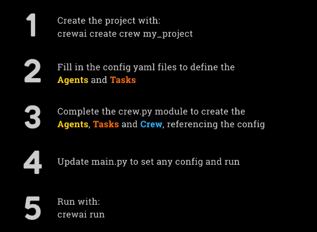

- [Crew AI](#crew-ai)
  - [Core Concepts of Crew AI](#core-concepts-of-crew-ai)
  - [LightLLM and CrewAI Project Setup](#lightllm-and-crewai-project-setup)
  - [LightLLM and Model Flexibility in CrewAI](#lightllm-and-model-flexibility-in-crewai)
  - [Structure and Workflow of a CrewAI Project](#structure-and-workflow-of-a-crewai-project)
    - [Define our files](#now-we-going-to-define-our-files)
  - [Run the project](#run-the-project)
  - [Recap: Your First Project with CrewAI](#recap-your-first-project-with-crewai)
- [Building Crew AI Projects: Tools, Context & Google Search Integration]()
- [Building Multi-Agent Financial Research System with Crew.ai]()


## Crew AI

This marks a transition from the familiar **OpenAI Agents SDK** to the world of **Crew AI**. Although the shift may feel abrupt, it's part of an ongoing process of exploring different agent frameworks. Each one offers unique perspectives and tools, and each will be more or less suited depending on the project at hand.

You’re encouraged to:

* Note the similarities and differences between frameworks.
* Decide for yourself which tool best suits your needs.
* Learn something valuable from each one.


**What Is Crew AI?**

**Crew AI** refers to multiple things, depending on context. These include:

**1. Crew AI Enterprise**

Also called the **Crew AI Platform**, this is a commercial platform for:

* Deploying agents
* Monitoring agent behavior
* Managing workflows through various dashboards

You can visit it at: **crewai.com** (not **crew\.ai**)

**2. Crew AI UI Studio**

A **low-code/no-code** tool for:

* Building agent interactions visually
* Allowing end-users to create workflows without coding

**3. Crew AI Framework**

An **open-source** Python framework built for:

> “Orchestrating high-performing AI agents with ease and scale.â€

This is the focus of the course: writing code and building agents from scratch using the open-source framework, not the commercial tools.


**Commercial Strategy of Crew AI**

Unlike OpenAI or Anthropic (which monetize via their LLMs), Crew AI:

* Needs a business model built around its tooling
* Offers the **free framework** as entry
* Monetizes through **hosting**, **deployment**, and **enterprise tools**

This is why the website includes heavy upselling — it aims to convert open-source users into paying enterprise customers.


**Two Modes in the Crew AI Framework**

Once inside the open-source framework, there are **two major approaches**:

**1. Crew AI Cruise**

* Teams of agents collaborating
* Roles are assigned to different agents
* Supports **autonomous**, **creative**, or **exploratory** solutions
* Suitable for agentic, unscripted workflows

“Crew†= A team of agents working together

**2. Crew AI Flows**

* Structured and linear workflows
* Tasks are broken into **deterministic steps**
* Includes decision points and expected outcomes
* Useful for **auditability**, **control**, or **predictable behavior**

This is likely a newer addition, possibly a response to concerns about the unpredictability of Cruise-style setups in production environments.


**When to Use Each Mode**

| Mode       | Best For                                                              |
| ---------- | --------------------------------------------------------------------- |
| **Cruise** | Autonomous problem-solving, creative collaboration, exploratory tasks |
| **Flows**  | Deterministic workflows, precision, audit trails                      |


## Core Concepts of Crew AI

**Agent**

An **agent** is the smallest autonomous unit in Crew AI. It is linked to an LLM and includes:

* **Role**: A description of what the agent does
* **Goal**: The purpose or objective of the agent
* **Backstory**: Context or background information for priming
* **Memory**: Optional storage for past interactions
* **Tools**: Optional tools the agent can use

Agents resemble those in OpenAI Agents SDK but are more prescriptive: instead of a single `instruction`, Crew AI uses multiple structured fields (role, goal, backstory).

**Task**

A **task** is a unit of work assigned to an agent. It includes:

* **Description**: What the task is
* **Expected Output**: The desired result
* **Agent**: The agent responsible for executing it

Tasks are a new construct, not present in OpenAI Agents SDK, and help separate logic from behavior.

**Crew**

A **crew** is a combination of:

* Multiple **agents**
* Multiple **tasks**

It defines how agents and tasks work together to solve a problem.

Crew can operate in two modes:

* **Sequential**: Tasks are executed in a defined order
* **Hierarchical**: A manager LLM dynamically assigns tasks to agents

---

**Comparison with OpenAI Agents SDK**

Crew AI is:

* **More opinionated**: Requires structured agent configuration
* **More prescriptive**: Enforces concepts like roles and backstories
* **Less transparent**: The system prompt is generated from multiple fields rather than a single `instruction`, which can make debugging more complex
* **Configurable**: Uses YAML to separate configuration from code

**Configuration via YAML**

Crew AI supports agent and task configuration via YAML files.
Advantages:

* **Separation of concerns**: Prompts and configuration are outside the main Python code
* **Easier to manage**: Especially for larger projects with many agents
* **Readable**: YAML is easy for humans to read and write

You can create agents by:

* Writing code: `Agent(...)`
* Referring to a YAML configuration: e.g. `"config.agent_config['researcher']"

**Python Structure: `crew.py`**

This is the main module where agents, tasks, and crews are defined.

**Decorators**

Crew AI uses decorators to structure the code:

| Decorator    | Purpose                                        |
| ------------ | ---------------------------------------------- |
| `@crew_base` | Marks the main class managing the crew         |
| `@agent`     | Decorates a method that defines an agent       |
| `@task`      | Decorates a method that defines a task         |
| `@crew`      | Decorates the function that assembles the crew |

These decorators:

* Register agents and tasks automatically
* Allow referencing `self.agents`, `self.tasks` in the final crew assembly
* Specify mode (`sequential` or `hierarchical`) within the `@crew` function


## LightLLM and CrewAI Project Setup

CrewAI uses **LightLLM**, a minimal and ultra-flexible framework, to connect with any LLM. Unlike heavier frameworks like LangChain, LightLLM allows you to:

* Connect instantly to hosted or local LLMs
* Use almost any provider or model
* Configure access easily in code or `.env` files

**Example usage**

```python
llm = LLM(model="openai/gpt-4o-mini")
llm = LLM(model="anthropic/claude-3-5-sonnet-latest")
llm = LLM(model="gemini/gemini-2-0-flash")
llm = LLM(model="groq/llama-3-70b-versatile")
llm = LLM(model="ollama/llama3.2", base_url="http://localhost:11434")
llm = LLM(
    model="openrouter/deepseek/deepseek-r1",
    base_url="https://openrouter.ai/api/v1",
    api_key=OPENROUTER_API_KEY
)
```

* The model format: `"provider/model"`
* Supports OpenAI, Anthropic, Gemini, Groq, Ollama, OpenRouter, etc.
* Can also run local models (e.g., via Ollama)


## LightLLM and Model Flexibility in CrewAI

One of the key advantages of CrewAI is its lightweight and flexible way of interacting with LLMs. Under the hood, it uses a framework called LightLLM. LightLLM is a very minimalistic and straightforward tool to interface with actual LLM providers. The speaker likes LightLLM a lot because of its simplicity and lack of overhead, especially compared to frameworks like LangChain, which add a lot of structure.

LightLLM allows you to connect to any LLM easily. In CrewAI, you just create an LLM by passing a model name. The naming structure follows this pattern: provider name followed by a slash, then the model name. This makes it easy to switch between different providers and models.

Examples include GPT-4 from OpenAI, Claude from Anthropic, 3.5 and 3.7 versions, Gemini, Flash, Grok (with a “Q†or a “Kâ€), and local models using Ollama. For local models, you can configure them by providing a base URL. You can also use OpenRouter, which acts as an abstraction layer over multiple LLMs. Configuring OpenRouter involves setting a base URL and an API key.

The idea behind all of this is to provide a simple and flexible system for connecting to any model you need. The speaker believes this gives CrewAI a clear advantage over OpenAI Agents SDK, which is more tightly coupled to a specific provider.


## Structure and Workflow of a CrewAI Project

The next major topic is how CrewAI handles projects. In earlier weeks of the course, everything was done inside Python notebooks (like in Cursor), or occasionally through basic Python modules. CrewAI, however, does not work that way. It requires working with actual Python code and comes with its own project and directory structure.

The CrewAI framework has already been installed using this command:

```bash
uv tool install crewai
```

That means when you clone the repo, the framework is already available.

To create a new Crew project, you use this command:

```bash
crewai create crew my_crew
```

You can name the project whatever you want. For example, “my\_crew†or “my\_project.â€

Alternatively, if you want to work with flows instead of crews (i.e., fixed workflows rather than agent-based ones), you can use:

```bash
crewai create flow my_project
```

However, in the course, the focus is on crews, not flows.

Running the `crewai create crew` command generates a full directory structure. At the top level is the project directory, such as `my_crew`. Inside that is a subdirectory called `src`. Within `src`, there is another directory with the name of your project, such as `my_crew` again.


```bash
(agents_env) ➜  my_agents git:(main) ✗ cd notebooks/week3_crew 
(agents_env) ➜  week3_crew git:(main) ✗ crewai create crew debate
Creating folder debate...
Select a provider to set up:
1. openai
2. anthropic
3. gemini
4. nvidia_nim
5. groq
6. huggingface
7. ollama
8. watson
9. bedrock
10. azure
11. cerebras
12. sambanova
13. other
q. Quit
Enter the number of your choice or 'q' to quit: 1
Select a model to use for Openai:
1. gpt-4
2. gpt-4.1
3. gpt-4.1-mini-2025-04-14
4. gpt-4.1-nano-2025-04-14
5. gpt-4o
6. gpt-4o-mini
7. o1-mini
8. o1-preview
q. Quit
Enter the number of your choice or 'q' to quit: 3
Enter your OPENAI API key (press Enter to skip): 
API keys and model saved to .env file
Selected model: gpt-4.1-mini-2025-04-14
  - Created debate/.gitignore
  - Created debate/pyproject.toml
  - Created debate/README.md
  - Created debate/knowledge/user_preference.txt
  - Created debate/src/debate/__init__.py
  - Created debate/src/debate/main.py
  - Created debate/src/debate/crew.py
  - Created debate/src/debate/tools/custom_tool.py
  - Created debate/src/debate/tools/__init__.py
  - Created debate/src/debate/config/agents.yaml
  - Created debate/src/debate/config/tasks.yaml
Crew debate created successfully!
```


```bash
(agents_env) ➜  week3_crew git:(main) ✗ cd debate
(agents_env) ➜  debate git:(main) ✗ tree
.
├── README.md
├── knowledge
│   └── user_preference.txt
├── pyproject.toml              # UV project configuration
├── src
│   └── debate
│       ├── __init__.py
│       ├── config
│       │   ├── agents.yaml     # Agent definitions
│       │   └── tasks.yaml      # Task definitions
│       ├── crew.py             # Main logic with decorators
│       ├── main.py             # Entry point for running the crew
│       └── tools
│           ├── __init__.py
│           └── custom_tool.py
└── tests

7 directories, 10 files
```

**Inside debate/:**

Contains a subfolder: `knowledge/`
* File: user_preference.yaml
* Contains user-specific background info.
* Used to pass context to the model (not used in this example).
```bash
(agents_env) ➜  week3_crew git:(main) cat debate/knowledge/user_preference.txt
User name is John Doe.
User is an AI Engineer.
User is interested in AI Agents.
User is based in San Francisco, California.
```

**source/ Folder**:

Path: `debate/source/debate/`

This nested structure exists because the project name is also **debate**.  

Subfolder: `config/` This folder contains two YAML files by default:
* `agents.yaml`, where you define agent configurations.
* `tasks.yaml`, where you define task configurations.
* Both with defeault examples.

Subfolder: `tools/`
* Empty or with placeholder code
* For adding custom tools later (not used in this example)

Python files:  
Also in the same directory are two important Python modules:
* `crew.py`, which is where you define your crew using decorators.
* `main.py`, which is the script that starts the execution of your crew.

```sh
mkdir other # ↠optional dummy folder to make VS Code show tree view properly
```

#### Now we going to define our files

**`agents.yaml`** :

And this contains some default, some sort of scaffolding, some example agents that are called the Researcher and the Reporting Analyst are the two examples it's given and we're going to change these to being what we're looking to build, and of course **we're looking to build a little debate team**, and in fact we only need **two agents** for what we're looking to do. We want an agent that will be the debater. One agent is going to play both roles of being for and against the motion 

```yaml
debater:
  role: >
    A compelling debater
  goal: >
    Present a clear argument either in favor of or against the motion. The motion is: {motion}
```
So now we have a back story... you're an experienced debater with a knack for giving concise but convincing arguments. You can also specify what model to use... GPT-40 Mini... or OpenAI/GPT-40 Mini...

```yaml
  backstory: >
    You're an experienced debator with a knack for giving concise but convincing arguments.
    The motion is: {motion}
  llm: openai/gpt-4o-mini
```
> Note : the `{motion}` fields acts as a dynamic template that will in `main.py`

But now let’s define our judge... the role we will say is decide the winner of the debate.. 

```yaml
judge:
  role: >
    Decide the winner of the debate based on the arguments presented
  goal: >
    Given arguments for and against this motion: {motion}, decide which side is more convincing,
    based purely on the arguments presented.
```

You’re a fair judge with a reputation for weighing up arguments without factoring in your own views... You can just have GPT-40 Mini, or... anthropic/claude-3-7-sonnet-latest...

```yaml
  backstory: >
    You are a fair judge with a reputation for weighing up arguments without factoring in
    your own views, and making a decision based purely on the merits of the argument.
    The motion is: {motion}
  llm: anthropic/claude-3-7-sonnet-latest
```

**`tasks.yaml`**:

The first task is to propose the motion — that is, give a strong argument in favor of it.
This task is assigned to the debater agent. 

```yaml
propose:
  description: >
    You are proposing the motion: {motion}.
    Come up with a clear argument in favor of the motion.
    Be very convincing.
  expected_output: >
    Your clear argument in favor of the motion, in a concise manner.
  agent: debater
  output_file: output/propose.md
```

The second task is to oppose the motion — that is, produce a strong argument against it.
Again, the same debater agent is used, but now in oposición.

```yaml
oppose:
  description: >
    You are in opposition to the motion: {motion}.
    Come up with a clear argument against the motion.
    Be very convincing.
  expected_output: >
    Your clear argument against the motion, in a concise manner.
  agent: debater
  output_file: output/oppose.md
```
Finally, the judge reviews the arguments and makes a decision about which side is more convincing.

```yaml
decide:
  description: >
    Review the arguments presented by the debaters and decide which side is more convincing.
  expected_output: >
    Your decision on which side is more convincing, and why.
  agent: judge
  output_file: output/decide.md
```

final result:

```yaml
propose  →  debater  →  output/propose.md
oppose   →  debater  →  output/oppose.md
decide   →  judge    →  output/decide.md
```

**`crew.py`**:

So this is the default module crew.py and you can see it's got some stuff in here based on the standard scaffolding.
It has created a class and it's got this crew base decorator around it and this class is named the same as the name of our project: Debate. 

It brings in the agents config and the tasks config from the config folder. You can see how it refers directly to our configuration...

```py
@CrewBase
class Debate():
    """Debate crew"""

    agents_config = 'config/agents.yaml'
    tasks_config = 'config/tasks.yaml'

```
We don’t have an agent called researcher, we have debater. The @agent decorator tells CrewAI this method defines an agent.

```py
    @agent
    def debater(self) -> Agent:
        return Agent(
            config=self.agents_config['debater'],
            verbose=True
        )
    @agent
    def judge(self) -> Agent:
        return Agent(
            config=self.agents_config['judge'],
            verbose=True
        )
```
And now we’re going to define our tasks.
First propose, then oppose, and finally decide.

```py
    @task
    def propose(self) -> Task:
        return Task(
            config=self.tasks_config['propose'],
        )

    @task
    def oppose(self) -> Task:
        return Task(
            config=self.tasks_config['oppose'],
        )

    @task
    def decide(self) -> Task:
        return Task(
            config=self.tasks_config['decide'],
        )
```

So those are our two agents and three tasks...
And now we define the Crew object that puts it all together.

```py
    @crew
    def crew(self) -> Crew:
        """Creates the Debate crew"""

        return Crew(
            agents=self.agents,  # autogenerado por los métodos @agent
            tasks=self.tasks,    # autogenerado por los métodos @task
            process=Process.sequential,
            verbose=True,
        )
```

**`main.py`**

This main file is intended to run your crew locally, so refrain from adding unnecessary logic.

So inputs, when we’re running the crew, this is where we choose those template values that we put in our YAML file.

```py
inputs = {
    'motion': 'There needs to be strict laws to regulate LLMs',
}
```
We should now be ready to run our first crew just based on that.

```py
result = Debate().crew().kickoff(inputs=inputs)
print(result.raw)
```
--- 

#### Run the project

```bash
crewai run
```

Internally, this runs:

```bash
uv run main.py
```

```bash
agents_env➜  AI_agents git:(main) ✗ cd my_agents/notebooks/week3_crew/debate && crewai run                 cd my_agents/notebooks/week3_crew/debate && crewai run
Running the Crew
warning: `VIRTUAL_ENV=/Users/alex/Desktop/00_projects/AI_agents/my_agents/agents_env` does not match the project environment path `.venv` and will be ignored; use `--active` to target the active environment instead
╭───────────────────────────────────────── Crew Execution Started ─────────────────────────────────────────╮
│                                                                                                          │
│  Crew Execution Started                                                                                  │
│  Name: crew                                                                                              │
│  ID: ee72804e-3821-4941-baea-118091fed1f6                                                                │
│  Tool Args:                                                                                              │
│                                                                                                          │
│                                                                                                          │
╰──────────────────────────────────────────────────────────────────────────────────────────────────────────╯

🚀 Crew: crew
└── 📋 Task: ccadd796-a54e-4084-a6b2-cfa64c2af9a7
    Status: Executing Task...
╭──────────────────────────────────────────── 🤖 Agent Started ────────────────────────────────────────────╮
│                                                                                                          │
│  Agent: A compelling debater                                                                             │
│                                                                                                          │
│  Task: You are proposing the motion: There needs to be strict laws to regulate LLMs. Come up with a      │
│  clear argument in favor of the motion. Be very convincing.                                              │
│                                                                                                          │
│                                                                                                          │
╰──────────────────────────────────────────────────────────────────────────────────────────────────────────╯

🚀 Crew: crew
└── 📋 Task: ccadd796-a54e-4084-a6b2-cfa64c2af9a7
    Status: Executing Task...
╭───────────────────────────────────────── ✅ Agent Final Answer ──────────────────────────────────────────╮
│                                                                                                          │
│  Agent: A compelling debater                                                                             │
│                                                                                                          │
│  Final Answer:                                                                                           │
│  There needs to be strict laws to regulate LLMs because, without proper oversight, these technologies    │
│  pose significant risks to society. Firstly, LLMs can generate misleading or false information, which    │
│  can undermine trust in factual communication and exacerbate misinformation. The absence of regulations  │
│  allows the spread of harmful narratives, potentially influencing public opinion and creating societal   │
│  divisions.                                                                                              │
│                                                                                                          │
│  Secondly, LLMs can inadvertently learn and perpetuate biases present in their training data, leading    │
│  to unethical outcomes that can affect marginalized communities. By establishing strict laws, we create  │
│  accountability and enforce standards that ensure the responsible development and deployment of these    │
│  models.                                                                                                 │
│                                                                                                          │
│  Furthermore, LLMs pose privacy concerns, as they can potentially generate personal or sensitive         │
│  information without consent. Regulations can help define the boundaries of acceptable use, thus         │
│  protecting individuals’ rights and privacy.                                                             │
│                                                                                                          │
│  Finally, the rapid advancement of LLMs outpaces our understanding of their full implications. Clear,    │
│  enforceable laws are necessary to adapt to evolving technology while ensuring safety and ethical use.   │
│  In conclusion, strict laws to regulate LLMs are essential to safeguard truth, protect the vulnerable,   │
│  uphold privacy, and maintain societal trust in these emerging technologies.                             │
│                                                                                                          │
╰──────────────────────────────────────────────────────────────────────────────────────────────────────────╯

🚀 Crew: crew
└── 📋 Task: ccadd796-a54e-4084-a6b2-cfa64c2af9a7
    Assigned to: A compelling debater
    
    Status: ✅ Completed
╭──────────────────────────────────────────── Task Completion ─────────────────────────────────────────────╮
│                                                                                                          │
│  Task Completed                                                                                          │
│  Name: ccadd796-a54e-4084-a6b2-cfa64c2af9a7                                                              │
│  Agent: A compelling debater                                                                             │
│                                                                                                          │
│  Tool Args:                                                                                              │
│                                                                                                          │
│                                                                                                          │
╰──────────────────────────────────────────────────────────────────────────────────────────────────────────╯

🚀 Crew: crew
├── 📋 Task: ccadd796-a54e-4084-a6b2-cfa64c2af9a7
│   Assigned to: A compelling debater
│   
│   Status: ✅ Completed
└── 📋 Task: 92a40bb0-8cf1-4449-8273-8c13d5a37db6
    Status: Executing Task...
╭──────────────────────────────────────────── 🤖 Agent Started ────────────────────────────────────────────╮
│                                                                                                          │
│  Agent: A compelling debater                                                                             │
│                                                                                                          │
│  Task: You are in opposition to the motion: There needs to be strict laws to regulate LLMs. Come up      │
│  with a clear argument against the motion. Be very convincing.                                           │
│                                                                                                          │
│                                                                                                          │
╰──────────────────────────────────────────────────────────────────────────────────────────────────────────╯

🚀 Crew: crew
├── 📋 Task: ccadd796-a54e-4084-a6b2-cfa64c2af9a7
│   Assigned to: A compelling debater
│   
│   Status: ✅ Completed
└── 📋 Task: 92a40bb0-8cf1-4449-8273-8c13d5a37db6
    Status: Executing Task...
╭───────────────────────────────────────── ✅ Agent Final Answer ──────────────────────────────────────────╮
│                                                                                                          │
│  Agent: A compelling debater                                                                             │
│                                                                                                          │
│  Final Answer:                                                                                           │
│  While the concerns surrounding large language models (LLMs) are valid, imposing strict laws to          │
│  regulate them can stifle innovation, impede progress, and limit their potential benefits for society.   │
│  Here are several compelling arguments against the motion:                                               │
│                                                                                                          │
│  Firstly, overregulation can hinder technological advancement. The rapid development of LLMs has led to  │
│  groundbreaking applications across various fields, including healthcare, education, and content         │
│  creation. Imposing strict laws may create barriers to innovation, preventing beneficial advancements    │
│  that could significantly improve lives and societal functions.                                          │
│                                                                                                          │
│  Secondly, the implementation of strict laws may disproportionately affect smaller companies and         │
│  startups that lack the resources to comply with extensive regulatory frameworks. This could further     │
│  entrench the dominance of larger corporations, limiting diversity and competition in the field. A more  │
│  nuanced approach that encourages responsible development while still permitting creativity and growth   │
│  is necessary.                                                                                           │
│                                                                                                          │
│  Additionally, while concerns about misinformation and bias are important, it is essential to recognize  │
│  that humans are ultimately responsible for the use of these technologies. Rather than creating rigid    │
│  laws, we should focus on developing guidelines that promote ethical use and enhance digital literacy    │
│  among users. Empowering individuals with knowledge and skills will lead to more responsible engagement  │
│  with LLMs than strict regulations ever could.                                                           │
│                                                                                                          │
│  Moreover, the technology itself is evolving rapidly. Regulations that may seem appropriate today can    │
│  quickly become outdated as the landscape changes. A flexible regulatory framework that adapts to        │
│  technological advancements is far more pragmatic than strict laws that may struggle to keep pace.       │
│                                                                                                          │
│  Lastly, collaboration between developers, ethicists, and the community can lead to better outcomes      │
│  than stringent legislation. By fostering open dialogue and shared best practices, we can mitigate       │
│  risks while still allowing for the exploration of new ideas and methodologies.                          │
│                                                                                                          │
│  In conclusion, while addressing the challenges posed by LLMs is necessary, strict laws are not the      │
│  solution. We should prioritize fostering innovation, encouraging responsible use, and adapting our      │
│  approach to regulation in line with the evolving nature of technology. An overbearing legal framework   │
│  risks stifling the significant benefits that LLMs have to offer, ultimately hindering progress and      │
│  societal advancement.                                                                                   │
│                                                                                                          │
╰──────────────────────────────────────────────────────────────────────────────────────────────────────────╯

🚀 Crew: crew
├── 📋 Task: ccadd796-a54e-4084-a6b2-cfa64c2af9a7
│   Assigned to: A compelling debater
│   
│   Status: ✅ Completed
└── 📋 Task: 92a40bb0-8cf1-4449-8273-8c13d5a37db6
    Assigned to: A compelling debater
    
    Status: ✅ Completed
╭──────────────────────────────────────────── Task Completion ─────────────────────────────────────────────╮
│                                                                                                          │
│  Task Completed                                                                                          │
│  Name: 92a40bb0-8cf1-4449-8273-8c13d5a37db6                                                              │
│  Agent: A compelling debater                                                                             │
│                                                                                                          │
│  Tool Args:                                                                                              │
│                                                                                                          │
│                                                                                                          │
╰──────────────────────────────────────────────────────────────────────────────────────────────────────────╯

🚀 Crew: crew
├── 📋 Task: ccadd796-a54e-4084-a6b2-cfa64c2af9a7
│   Assigned to: A compelling debater
│   
│   Status: ✅ Completed
├── 📋 Task: 92a40bb0-8cf1-4449-8273-8c13d5a37db6
│   Assigned to: A compelling debater
│   
│   Status: ✅ Completed
└── 📋 Task: 4a1f5600-9315-4482-9346-1e35fe02a8d3
    Status: Executing Task...
╭──────────────────────────────────────────── 🤖 Agent Started ────────────────────────────────────────────╮
│                                                                                                          │
│  Agent: Decide the winner of the debate based on the arguments presented                                 │
│                                                                                                          │
│  Task: Review the arguments presented by the debaters and decide which side is more convincing.          │
│                                                                                                          │
│                                                                                                          │
╰──────────────────────────────────────────────────────────────────────────────────────────────────────────╯

🚀 Crew: crew
├── 📋 Task: ccadd796-a54e-4084-a6b2-cfa64c2af9a7
│   Assigned to: A compelling debater
│   
│   Status: ✅ Completed
├── 📋 Task: 92a40bb0-8cf1-4449-8273-8c13d5a37db6
│   Assigned to: A compelling debater
│   
│   Status: ✅ Completed
└── 📋 Task: 4a1f5600-9315-4482-9346-1e35fe02a8d3
    Status: Executing Task...
╭───────────────────────────────────────── ✅ Agent Final Answer ──────────────────────────────────────────╮
│                                                                                                          │
│  Agent: Decide the winner of the debate based on the arguments presented                                 │
│                                                                                                          │
│  Final Answer:                                                                                           │
│  After thoroughly evaluating the arguments presented for and against the motion that strict laws need    │
│  to be established to regulate large language models (LLMs), the case for imposing such laws is          │
│  ultimately more convincing.                                                                             │
│                                                                                                          │
│  The arguments in favor highlight several critical points that underscore the necessity of regulation.   │
│  First and foremost, the proliferation of misleading and false information generated by LLMs carries     │
│  significant risks—not only to individual users but broadly to societal trust and cohesion. Without      │
│  regulation, these technologies could exacerbate misinformation and create division among communities,   │
│  potentially influencing public opinion in detrimental ways.                                             │
│                                                                                                          │
│  Moreover, the issue of bias in LLMs cannot be understated. The recognition that these models can        │
│  perpetuate existing biases present in training data raises ethical concerns that impact marginalized    │
│  populations. Establishing strict laws would foster accountability in the development and deployment of  │
│  LLM technology, ensuring a more ethical approach that protects vulnerable groups.                       │
│                                                                                                          │
│  In addition, privacy concerns are paramount. LLMs can inadvertently disclose personal data, raising     │
│  ethical issues about consent and individual rights. Regulations are critical to delineating acceptable  │
│  use, thus safeguarding personal information.                                                            │
│                                                                                                          │
│  The argument regarding the pace of advancement in LLM technology is also compelling. As innovations     │
│  develop faster than our understanding of their implications, strict and clear laws will create          │
│  frameworks for responsible usage while adapting to ongoing changes.                                     │
│                                                                                                          │
│  On the opposing side, while the desire to foster innovation and maintain competitive diversity in the   │
│  field is valid, it does not outweigh the pressing need for regulatory oversight to mitigate potential   │
│  harms. The argument that regulations may unfairly disadvantage smaller companies is addressed by the    │
│  idea that regulations can be tailored in a way that allows for innovation while protecting users and    │
│  broader societal interests.                                                                             │
│                                                                                                          │
│  Furthermore, the reliance on ethical guidelines and digital literacy, rather than stringent             │
│  regulations, does not provide a robust framework to ensure accountability, especially given the         │
│  potential for misuse and harm that has already been witnessed.                                          │
│                                                                                                          │
│  Overall, while there are valid perspectives on the importance of innovation and flexible regulatory     │
│  approaches, the weight of the arguments supporting strict laws to regulate LLMs—focused on              │
│  safeguarding trust, mitigating misinformation, addressing bias, protecting privacy, and navigating      │
│  technological advancements—makes it clear that there is a profound need for such regulations.           │
│  Therefore, the conclusion is that strict laws to regulate LLMs are essential for responsible            │
│  technological advancement and societal protection.                                                      │
│                                                                                                          │
╰──────────────────────────────────────────────────────────────────────────────────────────────────────────╯

🚀 Crew: crew
├── 📋 Task: ccadd796-a54e-4084-a6b2-cfa64c2af9a7
│   Assigned to: A compelling debater
│   
│   Status: ✅ Completed
├── 📋 Task: 92a40bb0-8cf1-4449-8273-8c13d5a37db6
│   Assigned to: A compelling debater
│   
│   Status: ✅ Completed
└── 📋 Task: 4a1f5600-9315-4482-9346-1e35fe02a8d3
    Assigned to: Decide the winner of the debate based on the arguments presented
    
    Status: ✅ Completed
╭──────────────────────────────────────────── Task Completion ─────────────────────────────────────────────╮
│                                                                                                          │
│  Task Completed                                                                                          │
│  Name: 4a1f5600-9315-4482-9346-1e35fe02a8d3                                                              │
│  Agent: Decide the winner of the debate based on the arguments presented                                 │
│                                                                                                          │
│  Tool Args:                                                                                              │
│                                                                                                          │
│                                                                                                          │
╰──────────────────────────────────────────────────────────────────────────────────────────────────────────╯

╭──────────────────────────────────────────── Crew Completion ─────────────────────────────────────────────╮
│                                                                                                          │
│  Crew Execution Completed                                                                                │
│  Name: crew                                                                                              │
│  ID: ee72804e-3821-4941-baea-118091fed1f6                                                                │
│  Tool Args:                                                                                              │
│  Final Output: After thoroughly evaluating the arguments presented for and against the motion that       │
│  strict laws need to be established to regulate large language models (LLMs), the case for imposing      │
│  such laws is ultimately more convincing.                                                                │
│                                                                                                          │
│  The arguments in favor highlight several critical points that underscore the necessity of regulation.   │
│  First and foremost, the proliferation of misleading and false information generated by LLMs carries     │
│  significant risks—not only to individual users but broadly to societal trust and cohesion. Without      │
│  regulation, these technologies could exacerbate misinformation and create division among communities,   │
│  potentially influencing public opinion in detrimental ways.                                             │
│                                                                                                          │
│  Moreover, the issue of bias in LLMs cannot be understated. The recognition that these models can        │
│  perpetuate existing biases present in training data raises ethical concerns that impact marginalized    │
│  populations. Establishing strict laws would foster accountability in the development and deployment of  │
│  LLM technology, ensuring a more ethical approach that protects vulnerable groups.                       │
│                                                                                                          │
│  In addition, privacy concerns are paramount. LLMs can inadvertently disclose personal data, raising     │
│  ethical issues about consent and individual rights. Regulations are critical to delineating acceptable  │
│  use, thus safeguarding personal information.                                                            │
│                                                                                                          │
│  The argument regarding the pace of advancement in LLM technology is also compelling. As innovations     │
│  develop faster than our understanding of their implications, strict and clear laws will create          │
│  frameworks for responsible usage while adapting to ongoing changes.                                     │
│                                                                                                          │
│  On the opposing side, while the desire to foster innovation and maintain competitive diversity in the   │
│  field is valid, it does not outweigh the pressing need for regulatory oversight to mitigate potential   │
│  harms. The argument that regulations may unfairly disadvantage smaller companies is addressed by the    │
│  idea that regulations can be tailored in a way that allows for innovation while protecting users and    │
│  broader societal interests.                                                                             │
│                                                                                                          │
│  Furthermore, the reliance on ethical guidelines and digital literacy, rather than stringent             │
│  regulations, does not provide a robust framework to ensure accountability, especially given the         │
│  potential for misuse and harm that has already been witnessed.                                          │
│                                                                                                          │
│  Overall, while there are valid perspectives on the importance of innovation and flexible regulatory     │
│  approaches, the weight of the arguments supporting strict laws to regulate LLMs—focused on              │
│  safeguarding trust, mitigating misinformation, addressing bias, protecting privacy, and navigating      │
│  technological advancements—makes it clear that there is a profound need for such regulations.           │
│  Therefore, the conclusion is that strict laws to regulate LLMs are essential for responsible            │
│  technological advancement and societal protection.                                                      │
│                                                                                                          │
│                                                                                                          │
╰──────────────────────────────────────────────────────────────────────────────────────────────────────────╯

After thoroughly evaluating the arguments presented for and against the motion that strict laws need to be established to regulate large language models (LLMs), the case for imposing such laws is ultimately more convincing. 

The arguments in favor highlight several critical points that underscore the necessity of regulation. First and foremost, the proliferation of misleading and false information generated by LLMs carries significant risks—not only to individual users but broadly to societal trust and cohesion. Without regulation, these technologies could exacerbate misinformation and create division among communities, potentially influencing public opinion in detrimental ways.

Moreover, the issue of bias in LLMs cannot be understated. The recognition that these models can perpetuate existing biases present in training data raises ethical concerns that impact marginalized populations. Establishing strict laws would foster accountability in the development and deployment of LLM technology, ensuring a more ethical approach that protects vulnerable groups.

In addition, privacy concerns are paramount. LLMs can inadvertently disclose personal data, raising ethical issues about consent and individual rights. Regulations are critical to delineating acceptable use, thus safeguarding personal information.

The argument regarding the pace of advancement in LLM technology is also compelling. As innovations develop faster than our understanding of their implications, strict and clear laws will create frameworks for responsible usage while adapting to ongoing changes.

On the opposing side, while the desire to foster innovation and maintain competitive diversity in the field is valid, it does not outweigh the pressing need for regulatory oversight to mitigate potential harms. The argument that regulations may unfairly disadvantage smaller companies is addressed by the idea that regulations can be tailored in a way that allows for innovation while protecting users and broader societal interests.

Furthermore, the reliance on ethical guidelines and digital literacy, rather than stringent regulations, does not provide a robust framework to ensure accountability, especially given the potential for misuse and harm that has already been witnessed.

Overall, while there are valid perspectives on the importance of innovation and flexible regulatory approaches, the weight of the arguments supporting strict laws to regulate LLMs—focused on safeguarding trust, mitigating misinformation, addressing bias, protecting privacy, and navigating technological advancements—makes it clear that there is a profound need for such regulations. Therefore, the conclusion is that strict laws to regulate LLMs are essential for responsible technological advancement and societal protection.
agents_env➜  debate git:(main) ✗
```

This setup creates a complete UV (micro) project. So when you run `crewai create crew`, it automatically generates UV project configuration files. These UV projects will be nested within the larger UV project that contains the entire course. This structure will become more intuitive once you see it in practice.


```bash
(agents_env) ➜  my_agents git:(main) tree notebooks/week3_crew/debate/output
notebooks/week3_crew/debate/output
├── decide.md
├── oppose.md
└── propose.md
```

**Final Note Before Practice**

The course is now ready to start using CrewAI hands-on. Everything is set up with UV, CrewAI is installed, and the directory structure has been generated. The next step is to go ahead and actually try it out by building your own crew.

In this first project using **CrewAI**, we successfully completed a full execution cycle of a crew of agents designed to simulate an automated debate using LLMs.

* **YAML configuration**: We defined the agents (`debater` and `judge`) and tasks (`propose`, `oppose`, `decide`) in the `agents.yaml` and `tasks.yaml` files.

* **crew\.py module**: We created the main crew class using the `@agent` and `@task` decorators. The class loads agent and task configurations from the YAML files and defines the execution order.

* **main.py module**: We specified the input values (in this case, the motion) as a dictionary and launched the crew using `Debate().crew().kickoff(inputs=...)`.

* **Execution flow**: The `debater` agent generated arguments both in favor of and against the motion. The `judge` agent, using Anthropic Claude, evaluated the arguments and made a decision.

* **Result**: The full debate ran successfully. The final decision from the judge was printed in the console and saved to output files as defined in the task configuration.

This project demonstrates how to build and run a basic CrewAI application. You can now create new projects or expand this one by adding tools, agents, or more complex logic.


#### Recap: Your First Project with CrewAI


1. **Created the project:**

   ```bash
   crewai create crew debate
   ```

2. **Generated folder structure:**

   ```
   debate/
   ├── source/
   │   └── debate/
   │       ├── config/
   │       │   ├── agents.yaml
   │       │   └── tasks.yaml
   │       ├── crew.py
   │       └── main.py
   ```

3. **Defined the agents (`agents.yaml`):**
   Each agent includes: name, role, goal, backstory, and LLM.
   You used one `debater` agent and one `judge`.

4. **Defined the tasks (`tasks.yaml`):**
   Three tasks: `propose`, `oppose`, and `decide`, each assigned to an agent, with description and expected output.

5. **Implemented the logic in `crew.py`:**
   You used the decorators `@agent`, `@task`, and `@crew`.
   The crew ran in sequential order using `Process.sequential`.

6. **Ran the project:**

   ```bash
   crewai run
   ```

   The debate completed successfully, including a decision by the judge.

### What can you do next?

**Optional extension to practice:**

Split the `debater` into two agents, like this in `agents.yaml`:

```yaml
proposer:
  llm: openai/gpt-4o-mini

opposer:
  llm: deepseek-ai/deepseek-chat
```

Then update `tasks.yaml`:

```yaml
propose:
  agent: proposer
oppose:
  agent: opposer
```

This allows you to:

* Compare different LLMs (e.g., OpenAI vs DeepSeek, vs Claude)
* Alternate roles and measure consistency and persuasion
* Use a neutral judge and build your own leaderboard of model performance

**What does this teach you?**

* How to fully structure and run a CrewAI project from scratch
* How to plug in and test multiple models
* How to automate debates and measure persuasiveness

**Suggested next step**

You can build a notebook (e.g., `debate_leaderboard.ipynb`) that tests different combinations of models in debate roles and logs which model wins more often according to a judge.

Would you like a ready-made CrewAI project template that includes:

* two agents (`proposer` and `opposer`)
* a judge
* predefined model options
* auto-logging of decisions

Let me know the format you want: `.zip`, `.py`, `.yaml`, or `.ipynb`.

## Building Crew AI Projects: Tools, Context & Google Search Integration

To quickly recap what we did last time, we learned about an **agent**, the agent being the smallest autonomous unit. It has an LLM associated with it (although it doesn't actually need to — you can have an agent without an LLM, but they typically do). It has a **role**, a **goal**, a **backstory**, and it also has **memory** and **tools**, not that we've looked at either of them just yet.

And then a **task** — this is the concept which doesn't have an analogue in OpenAI Agent SDK. A task is an **assignment to be carried out** with a **description**, **expected output**, perhaps an **output file**, and it's **assigned to an agent**.

And then a **crew**, which is a **team of agents and tasks** together, assigned to those agents, and they can run **sequentially or hierarchically**, in which case you'd have to assign a manager LLM to figure out which task is assigned to which agent.

<p align="center">
  
</p>


So that's the overall structure of Crew, which now should be pretty familiar to you.
And you'll remember that there are **five steps** that we went through when we set up our first crew project:

1. We created a project:

   ```bash
   crewai create crew my_project
   ```

2. We went into `source/my_project/config` and edited the YAML files for **agents** and **tasks**.

3. We edited `crew.py` to define the **agents**, **tasks**, and the **crew**, referencing the YAML config.

4. We updated `main.py` to define inputs — in our case, the **motion** for the debate.

5. We ran the crew with:

   ```bash
   crewai run
   ```

<p align="center">
  
</p>

## Introducing the Second Project: Financial Researcher

Now we’re going to go a little bit deeper in two ways in our next project:

1. **Tools** – equipping agents with capabilities (something you're probably familiar with from other frameworks).
2. **Context** – passing information from one task to the next, CrewAI-style.

<p align="center">
  
</p>

But first, let’s sign up for a powerful new tool that will allow our agents to access the web.

We’ll use **[Serper.dev](https://serper.dev)** — a lightning-fast and free API for Google search.

* Visit: [https://serper.dev](https://serper.dev)
* Sign up for an account (you’ll receive 2,500 free credits)
* Copy your API Key and paste it into your `.env` file as:

```env
SERPER_API_KEY=your_key_here
```

> âš ï¸ Don’t confuse **Serper.dev** with **SerpAPI** – they are different services!


Now let’s create our new project called `financial_researcher`:

```bash
(agents_env) ➜  week3_crew git:(main) crewai create crew financial_researcher

Creating folder financial_researcher...
Select a provider to set up:
1. openai
2. anthropic
3. gemini
4. nvidia_nim
5. groq
6. huggingface
7. ollama
8. watson
9. bedrock
10. azure
11. cerebras
12. sambanova
13. other
q. Quit
Enter the number of your choice or 'q' to quit: 1
Select a model to use for Openai:
1. gpt-4
2. gpt-4.1
3. gpt-4.1-mini-2025-04-14
4. gpt-4.1-nano-2025-04-14
5. gpt-4o
6. gpt-4o-mini
7. o1-mini
8. o1-preview
q. Quit
Enter the number of your choice or 'q' to quit: 3
Enter your OPENAI API key (press Enter to skip): 
API keys and model saved to .env file
Selected model: gpt-4.1-mini-2025-04-14
  - Created financial_researcher/.gitignore
  - Created financial_researcher/pyproject.toml
  - Created financial_researcher/README.md
  - Created financial_researcher/knowledge/user_preference.txt
  - Created financial_researcher/src/financial_researcher/__init__.py
  - Created financial_researcher/src/financial_researcher/main.py
  - Created financial_researcher/src/financial_researcher/crew.py
  - Created financial_researcher/src/financial_researcher/tools/custom_tool.py
  - Created financial_researcher/src/financial_researcher/tools/__init__.py
  - Created financial_researcher/src/financial_researcher/config/agents.yaml
  - Created financial_researcher/src/financial_researcher/config/tasks.yaml
Crew financial_researcher created successfully!
```

**Defining our agents**. 

This block defines the researcher agent. Its role is to act as a Senior Financial Researcher for the given company. The agent’s goal is to research the company, find news, and assess its potential. The backstory describes the agent as someone skilled at identifying and presenting the most relevant information. The model assigned here is OpenAI GPT-4o-mini.

```yml
researcher:
  role: >
    Senior Financial Researcher for {company}
  goal: >
    Research the company, news and potential for {company}
  backstory: >
    You're a seasoned financial researcher with a talent for finding
    the most relevant information about {company}.
    Known for your ability to find the most relevant
    information and present it in a clear and concise manner.
  llm: openai/gpt-4o-mini
  ```

This block defines the analyst agent. Its job is to analyze the target company and write a comprehensive report. The backstory highlights the analyst’s meticulous approach and skill in turning research into valuable, clear insights. This agent also uses GPT-4o-mini.

```yml
analyst:
  role: >
    Market Analyst and Report writer focused on {company}
  goal: >
    Analyze company {company} and create a comprehensive, well-structured report
    that presents insights in a clear and engaging way
  backstory: >
    You're a meticulous, skilled analyst with a background in financial analysis
    and company research. You have a talent for identifying patterns and extracting
    meaningful insights from research data, then communicating
    those insights through well crafted reports.
  llm: openai/gpt-4o-mini
```

**Tasks Configuration**

The research task, assigned to the researcher, details what to investigate about the company (current status, history, challenges, opportunities, news, outlook). Findings should be well organized into clear sections.


```yml
# src/research_crew/config/tasks.yaml
research_task:
  description: >
    Conduct thorough research on company {company}. Focus on:
    1. Current company status and health
    2. Historical company performance
    3. Major challenges and opportunities
    4. Recent news and events
    5. Future outlook and potential developments

    Make sure to organize your findings in a structured format with clear sections.
  expected_output: >
    A comprehensive research document with well-organized sections covering
    all the requested aspects of {company}. Include specific facts, figures,
    and examples where relevant.
  agent: researcher
```

The analysis task, assigned to the analyst, requires a report based on the research findings, including an executive summary, key information, insights, and a market outlook. The report must be professional and easy to read.
Importantly, the analysis task takes the research_task as its context, ensuring output continuity, and the result is saved to output/report.md.

```yml
analysis_task:
  description: >
    Analyze the research findings and create a comprehensive report on {company}.
    Your report should:
    1. Begin with an executive summary
    2. Include all key information from the research
    3. Provide insightful analysis of trends and patterns
    4. Offer a market outlook for company, noting that this should not be used for trading decisions
    5. Be formatted in a professional, easy-to-read style with clear headings
  expected_output: >
    A polished, professional report on {company} that presents the research
    findings with added analysis and insights. The report should be well-structured
    with an executive summary, main sections, and conclusion.
  agent: analyst
  context:
    - research_task
  output_file: output/report.md
```

**Research `Crew.py` Implementation**

This file defines the `ResearchCrew class`, which wires up our agents and tasks.
* There are two agents: researcher and analyst.
* Two tasks: research_task and analysis_task.
* The crew runs the agents and tasks in a sequential process, meaning each task waits for the previous to finish, ensuring correct order and context passing.

```py
# src/financial_researcher/crew.py
from crewai import Agent, Crew, Process, Task
from crewai.project import CrewBase, agent, crew, task
from crewai_tools import SerperDevTool

@CrewBase
class ResearchCrew():
    """Research crew for comprehensive topic analysis and reporting"""

    @agent
    def researcher(self) -> Agent:
        return Agent(
            config=self.agents_config['researcher'],
            verbose=True,
            tools=[SerperDevTool()]
        )

    @agent
    def analyst(self) -> Agent:
        return Agent(
            config=self.agents_config['analyst'],
            verbose=True
        )

    @task
    def research_task(self) -> Task:
        return Task(
            config=self.tasks_config['research_task']
        )

    @task
    def analysis_task(self) -> Task:
        return Task(
            config=self.tasks_config['analysis_task'],
            output_file='output/report.md'
        )

    @crew
    def crew(self) -> Crew:
        """Creates the research crew"""
        return Crew(
            agents=self.agents,
            tasks=self.tasks,
            process=Process.sequential,
            verbose=True,
        )
```

**`main.py` Script to Run the Crew**
* It ensures the output directory exists.
* Sets the company to be researched.
* Instantiates the ResearchCrew and kicks it off with the company input.
* Prints the result and confirms where the report was saved.


```py
#!/usr/bin/env python
# src/financial_researcher/main.py
import os
from financial_researcher.crew import ResearchCrew

# Create output directory if it doesn't exist
os.makedirs('output', exist_ok=True)

def run():
    """
    Run the research crew.
    """
    inputs = {
        'company': 'Apple'
    }

    # Create and run the crew
    result = ResearchCrew().crew().kickoff(inputs=inputs)

    # Print the result
    print("\n\n=== FINAL REPORT ===\n\n")
    print(result.raw)

    print("\n\nReport has been saved to output/report.md")

if __name__ == "__main__":
    run()
```

To run the workflow, open a terminal in the project folder and execute the command to start the process (e.g., crewai run). Inputs like the company name will be assigned automatically, and you’ll see the research agent take on the assigned task. Some models may be slower but provide more detailed research.

The process is set to sequential, and all verbose output is enabled for transparency.


```bsh
(agents) ➜  my_agents git:(main) ✗ cd notebooks/week3_crew/financial_researcher && crewai run
Running the Crew
warning: `VIRTUAL_ENV=/Users/alex/Desktop/00_projects/AI_agents/my_agents/.venv` does not match the project environment path `.venv` and will be ignored; use `--active` to target the active environment instead
/Users/alex/Desktop/00_projects/AI_agents/my_agents/notebooks/week3_crew/financial_researcher/.venv/lib/python3.12/site-packages/pydantic/fields.py:1093: PydanticDeprecatedSince20: Using extra keyword arguments on `Field` is deprecated and will be removed. Use `json_schema_extra` instead. (Extra keys: 'required'). Deprecated in Pydantic V2.0 to be removed in V3.0. See Pydantic V2 Migration Guide at https://errors.pydantic.dev/2.11/migration/
  warn(
╭─────────────────────────────────────────────────────────────────────────────────────────── Crew Execution Started ────────────────────────────────────────────────────────────────────────────────────────────╮
│                                                                                                                                                                                                               │
│  Crew Execution Started                                                                                                                                                                                       │
│  Name: crew                                                                                                                                                                                                   │
│  ID: 60e9bdbb-0724-440f-9bfa-08f4464df492                                                                                                                                                                     │
│  Tool Args:                                                                                                                                                                                                   │
│                                                                                                                                                                                                               │
│                                                                                                                                                                                                               │
╰───────────────────────────────────────────────────────────────────────────────────────────────────────────────────────────────────────────────────────────────────────────────────────────────────────────────╯

🚀 Crew: crew
└── 📋 Task: 91c8dfb2-7fb5-4af2-b040-d4acafadce02
    Status: Executing Task...
╭────────────────────────────────────────────────────────────────────────────────────────────── 🤖 Agent Started ───────────────────────────────────────────────────────────────────────────────────────────────╮
│                                                                                                                                                                                                               │
│  Agent: Senior Financial Researcher for Apple                                                                                                                                                                 │
│                                                                                                                                                                                                               │
│  Task: Conduct thorough research on company Apple. Focus on: 1. Current company status and health 2. Historical company performance 3. Major challenges and opportunities 4. Recent news and events 5.        │
│  Future outlook and potential developments                                                                                                                                                                    │
│  Make sure to organize your findings in a structured format with clear sections.                                                                                                                              │
│                                                                                                                                                                                                               │
│                                                                                                                                                                                                               │
╰───────────────────────────────────────────────────────────────────────────────────────────────────────────────────────────────────────────────────────────────────────────────────────────────────────────────╯

🚀 Crew: crew
└── 📋 Task: 91c8dfb2-7fb5-4af2-b040-d4acafadce02
    Status: Executing Task...
    └── 🔧 Used Search the internet with Serper (1)
╭─────────────────────────────────────────────────────────────────────────────────────────── 🔧 Agent Tool Execution ───────────────────────────────────────────────────────────────────────────────────────────╮
│                                                                                                                                                                                                               │
│  Agent: Senior Financial Researcher for Apple                                                                                                                                                                 │
│                                                                                                                                                                                                               │
│  Thought: I need to gather comprehensive information about Apple, focusing on its current status, historical performance, challenges and opportunities, recent news, and future outlook. This will involve    │
│  multiple searches to ensure thorough coverage of each aspect.                                                                                                                                                │
│                                                                                                                                                                                                               │
│  Using Tool: Search the internet with Serper                                                                                                                                                                  │
│                                                                                                                                                                                                               │
╰───────────────────────────────────────────────────────────────────────────────────────────────────────────────────────────────────────────────────────────────────────────────────────────────────────────────╯
╭───────────────────────────────────────────────────────────────────────────────────────────────── Tool Input ──────────────────────────────────────────────────────────────────────────────────────────────────╮
│                                                                                                                                                                                                               │
│  "{\"search_query\": \"Apple Inc. current company status and health 2023\"}"                                                                                                                                  │
│                                                                                                                                                                                                               │
╰───────────────────────────────────────────────────────────────────────────────────────────────────────────────────────────────────────────────────────────────────────────────────────────────────────────────╯
╭───────────────────────────────────────────────────────────────────────────────────────────────── Tool Output ─────────────────────────────────────────────────────────────────────────────────────────────────╮
│                                                                                                                                                                                                               │
│  {'searchParameters': {'q': 'Apple Inc. current company status and health 2023', 'type': 'search', 'num': 10, 'engine': 'google'}, 'organic': [{'title': 'Investor Relations - Apple', 'link':                │
│  'https://investor.apple.com/investor-relations/default.aspx', 'snippet': "Apple's conference call to discuss third fiscal quarter results and business updates is scheduled for Thursday, July 31, 2025",    │
│  'position': 1, 'sitelinks': [{'title': 'Stock Price', 'link': 'https://investor.apple.com/stock-price/default.aspx'}, {'title': 'Leadership and Governance', 'link':                                         │
│  'https://investor.apple.com/leadership-and-governance/default.aspx'}, {'title': 'Apple reports second quarter...', 'link': 'https://www.apple.com/newsroom/2025/05/apple-reports-second-quarter-results/'},  │
│  {'title': 'Contact', 'link': 'https://investor.apple.com/contact/default.aspx'}]}, {'title': 'Apple Inc. (AAPL) Company Profile & Facts - Yahoo Finance', 'link':                                            │
│  'https://finance.yahoo.com/quote/AAPL/profile/', 'snippet': "Apple Inc.'s ISS Governance QualityScore as of June 1, 2025 is 1. The pillar scores are Audit: 7; Board: 1; Shareholder Rights: 1;              │
│  Compensation: 3. Corporate ...", 'position': 2}, {'title': 'Apple reports fourth quarter results', 'link': 'https://www.apple.com/newsroom/2023/11/apple-reports-fourth-quarter-results/', 'snippet':        │
│  'Apple today announced financial results for its fiscal 2023 fourth quarter ended September 30, 2023.', 'position': 3}, {'title': 'Apple | AAPL Stock Price, Company Overview & News - Forbes', 'link':      │
│  'https://www.forbes.com/companies/apple/', 'snippet': 'Apple Inc. engages in the design, manufacture, and sale of smartphones, personal computers, tablets, wearables and accessories, and other variety of  │
│  related ...', 'position': 4}, {'title': '[PDF] Apple Inc. on Form 10-K for the fiscal year ended September 30, 2023', 'link':                                                                                │
│  'https://s2.q4cdn.com/470004039/files/doc_earnings/2023/q4/filing/_10-K-Q4-2023-As-Filed.pdf', 'snippet': 'Major public health issues, including pandemics...                                                │
│                                                                                                                                                                                                               │
╰───────────────────────────────────────────────────────────────────────────────────────────────────────────────────────────────────────────────────────────────────────────────────────────────────────────────╯

🚀 Crew: crew
└── 📋 Task: 91c8dfb2-7fb5-4af2-b040-d4acafadce02
    Status: Executing Task...
    ├── 🔧 Used Search the internet with Serper (1)
    └── 🔧 Used Search the internet with Serper (2)
╭─────────────────────────────────────────────────────────────────────────────────────────── 🔧 Agent Tool Execution ───────────────────────────────────────────────────────────────────────────────────────────╮
│                                                                                                                                                                                                               │
│  Agent: Senior Financial Researcher for Apple                                                                                                                                                                 │
│                                                                                                                                                                                                               │
│  Thought: Thought: I need to further investigate historical performance, challenges, opportunities, recent news, and future outlook for Apple.                                                                │
│                                                                                                                                                                                                               │
│  Using Tool: Search the internet with Serper                                                                                                                                                                  │
│                                                                                                                                                                                                               │
╰───────────────────────────────────────────────────────────────────────────────────────────────────────────────────────────────────────────────────────────────────────────────────────────────────────────────╯
╭───────────────────────────────────────────────────────────────────────────────────────────────── Tool Input ──────────────────────────────────────────────────────────────────────────────────────────────────╮
│                                                                                                                                                                                                               │
│  "{\"search_query\": \"Apple Inc. historical company performance 2023\"}"                                                                                                                                     │
│                                                                                                                                                                                                               │
╰───────────────────────────────────────────────────────────────────────────────────────────────────────────────────────────────────────────────────────────────────────────────────────────────────────────────╯
╭───────────────────────────────────────────────────────────────────────────────────────────────── Tool Output ─────────────────────────────────────────────────────────────────────────────────────────────────╮
│                                                                                                                                                                                                               │
│  {'searchParameters': {'q': 'Apple Inc. historical company performance 2023', 'type': 'search', 'num': 10, 'engine': 'google'}, 'organic': [{'title': 'Apple Revenue 2010-2025 | AAPL - Macrotrends',         │
│  'link': 'https://www.macrotrends.net/stocks/charts/AAPL/apple/revenue', 'snippet': 'Apple annual revenue for 2023 was $383.285B , a 2.8% decline from 2022. Apple annual revenue for 2022 was $394.328B, a   │
│  7.79% increase from 2021.', 'position': 1}, {'title': 'Investor Relations - Apple', 'link': 'https://investor.apple.com/investor-relations/default.aspx', 'snippet': "FY 25 Third Quarter Results. Apple's   │
│  conference call to discuss third fiscal quarter results and business updates is scheduled for Thursday, July 31, 2025", 'position': 2, 'sitelinks': [{'title': 'Stock Price', 'link':                        │
│  'https://investor.apple.com/stock-price/default.aspx'}, {'title': 'Leadership and Governance', 'link': 'https://investor.apple.com/leadership-and-governance/default.aspx'}, {'title': 'Apple reports        │
│  second quarter...', 'link': 'https://www.apple.com/newsroom/2025/05/apple-reports-second-quarter-results/'}, {'title': 'Contact', 'link': 'https://investor.apple.com/contact/default.aspx'}]}, {'title':    │
│  'Apple Inc. (AAPL) Stock Historical Prices & Data - Yahoo Finance', 'link': 'https://finance.yahoo.com/quote/AAPL/history/', 'snippet': 'Discover historical prices for AAPL stock on Yahoo Finance. View    │
│  daily, weekly or monthly format back to when Apple Inc. stock was issued.', 'position': 3, 'sitelinks': [{'title': '209.95', 'link': 'https://ca.finance.yahoo.com/quote/AAPL/history/'}, {'title':          │
│  'Historical data', 'link': 'https://uk.finance.yahoo.com/quote/AAPL/history/'}, {'title': '212.29', 'link': 'https://au.finance.yahoo.com/quote/AAPL/history/'}, {'title': '213.55', 'link':                 │
│  'https://nz.finance.yahoo.com/quote/AAPL/history/'}]}, {'title': 'Apple (AAPL) Performance History & Total Returns', 'link': 'https://www.financecharts.com/stocks/AAPL/performance', 'snippet': 'The total  │
│  return for AAPL stock...                                                                                                                                                                                     │
│                                                                                                                                                                                                               │
╰───────────────────────────────────────────────────────────────────────────────────────────────────────────────────────────────────────────────────────────────────────────────────────────────────────────────╯

🚀 Crew: crew
└── 📋 Task: 91c8dfb2-7fb5-4af2-b040-d4acafadce02
    Status: Executing Task...
    ├── 🔧 Used Search the internet with Serper (1)
    ├── 🔧 Used Search the internet with Serper (2)
    └── 🔧 Used Search the internet with Serper (3)
╭─────────────────────────────────────────────────────────────────────────────────────────── 🔧 Agent Tool Execution ───────────────────────────────────────────────────────────────────────────────────────────╮
│                                                                                                                                                                                                               │
│  Agent: Senior Financial Researcher for Apple                                                                                                                                                                 │
│                                                                                                                                                                                                               │
│  Thought: Thought: Next, I will search for the major challenges and opportunities currently facing Apple as well as gather relevant recent news and events.                                                   │
│                                                                                                                                                                                                               │
│  Using Tool: Search the internet with Serper                                                                                                                                                                  │
│                                                                                                                                                                                                               │
╰───────────────────────────────────────────────────────────────────────────────────────────────────────────────────────────────────────────────────────────────────────────────────────────────────────────────╯
╭───────────────────────────────────────────────────────────────────────────────────────────────── Tool Input ──────────────────────────────────────────────────────────────────────────────────────────────────╮
│                                                                                                                                                                                                               │
│  "{\"search_query\": \"Apple Inc. major challenges and opportunities 2023\"}"                                                                                                                                 │
│                                                                                                                                                                                                               │
╰───────────────────────────────────────────────────────────────────────────────────────────────────────────────────────────────────────────────────────────────────────────────────────────────────────────────╯
╭───────────────────────────────────────────────────────────────────────────────────────────────── Tool Output ─────────────────────────────────────────────────────────────────────────────────────────────────╮
│                                                                                                                                                                                                               │
│  {'searchParameters': {'q': 'Apple Inc. major challenges and opportunities 2023', 'type': 'search', 'num': 10, 'engine': 'google'}, 'organic': [{'title': '5 huge challenges facing Apple this year | CNN     │
│  Business', 'link': 'https://www.cnn.com/2024/01/25/tech/five-big-challenges-apple-is-facing-in-2024', 'snippet': "Sales problems in China. Patent lawsuits in the US. Behind in generative AI. It's only a   │
│  few weeks into 2024, and Apple's year ahead is paved with trouble.", 'position': 1}, {'title': 'Apple underperformed mega-cap peers in 2023 due to revenue slide', 'link':                                   │
│  'https://www.cnbc.com/2023/12/29/apple-underperformed-mega-cap-peers-in-2023-due-to-revenue-slide.html', 'snippet': 'In 2023, Apple suffered its longest revenue slide in 22 years, reporting four straight  │
│  quarters of declining sales.', 'position': 2}, {'title': '[PDF] Environmental Progress Report - Apple', 'link': 'https://www.apple.com/environment/pdf/Apple_Environmental_Progress_Report_2023.pdf',        │
│  'snippet': 'We have to meet a global challenge with global solutions — solutions that center on people. I have so many talented, passionate colleagues who share in this ...', 'position': 3}, {'title':     │
│  "Apple's 10 Biggest Challenges, From AI to Tariffs - Bloomberg", 'link': 'https://www.bloomberg.com/news/articles/2025-06-12/apple-s-10-biggest-challenges-from-ai-to-tariffs-and-antitrust', 'snippet':     │
│  'The company is scrambling to catch up with rivals in artificial intelligence, and regulators are attacking its business model globally.', 'position': 4}, {'title': 'Apple 2022 year-in-review and 2023     │
│  challenges - SecureMac', 'link': 'https://www.securemac.com/news/apple-2022-year-in-review-and-2023-challenges', 'snippet': 'Apple 2023 challenges: After losing the battle over hardware interoperability,  │
│  Apple will find itself on the defensive in other areas as well.', 'position': 5}, {'title': 'Apple heads into annual showcase reeling from AI missteps, tech ...', 'link':                                   │
│  'https://brandequity.economictimes.indiati...                                                                                                                                                                │
│                                                                                                                                                                                                               │
╰───────────────────────────────────────────────────────────────────────────────────────────────────────────────────────────────────────────────────────────────────────────────────────────────────────────────╯

🚀 Crew: crew
└── 📋 Task: 91c8dfb2-7fb5-4af2-b040-d4acafadce02
    Status: Executing Task...
    ├── 🔧 Used Search the internet with Serper (1)
    ├── 🔧 Used Search the internet with Serper (2)
    ├── 🔧 Used Search the internet with Serper (3)
    └── 🔧 Used Search the internet with Serper (4)
╭─────────────────────────────────────────────────────────────────────────────────────────── 🔧 Agent Tool Execution ───────────────────────────────────────────────────────────────────────────────────────────╮
│                                                                                                                                                                                                               │
│  Agent: Senior Financial Researcher for Apple                                                                                                                                                                 │
│                                                                                                                                                                                                               │
│  Thought: Thought: I now need to gather information on recent news and events related to Apple to complete the research.                                                                                      │
│                                                                                                                                                                                                               │
│  Using Tool: Search the internet with Serper                                                                                                                                                                  │
│                                                                                                                                                                                                               │
╰───────────────────────────────────────────────────────────────────────────────────────────────────────────────────────────────────────────────────────────────────────────────────────────────────────────────╯
╭───────────────────────────────────────────────────────────────────────────────────────────────── Tool Input ──────────────────────────────────────────────────────────────────────────────────────────────────╮
│                                                                                                                                                                                                               │
│  "{\"search_query\": \"Apple Inc. recent news events 2023 2024\"}"                                                                                                                                            │
│                                                                                                                                                                                                               │
╰───────────────────────────────────────────────────────────────────────────────────────────────────────────────────────────────────────────────────────────────────────────────────────────────────────────────╯
╭───────────────────────────────────────────────────────────────────────────────────────────────── Tool Output ─────────────────────────────────────────────────────────────────────────────────────────────────╮
│                                                                                                                                                                                                               │
│  {'searchParameters': {'q': 'Apple Inc. recent news events 2023 2024', 'type': 'search', 'num': 10, 'engine': 'google'}, 'organic': [{'title': 'Apple Events', 'link':                                        │
│  'https://www.apple.com/apple-events/?useASL=true', 'snippet': 'View recent Apple events · Apple Event September 9, 2024 · WWDC June 10, 2024 · Apple Event May 7, 2024 · Apple Event October 30, 2023 ·      │
│  Apple Event September 12, ...', 'position': 1}, {'title': 'Newsroom - Apple', 'link': 'https://www.apple.com/newsroom/', 'snippet': 'The official source for news about Apple, from Apple. Read press        │
│  releases, get updates, watch video and download images.', 'position': 2, 'sitelinks': [{'title': 'View Archive', 'link': 'https://www.apple.com/newsroom/archive/'}, {'title': 'Events News', 'link':        │
│  'https://www.apple.com/newsroom/topics/events/'}, {'title': 'Apple launches Apple News+...', 'link':                                                                                                         │
│  'https://www.apple.com/newsroom/2019/03/apple-launches-apple-news-plus-an-immersive-magazine-and-news-reading-experience/'}, {'title': 'Apple (AU)', 'link': 'https://www.apple.com/au/newsroom/'}]},        │
│  {'title': 'Events News - Newsroom - Apple', 'link': 'https://www.apple.com/newsroom/topics/events/', 'snippet': "Events · UPDATE. Apple unveils winners and finalists of the 2025 Apple Design Awards ·      │
│  PHOTOS. His Majesty King Charles III visits Apple's U.K. headquarters.", 'position': 3}, {'title': 'List of Apple Inc. media events - Wikipedia', 'link':                                                    │
│  'https://en.wikipedia.org/wiki/List_of_Apple_Inc._media_events', 'snippet': '2024 ; Apple event (May 7, 2024) · An Apple event was held on May 7, 2024 at 7:00 am ; WWDC 2024 (June 10–14, 2024) · WWDC      │
│  2024 was held from June 10 to June 14. It ...', 'position': 4}, {'title': 'Investor Relations - Apple', 'link': 'https://investor.apple.com/investor-relations/default.aspx', 'snippet': 'Apple and Major    │
│  League Baseball announce August “Friday Night Baseball†schedule · Apple Music celebrates 10 years with the launch of a new global hub for ...', 'position': 5, 'sitelinks': [{'titl...                      │
│                                                                                                                                                                                                               │
╰───────────────────────────────────────────────────────────────────────────────────────────────────────────────────────────────────────────────────────────────────────────────────────────────────────────────╯

🚀 Crew: crew
└── 📋 Task: 91c8dfb2-7fb5-4af2-b040-d4acafadce02
    Status: Executing Task...
    ├── 🔧 Used Search the internet with Serper (1)
    ├── 🔧 Used Search the internet with Serper (2)
    ├── 🔧 Used Search the internet with Serper (3)
    └── 🔧 Used Search the internet with Serper (4)
╭──────────────────────────────────────────────────────────────────────────────────────────── ✅ Agent Final Answer ────────────────────────────────────────────────────────────────────────────────────────────╮
│                                                                                                                                                                                                               │
│  Agent: Senior Financial Researcher for Apple                                                                                                                                                                 │
│                                                                                                                                                                                                               │
│  Final Answer:                                                                                                                                                                                                │
│  # Comprehensive Research Document on Apple Inc.                                                                                                                                                              │
│                                                                                                                                                                                                               │
│  ## 1. Current Company Status and Health                                                                                                                                                                      │
│  As of 2023, Apple Inc. (AAPL) has shown signs of revenue difficulties, marking its longest revenue slide in 22 years, with four consecutive quarters of declining sales. The total revenue for 2023 was      │
│  approximately $383.3 billion, representing a 2.8% decline from $394.3 billion in 2022. The current gross profit margin is around 44%. Despite these setbacks, Apple's stock has performed well, showing a    │
│  significant rise of 49.01% year-to-date as of early 2024.                                                                                                                                                    │
│                                                                                                                                                                                                               │
│  Apple has a favorable research and development (R&D) investment strategy, focusing on technological advancements while maintaining high customer loyalty. It has an ISS Governance QualityScore of 1,        │
│  reflecting strong corporate governance.                                                                                                                                                                      │
│                                                                                                                                                                                                               │
│  ## 2. Historical Company Performance                                                                                                                                                                         │
│  Historically, Apple has enjoyed exceptional growth since its inception. The company has transformed from a personal computer manufacturer in the 1970s to a leader in smartphones, tablets, and personal     │
│  devices. Over the last decade, Apple has generated impressive annual revenues, peaking at over $394 billion in 2022. The company's net income has shown fluctuations; it reported $93.74 billion in 2024,    │
│  down from a record high in 2022.                                                                                                                                                                             │
│                                                                                                                                                                                                               │
│  The stock price trends have mirrored these performance fluctuations. Apple's shares have experienced splits and consistent gains, making it a highly valued and influential component of the NASDAQ index.   │
│                                                                                                                                                                                                               │
│  ## 3. Major Challenges and Opportunities                                                                                                                                                                     │
│  ### Challenges:                                                                                                                                                                                              │
│  - **Revenue Decline**: The company is experiencing its longest revenue drop in two decades, impacted by declining iPhone sales, especially in China.                                                         │
│  - **Patent Lawsuits**: Apple has faced various patent lawsuits and increased scrutiny from regulators that threaten its operational model.                                                                   │
│  - **Competition in AI**: Apple is lagging behind competitors in artificial intelligence technology, raising concerns about its innovation pipeline.                                                          │
│  - **Market Saturation**: Increased competition in the smartphone sector has made it challenging for Apple to maintain its market dominance.                                                                  │
│                                                                                                                                                                                                               │
│  ### Opportunities:                                                                                                                                                                                           │
│  - **Emerging Markets**: Apple has tremendous potential for expansion in developing markets, which can lead to growth in service offerings and device sales.                                                  │
│  - **Services Diversification**: The company's services segment, including Apple Music, iCloud, and Apple TV+, presents a growing revenue stream that enhances Apple's ecosystem.                             │
│  - **Wearable Technology**: Adding innovations in its wearable segment (Apple Watch, AirPods) positions Apple to capitalize on health tech trends.                                                            │
│                                                                                                                                                                                                               │
│  ## 4. Recent News and Events                                                                                                                                                                                 │
│  Several notable events and announcements have occurred recently:                                                                                                                                             │
│  - Apple held multiple significant product launch events in 2023, showcasing new devices and software upgrades, including updates at its annual WWDC in June and a major event in September.                  │
│  - The company announced plans to expand its retail presence in Saudi Arabia, indicating a strategic move to tap into growing markets.                                                                        │
│  - In October 2023, Apple reported a fourth-quarter revenue of $94.9 billion, representing a 6% increase year-over-year, signaling a rebound in certain product lines.                                        │
│  - Apple also faced challenges with production disruptions and regulatory scrutiny, particularly regarding its App Store policies.                                                                            │
│                                                                                                                                                                                                               │
│  ## 5. Future Outlook and Potential Developments                                                                                                                                                              │
│  Looking ahead, Apple's focus will likely remain on innovation within its product lines and expanding its services. The company may pivot from its heavy dependence on iPhone sales by enhancing its          │
│  offerings in wearables and services. The ongoing competition in AI technology will necessitate investment in R&D and potential partnerships or acquisitions to remain competitive.                           │
│                                                                                                                                                                                                               │
│  Additionally, Apple's expansion into emerging markets and its commitment to sustainability will shape its growth trajectory. Given its historical resilience and substantial cash reserves, analysts have    │
│  mixed but generally positive outlooks regarding Apple's capacity to navigate current challenges while seizing future opportunities.                                                                          │
│                                                                                                                                                                                                               │
│  Overall, while Apple faces significant challenges in the ongoing economic environment, its robust brand, loyal customer base, and diversified revenue streams position it for potential recovery and growth  │
│  in the coming years.                                                                                                                                                                                         │
│                                                                                                                                                                                                               │
╰───────────────────────────────────────────────────────────────────────────────────────────────────────────────────────────────────────────────────────────────────────────────────────────────────────────────╯

🚀 Crew: crew
└── 📋 Task: 91c8dfb2-7fb5-4af2-b040-d4acafadce02
    Assigned to: Senior Financial Researcher for Apple
    
    Status: ✅ Completed
    ├── 🔧 Used Search the internet with Serper (1)
    ├── 🔧 Used Search the internet with Serper (2)
    ├── 🔧 Used Search the internet with Serper (3)
    └── 🔧 Used Search the internet with Serper (4)
╭─────────────────────────────────────────────────────────────────────────────────────────────── Task Completion ───────────────────────────────────────────────────────────────────────────────────────────────╮
│                                                                                                                                                                                                               │
│  Task Completed                                                                                                                                                                                               │
│  Name: 91c8dfb2-7fb5-4af2-b040-d4acafadce02                                                                                                                                                                   │
│  Agent: Senior Financial Researcher for Apple                                                                                                                                                                 │
│                                                                                                                                                                                                               │
│  Tool Args:                                                                                                                                                                                                   │
│                                                                                                                                                                                                               │
│                                                                                                                                                                                                               │
╰───────────────────────────────────────────────────────────────────────────────────────────────────────────────────────────────────────────────────────────────────────────────────────────────────────────────╯

🚀 Crew: crew
├── 📋 Task: 91c8dfb2-7fb5-4af2-b040-d4acafadce02
│   Assigned to: Senior Financial Researcher for Apple
│   
│   Status: ✅ Completed
│   ├── 🔧 Used Search the internet with Serper (1)
│   ├── 🔧 Used Search the internet with Serper (2)
│   ├── 🔧 Used Search the internet with Serper (3)
│   └── 🔧 Used Search the internet with Serper (4)
└── 📋 Task: 855690fa-1e13-45db-993e-df97e7c67504
    Status: Executing Task...
╭────────────────────────────────────────────────────────────────────────────────────────────── 🤖 Agent Started ───────────────────────────────────────────────────────────────────────────────────────────────╮
│                                                                                                                                                                                                               │
│  Agent: Market Analyst and Report writer focused on Apple                                                                                                                                                     │
│                                                                                                                                                                                                               │
│  Task: Analyze the research findings and create a comprehensive report on Apple. Your report should: 1. Begin with an executive summary 2. Include all key information from the research 3. Provide           │
│  insightful analysis of trends and patterns 4. Offer a market outlook for company, noting that this should not be used for trading decisions 5. Be formatted in a professional, easy-to-read style with       │
│  clear headings                                                                                                                                                                                               │
│                                                                                                                                                                                                               │
│                                                                                                                                                                                                               │
╰───────────────────────────────────────────────────────────────────────────────────────────────────────────────────────────────────────────────────────────────────────────────────────────────────────────────╯

🚀 Crew: crew
├── 📋 Task: 91c8dfb2-7fb5-4af2-b040-d4acafadce02
│   Assigned to: Senior Financial Researcher for Apple
│   
│   Status: ✅ Completed
│   ├── 🔧 Used Search the internet with Serper (1)
│   ├── 🔧 Used Search the internet with Serper (2)
│   ├── 🔧 Used Search the internet with Serper (3)
│   └── 🔧 Used Search the internet with Serper (4)
└── 📋 Task: 855690fa-1e13-45db-993e-df97e7c67504
    Status: Executing Task...
╭──────────────────────────────────────────────────────────────────────────────────────────── ✅ Agent Final Answer ────────────────────────────────────────────────────────────────────────────────────────────╮
│                                                                                                                                                                                                               │
│  Agent: Market Analyst and Report writer focused on Apple                                                                                                                                                     │
│                                                                                                                                                                                                               │
│  Final Answer:                                                                                                                                                                                                │
│  # Apple Inc. Comprehensive Analysis Report                                                                                                                                                                   │
│                                                                                                                                                                                                               │
│  ## Executive Summary                                                                                                                                                                                         │
│  Apple Inc. (AAPL), a leader in technology and consumer electronics, is undergoing notable changes as of 2023. After experiencing its longest revenue decline in over two decades, marked by four             │
│  consecutive quarters of negative sales growth, the company reported a total revenue of approximately $383.3 billion, a 2.8% decrease from $394.3 billion in 2022. Despite these challenges, Apple's stock    │
│  has performed admirably, soaring by 49.01% year-to-date by early 2024. This report presents a thorough analysis of Apple’s current situation, historical performance, identified challenges and              │
│  opportunities, recent events affecting the company, and a market outlook for the future.                                                                                                                     │
│                                                                                                                                                                                                               │
│  ## 1. Current Company Status and Health                                                                                                                                                                      │
│  ### Revenue and Profitability                                                                                                                                                                                │
│  In 2023, Apple faced significant revenue challenges but maintained a commendable gross profit margin of around 44%. The decline in sales is attributed primarily to diminishing iPhone sales, which          │
│  represent a substantial portion of its revenue. However, the company’s long-standing reputation for innovation and strong customer loyalty continues to bolster its financial position.                      │
│                                                                                                                                                                                                               │
│  ### Investment in R&D                                                                                                                                                                                        │
│  Apple has consistently prioritized research and development to stay at the forefront of technological advancements. The company's ISS Governance QualityScore of 1 indicates robust corporate governance     │
│  and commitment to sustainable practices.                                                                                                                                                                     │
│                                                                                                                                                                                                               │
│  ## 2. Historical Company Performance                                                                                                                                                                         │
│  ### Growth Trajectory                                                                                                                                                                                        │
│  Since its inception in the 1970s, Apple has evolved from a personal computer manufacturer to a powerhouse in smartphones and other personal devices. The company’s revenue reached an unprecedented peak in  │
│  2022, generating over $394 billion. Despite some fluctuations in net income, notably $93.74 billion in 2024, Apple's stock performance has generally reflected this growth trajectory with periodic gains.   │
│                                                                                                                                                                                                               │
│  ## 3. Major Challenges and Opportunities                                                                                                                                                                     │
│  ### Challenges                                                                                                                                                                                               │
│  1. **Revenue Decline**: The persistent drop reflects broader challenges such as reduced iPhone sales, particularly in vital markets like China.                                                              │
│  2. **Legal and Regulatory Pressures**: Apple faces increasing patent lawsuits and scrutiny from regulators, which could destabilize its traditional operational models.                                      │
│  3. **AI Competition**: The company is perceived to be lagging in artificial intelligence innovations, creating vulnerabilities in its growth strategy.                                                       │
│  4. **Market Saturation**: Heightened competition within the smartphone industry makes it difficult for Apple to sustain its historic market dominance.                                                       │
│                                                                                                                                                                                                               │
│  ### Opportunities                                                                                                                                                                                            │
│  1. **Emerging Markets**: There is ample room for growth in developing markets, which could bolster both device sales and services.                                                                           │
│  2. **Service Diversification**: Expanding offerings like Apple Music, iCloud, and Apple TV+ enhances Apple's revenue potential.                                                                              │
│  3. **Innovations in Wearable Technology**: By furthering innovations in wearables, such as the Apple Watch and AirPods, Apple can capitalize on growing trends in health and personal technology.            │
│                                                                                                                                                                                                               │
│  ## 4. Recent News and Events                                                                                                                                                                                 │
│  ### Key Developments                                                                                                                                                                                         │
│  1. **Product Launches**: Apple hosted multiple product launch events throughout 2023, highlighting new devices and software upgrades, including significant updates revealed at its WWDC in June and a       │
│  notable event in September.                                                                                                                                                                                  │
│  2. **Retail Expansion**: The company's strategic move to enhance its retail presence in Saudi Arabia signals its intent to enter and capture emerging markets.                                               │
│  3. **Quarterly Performance**: In October 2023, Apple reported fourth-quarter revenues of $94.9 billion, marking a 6% year-over-year increase, demonstrating a rebound in select product categories.          │
│  4. **Regulatory Scrutiny**: The ongoing challenges regarding production disruptions and App Store policies have imposed additional hurdles for the company.                                                  │
│                                                                                                                                                                                                               │
│  ## 5. Future Outlook and Potential Developments                                                                                                                                                              │
│  The outlook for Apple suggests a continued commitment to innovation across its product lines while recognizing the need to diversify beyond iPhone sales. The anticipated focus on wearables and services    │
│  aligns with consumer trends and enhances the company's holistic ecosystem. Competing effectively in the realm of AI will necessitate strategic investments in R&D, partnerships, and potential               │
│  acquisitions.                                                                                                                                                                                                │
│                                                                                                                                                                                                               │
│  Additionally, the emphasis on sustainability and the exploration of emerging markets will play crucial roles in shaping the company’s growth trajectory. Despite current challenges, Apple’s historical      │
│  resilience and significant cash reserves suggest that it has the capacity to adapt and recover, potentially reestablishing itself as a market leader.                                                        │
│                                                                                                                                                                                                               │
│  ## Conclusion                                                                                                                                                                                                │
│  In conclusion, while Apple Inc. is navigating a challenging economic landscape marked by revenue declines and competitive pressures, its strong brand equity, loyal customer base, and commitment to         │
│  innovation provide a solid foundation for future growth. The company’s diverse revenue streams and concerted efforts to tap into emerging markets are likely to present significant opportunities,           │
│  positioning Apple favorably in the ever-evolving technology landscape. As such, stakeholders should monitor these developments with a view to capitalize on future advancements while recognizing the        │
│  inherent market risks.                                                                                                                                                                                       │
│                                                                                                                                                                                                               │
╰───────────────────────────────────────────────────────────────────────────────────────────────────────────────────────────────────────────────────────────────────────────────────────────────────────────────╯

🚀 Crew: crew
├── 📋 Task: 91c8dfb2-7fb5-4af2-b040-d4acafadce02
│   Assigned to: Senior Financial Researcher for Apple
│   
│   Status: ✅ Completed
│   ├── 🔧 Used Search the internet with Serper (1)
│   ├── 🔧 Used Search the internet with Serper (2)
│   ├── 🔧 Used Search the internet with Serper (3)
│   └── 🔧 Used Search the internet with Serper (4)
└── 📋 Task: 855690fa-1e13-45db-993e-df97e7c67504
    Assigned to: Market Analyst and Report writer focused on Apple
    
    Status: ✅ Completed
╭─────────────────────────────────────────────────────────────────────────────────────────────── Task Completion ───────────────────────────────────────────────────────────────────────────────────────────────╮
│                                                                                                                                                                                                               │
│  Task Completed                                                                                                                                                                                               │
│  Name: 855690fa-1e13-45db-993e-df97e7c67504                                                                                                                                                                   │
│  Agent: Market Analyst and Report writer focused on Apple                                                                                                                                                     │
│                                                                                                                                                                                                               │
│  Tool Args:                                                                                                                                                                                                   │
│                                                                                                                                                                                                               │
│                                                                                                                                                                                                               │
╰───────────────────────────────────────────────────────────────────────────────────────────────────────────────────────────────────────────────────────────────────────────────────────────────────────────────╯

╭─────────────────────────────────────────────────────────────────────────────────────────────── Crew Completion ───────────────────────────────────────────────────────────────────────────────────────────────╮
│                                                                                                                                                                                                               │
│  Crew Execution Completed                                                                                                                                                                                     │
│  Name: crew                                                                                                                                                                                                   │
│  ID: 60e9bdbb-0724-440f-9bfa-08f4464df492                                                                                                                                                                     │
│  Tool Args:                                                                                                                                                                                                   │
│  Final Output: # Apple Inc. Comprehensive Analysis Report                                                                                                                                                     │
│                                                                                                                                                                                                               │
│  ## Executive Summary                                                                                                                                                                                         │
│  Apple Inc. (AAPL), a leader in technology and consumer electronics, is undergoing notable changes as of 2023. After experiencing its longest revenue decline in over two decades, marked by four             │
│  consecutive quarters of negative sales growth, the company reported a total revenue of approximately $383.3 billion, a 2.8% decrease from $394.3 billion in 2022. Despite these challenges, Apple's stock    │
│  has performed admirably, soaring by 49.01% year-to-date by early 2024. This report presents a thorough analysis of Apple’s current situation, historical performance, identified challenges and              │
│  opportunities, recent events affecting the company, and a market outlook for the future.                                                                                                                     │
│                                                                                                                                                                                                               │
│  ## 1. Current Company Status and Health                                                                                                                                                                      │
│  ### Revenue and Profitability                                                                                                                                                                                │
│  In 2023, Apple faced significant revenue challenges but maintained a commendable gross profit margin of around 44%. The decline in sales is attributed primarily to diminishing iPhone sales, which          │
│  represent a substantial portion of its revenue. However, the company’s long-standing reputation for innovation and strong customer loyalty continues to bolster its financial position.                      │
│                                                                                                                                                                                                               │
│  ### Investment in R&D                                                                                                                                                                                        │
│  Apple has consistently prioritized research and development to stay at the forefront of technological advancements. The company's ISS Governance QualityScore of 1 indicates robust corporate governance     │
│  and commitment to sustainable practices.                                                                                                                                                                     │
│                                                                                                                                                                                                               │
│  ## 2. Historical Company Performance                                                                                                                                                                         │
│  ### Growth Trajectory                                                                                                                                                                                        │
│  Since its inception in the 1970s, Apple has evolved from a personal computer manufacturer to a powerhouse in smartphones and other personal devices. The company’s revenue reached an unprecedented peak in  │
│  2022, generating over $394 billion. Despite some fluctuations in net income, notably $93.74 billion in 2024, Apple's stock performance has generally reflected this growth trajectory with periodic gains.   │
│                                                                                                                                                                                                               │
│  ## 3. Major Challenges and Opportunities                                                                                                                                                                     │
│  ### Challenges                                                                                                                                                                                               │
│  1. **Revenue Decline**: The persistent drop reflects broader challenges such as reduced iPhone sales, particularly in vital markets like China.                                                              │
│  2. **Legal and Regulatory Pressures**: Apple faces increasing patent lawsuits and scrutiny from regulators, which could destabilize its traditional operational models.                                      │
│  3. **AI Competition**: The company is perceived to be lagging in artificial intelligence innovations, creating vulnerabilities in its growth strategy.                                                       │
│  4. **Market Saturation**: Heightened competition within the smartphone industry makes it difficult for Apple to sustain its historic market dominance.                                                       │
│                                                                                                                                                                                                               │
│  ### Opportunities                                                                                                                                                                                            │
│  1. **Emerging Markets**: There is ample room for growth in developing markets, which could bolster both device sales and services.                                                                           │
│  2. **Service Diversification**: Expanding offerings like Apple Music, iCloud, and Apple TV+ enhances Apple's revenue potential.                                                                              │
│  3. **Innovations in Wearable Technology**: By furthering innovations in wearables, such as the Apple Watch and AirPods, Apple can capitalize on growing trends in health and personal technology.            │
│                                                                                                                                                                                                               │
│  ## 4. Recent News and Events                                                                                                                                                                                 │
│  ### Key Developments                                                                                                                                                                                         │
│  1. **Product Launches**: Apple hosted multiple product launch events throughout 2023, highlighting new devices and software upgrades, including significant updates revealed at its WWDC in June and a       │
│  notable event in September.                                                                                                                                                                                  │
│  2. **Retail Expansion**: The company's strategic move to enhance its retail presence in Saudi Arabia signals its intent to enter and capture emerging markets.                                               │
│  3. **Quarterly Performance**: In October 2023, Apple reported fourth-quarter revenues of $94.9 billion, marking a 6% year-over-year increase, demonstrating a rebound in select product categories.          │
│  4. **Regulatory Scrutiny**: The ongoing challenges regarding production disruptions and App Store policies have imposed additional hurdles for the company.                                                  │
│                                                                                                                                                                                                               │
│  ## 5. Future Outlook and Potential Developments                                                                                                                                                              │
│  The outlook for Apple suggests a continued commitment to innovation across its product lines while recognizing the need to diversify beyond iPhone sales. The anticipated focus on wearables and services    │
│  aligns with consumer trends and enhances the company's holistic ecosystem. Competing effectively in the realm of AI will necessitate strategic investments in R&D, partnerships, and potential               │
│  acquisitions.                                                                                                                                                                                                │
│                                                                                                                                                                                                               │
│  Additionally, the emphasis on sustainability and the exploration of emerging markets will play crucial roles in shaping the company’s growth trajectory. Despite current challenges, Apple’s historical      │
│  resilience and significant cash reserves suggest that it has the capacity to adapt and recover, potentially reestablishing itself as a market leader.                                                        │
│                                                                                                                                                                                                               │
│  ## Conclusion                                                                                                                                                                                                │
│  In conclusion, while Apple Inc. is navigating a challenging economic landscape marked by revenue declines and competitive pressures, its strong brand equity, loyal customer base, and commitment to         │
│  innovation provide a solid foundation for future growth. The company’s diverse revenue streams and concerted efforts to tap into emerging markets are likely to present significant opportunities,           │
│  positioning Apple favorably in the ever-evolving technology landscape. As such, stakeholders should monitor these developments with a view to capitalize on future advancements while recognizing the        │
│  inherent market risks.                                                                                                                                                                                       │
│                                                                                                                                                                                                               │
│                                                                                                                                                                                                               │
╰───────────────────────────────────────────────────────────────────────────────────────────────────────────────────────────────────────────────────────────────────────────────────────────────────────────────╯


=== FINAL REPORT ===


# Apple Inc. Comprehensive Analysis Report

## Executive Summary
Apple Inc. (AAPL), a leader in technology and consumer electronics, is undergoing notable changes as of 2023. After experiencing its longest revenue decline in over two decades, marked by four consecutive quarters of negative sales growth, the company reported a total revenue of approximately $383.3 billion, a 2.8% decrease from $394.3 billion in 2022. Despite these challenges, Apple's stock has performed admirably, soaring by 49.01% year-to-date by early 2024. This report presents a thorough analysis of Apple’s current situation, historical performance, identified challenges and opportunities, recent events affecting the company, and a market outlook for the future. 

## 1. Current Company Status and Health
### Revenue and Profitability
In 2023, Apple faced significant revenue challenges but maintained a commendable gross profit margin of around 44%. The decline in sales is attributed primarily to diminishing iPhone sales, which represent a substantial portion of its revenue. However, the company’s long-standing reputation for innovation and strong customer loyalty continues to bolster its financial position.

### Investment in R&D
Apple has consistently prioritized research and development to stay at the forefront of technological advancements. The company's ISS Governance QualityScore of 1 indicates robust corporate governance and commitment to sustainable practices.

## 2. Historical Company Performance
### Growth Trajectory
Since its inception in the 1970s, Apple has evolved from a personal computer manufacturer to a powerhouse in smartphones and other personal devices. The company’s revenue reached an unprecedented peak in 2022, generating over $394 billion. Despite some fluctuations in net income, notably $93.74 billion in 2024, Apple's stock performance has generally reflected this growth trajectory with periodic gains.

## 3. Major Challenges and Opportunities
### Challenges
1. **Revenue Decline**: The persistent drop reflects broader challenges such as reduced iPhone sales, particularly in vital markets like China.
2. **Legal and Regulatory Pressures**: Apple faces increasing patent lawsuits and scrutiny from regulators, which could destabilize its traditional operational models.
3. **AI Competition**: The company is perceived to be lagging in artificial intelligence innovations, creating vulnerabilities in its growth strategy.
4. **Market Saturation**: Heightened competition within the smartphone industry makes it difficult for Apple to sustain its historic market dominance.

### Opportunities
1. **Emerging Markets**: There is ample room for growth in developing markets, which could bolster both device sales and services.
2. **Service Diversification**: Expanding offerings like Apple Music, iCloud, and Apple TV+ enhances Apple's revenue potential.
3. **Innovations in Wearable Technology**: By furthering innovations in wearables, such as the Apple Watch and AirPods, Apple can capitalize on growing trends in health and personal technology.

## 4. Recent News and Events
### Key Developments
1. **Product Launches**: Apple hosted multiple product launch events throughout 2023, highlighting new devices and software upgrades, including significant updates revealed at its WWDC in June and a notable event in September.
2. **Retail Expansion**: The company's strategic move to enhance its retail presence in Saudi Arabia signals its intent to enter and capture emerging markets.
3. **Quarterly Performance**: In October 2023, Apple reported fourth-quarter revenues of $94.9 billion, marking a 6% year-over-year increase, demonstrating a rebound in select product categories.
4. **Regulatory Scrutiny**: The ongoing challenges regarding production disruptions and App Store policies have imposed additional hurdles for the company.

## 5. Future Outlook and Potential Developments
The outlook for Apple suggests a continued commitment to innovation across its product lines while recognizing the need to diversify beyond iPhone sales. The anticipated focus on wearables and services aligns with consumer trends and enhances the company's holistic ecosystem. Competing effectively in the realm of AI will necessitate strategic investments in R&D, partnerships, and potential acquisitions.

Additionally, the emphasis on sustainability and the exploration of emerging markets will play crucial roles in shaping the company’s growth trajectory. Despite current challenges, Apple’s historical resilience and significant cash reserves suggest that it has the capacity to adapt and recover, potentially reestablishing itself as a market leader.

## Conclusion
In conclusion, while Apple Inc. is navigating a challenging economic landscape marked by revenue declines and competitive pressures, its strong brand equity, loyal customer base, and commitment to innovation provide a solid foundation for future growth. The company’s diverse revenue streams and concerted efforts to tap into emerging markets are likely to present significant opportunities, positioning Apple favorably in the ever-evolving technology landscape. As such, stakeholders should monitor these developments with a view to capitalize on future advancements while recognizing the inherent market risks.


Report has been saved to output/report.md
```