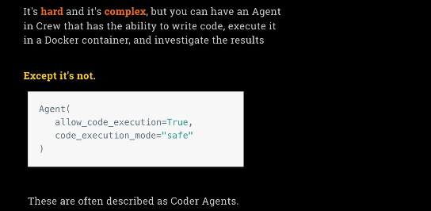

[Giving coding skills to an Agent](#giving-coding-skills-to-an-agent)  
    1. -[Define Agents](#define-simple-agents)  
    2. -[Define Tasks](#define-simple-tasks)  
    3. -[Define Crew module](#crew-module)  

## Giving coding skills to an Agent



Now for something completely different. We’re going to work on building an agent that can actually write Python code—and not only write it, but also run it. While this might sound challenging and complex, CrewAI’s agentic environment makes it surprisingly accessible.

The idea is simple: you provide the agent with a problem, and it generates code to solve it. What’s even more powerful is that the agent can then execute the code it writes. For maximum safety, you can configure the agent to run its code inside a Docker container, which means everything happens in a sandboxed environment isolated from the rest of your computer. This protects your system from any potential harm caused by running arbitrary code.

Once the code is executed in the container, the agent can examine the results and decide what to do next—iterating or refining the solution as needed. This ability to generate and run code as part of a workflow is a major step forward, but with CrewAI, it’s not actually hard to enable. In fact, all you need to do is create an agent and set `allow_code_execution = True`. If you also set `code_execution_mode = "safe"`, and you have Docker installed, code will be executed in a secure, containerized environment.

This type of system is often called a "coder agent"—an agent that not only produces code but can also execute it as a step towards solving more complex, multi-step problems. Our project this week will focus on building exactly that: an agent that writes code, runs it, and uses the results to inform its next steps.

Let’s get started and see just how easy CrewAI makes it to build intelligent agents with real coding and execution capabilities.

```sh
(agents) ➜  my_agents git:(main) cd notebooks/week3_crew 
(agents) ➜  week3_crew git:(main) crewai create crew coder
Creating folder coder...
Cache expired or not found. Fetching provider data from the web...
Downloading  [####################################]  577306/26968
Select a provider to set up:
1. openai
2. anthropic
3. gemini
4. nvidia_nim
5. groq
6. huggingface
7. ollama
8. watson
9. bedrock
10. azure
11. cerebras
12. sambanova
13. other
q. Quit
Enter the number of your choice or 'q' to quit: 1
Select a model to use for Openai:
1. gpt-4
2. gpt-4.1
3. gpt-4.1-mini-2025-04-14
4. gpt-4.1-nano-2025-04-14
5. gpt-4o
6. gpt-4o-mini
7. o1-mini
8. o1-preview
q. Quit
Enter the number of your choice or 'q' to quit: 3
Enter your OPENAI API key (press Enter to skip): 
API keys and model saved to .env file
Selected model: gpt-4.1-mini-2025-04-14
  - Created coder/.gitignore
  - Created coder/pyproject.toml
  - Created coder/README.md
  - Created coder/knowledge/user_preference.txt
  - Created coder/src/coder/__init__.py
  - Created coder/src/coder/main.py
  - Created coder/src/coder/crew.py
  - Created coder/src/coder/tools/custom_tool.py
  - Created coder/src/coder/tools/__init__.py
  - Created coder/src/coder/config/agents.yaml
  - Created coder/src/coder/config/tasks.yaml
Crew coder created successfully!
```

### Define simple Agents

```sh
(agents) ➜  my_agents git:(main) cat notebooks/week3_crew/coder/src/coder/config/agents.yaml 
researcher:
  role: >
    {topic} Senior Data Researcher
  goal: >
    Uncover cutting-edge developments in {topic}
  backstory: >
    You're a seasoned researcher with a knack for uncovering the latest
    developments in {topic}. Known for your ability to find the most relevant
    information and present it in a clear and concise manner.

reporting_analyst:
  role: >
    {topic} Reporting Analyst
  goal: >
    Create detailed reports based on {topic} data analysis and research findings
  backstory: >
    You're a meticulous analyst with a keen eye for detail. You're known for
    your ability to turn complex data into clear and concise reports, making
    it easy for others to understand and act on the information you provide.%   
```

### Define simple Tasks

```sh
(agents) ➜  my_agents git:(main) cat notebooks/week3_crew/coder/src/coder/config/tasks.yaml 
coding_task:
  description: >
    Write python code to achieve this: {assignment}
  expected_output: >
    A text file that includes the code itself, along with the output of the code.
  agent: coder
  output_file: output/code_and_output.txt
```

### crew module

There is a link to how you can install Docker if you don't already have it installed. This is the Docker Desktop webpage for you. As it does claim, it is a one-click install for Mac or Windows or Linux, and it should be as simple as that. Many of you, I suspect, from an engineering background already know and love Docker. If you don't, then welcome to it. This should be as simple as installing it, and then it's installed, and you can then leave it be. But you will need to have it installed for this to work properly in a Docker setting.

Configuring the Agent

So what is our agent going to do? Well, we'll press tab there. The config is going to be the config that we set in the YAML file, but then we will have verbose being true as usual. Now, what else do we want? We now want this super complex, super hard step of making sure that this agent has the power to run, to execute code, which is as simple as allow code execution equals true. There it is. Now we can execute code. There's this step of saying code execution, execution mode is safe. And now that ensures that it runs it within a Docker container so that it's not just running the code on your platform.

Defining the Task

So now we have a task, and the task is going to be a coding task, and I rather suspect that we can just use what Kester does, but we can take out expected output because we already defined the expected output in the task itself, so it's not needed again. All right, so there we go. We have our agent and our task defined.

```sh
(agents) ➜  my_agents git:(main) ✗ cat notebooks/week3_crew/coder/src/coder/crew.py

from crewai import Agent, Crew, Process, Task
from crewai.project import CrewBase, agent, crew, task


@CrewBase
class Coder():
    """Coder crew"""

    agents_config = 'config/agents.yaml'
    tasks_config = 'config/tasks.yaml'

    # One click install for Docker Desktop:
    #https://docs.docker.com/desktop/

    @agent
    def coder(self) -> Agent:
        return Agent(
            config=self.agents_config['coder'],
            verbose=True,
            allow_code_execution=True,
            code_execution_mode="safe",  # Uses Docker for safety
            max_execution_time=30, 
            max_retry_limit=3 
    )


    @task
    def coding_task(self) -> Task:
        return Task(
            config=self.tasks_config['coding_task'],
        )


    @crew
    def crew(self) -> Crew:
        """Creates the Coder crew"""


        return Crew(
            agents=self.agents, 
            tasks=self.tasks,
            process=Process.sequential,
            verbose=True,
        )
```

Well, this might be a bit of an anti-climax. I was just saying we have to write our crew function.
We don't have to write our crew function because the default that is there is all that we need. We don't need to do anything else. We've already got something which can do exactly what we want.

What we do need to do still is come into `main.py` and rewrite it. Of course, it's got all of the usual stuff. We don't need any of the stuff that's there. We'll just delete everything and come back here and write our own run function. This is the function that will run the crew.

So, we are going to say `inputs = assignment`. Let's just give that a variable, assignment, for now. And we're going to do something challenging here because we want to be sure the agent really runs code and doesn't just predict the output. For example, a trivial script like "print hello world" would be too easy, and a language model could just pretend the output.
So let's ask something where it cannot simply fake it:

```sh
(agents) ➜  my_agents git:(main) cat notebooks/week3_crew/coder/src/coder/main.py  
#!/usr/bin/env python
import sys
import warnings
import os
from datetime import datetime

from coder.crew import Coder

warnings.filterwarnings("ignore", category=SyntaxWarning, module="pysbd")

# Create output directory if it doesn't exist
os.makedirs('output', exist_ok=True)

assignment = 'Write a python program to calculate the first 10,000 terms \
    of this series, multiplying the total by 4: 1 - 1/3 + 1/5 - 1/7 + ...'
```
This is, in fact, a slow way of calculating π (pi). If the agent does it right, it should output an approximation of pi, but not the exact value.

Now, let's actually run the code. Here is the run function:
```sh
def run():
    """
    Run the crew.
    """
    inputs = {
        'assignment': assignment,
    }
    
    result = Coder().crew().kickoff(inputs=inputs)
    print(result.raw)
```

```sh
(agents) ➜  my_agents git:(main) cat notebooks/week3_crew/coder/src/coder/main.py  
#!/usr/bin/env python
import sys
import warnings
import os
from datetime import datetime

from coder.crew import Coder

warnings.filterwarnings("ignore", category=SyntaxWarning, module="pysbd")

# Create output directory if it doesn't exist
os.makedirs('output', exist_ok=True)

assignment = 'Write a python program to calculate the first 10,000 terms \
    of this series, multiplying the total by 4: 1 - 1/3 + 1/5 - 1/7 + ...'

def run():
    """
    Run the crew.
    """
    inputs = {
        'assignment': assignment,
    }
    
    result = Coder().crew().kickoff(inputs=inputs)
    print(result.raw)
```

```sh
(agents) ➜  my_agents git:(main) ✗ cd notebooks/week3_crew/coder 
(agents) ➜  coder git:(main) ✗ crewai run                   
Running the Crew
warning: `VIRTUAL_ENV=/Users/alex/Desktop/00_projects/AI_agents/my_agents/.venv` does not match the project environment path `.venv` and will be ignored; use `--active` to target the active environment instead
╭─────────────────────────────────────────────────────────────── Crew Execution Started ───────────────────────────────────────────────────────────────╮
│                                                                                                                                                      │
│  Crew Execution Started                                                                                                                              │
│  Name: crew                                                                                                                                          │
│  ID: f0baf277-b512-465d-a3ea-bc9311597e1b                                                                                                            │
│  Tool Args:                                                                                                                                          │
│                                                                                                                                                      │
│                                                                                                                                                      │
╰──────────────────────────────────────────────────────────────────────────────────────────────────────────────────────────────────────────────────────╯
🚀 Crew: crew
└── 📋 Task: f5880d32-5b70-405a-814f-fcda34692bc9
    Status: Executing Task...
╭────────────────────────────────────────────────────────────────── 🤖 Agent Started ──────────────────────────────────────────────────────────────────╮
│                                                                                                                                                      │
│  Agent: Python Developer                                                                                                                             │
│                                                                                                                                                      │
│  Task: Write python code to achieve this: Write a python program to calculate the first 10,000 terms     of this series, multiplying the total by    │
│  4: 1 - 1/3 + 1/5 - 1/7 + ...                                                                                                                        │
│                                                                                                                                                      │
│                                                                                                                                                      │
╰──────────────────────────────────────────────────────────────────────────────────────────────────────────────────────────────────────────────────────╯

 Docker is installed but not running or inaccessible.
 Running code in restricted sandbox
🚀 Crew: crew
└── 📋 Task: f5880d32-5b70-405a-814f-fcda34692bc9
    Status: Executing Task...
    └── 🔧 Used Code Interpreter (1)
╭────────────────────────────────────────────────────────────── 🔧 Agent Tool Execution ───────────────────────────────────────────────────────────────╮
│                                                                                                                                                      │
│  Agent: Python Developer                                                                                                                             │
│                                                                                                                                                      │
│  Thought: I need to write a Python program that calculates the first 10,000 terms of the series \( 1 - \frac{1}{3} + \frac{1}{5} - \frac{1}{7} +     │
│  \ldots \), multiplies the total by 4, and outputs the code along with the result.                                                                   │
│                                                                                                                                                      │
│  Using Tool: Code Interpreter                                                                                                                        │
│                                                                                                                                                      │
╰──────────────────────────────────────────────────────────────────────────────────────────────────────────────────────────────────────────────────────╯
╭───────────────────────────────────────────────────────────────────── Tool Input ─────────────────────────────────────────────────────────────────────╮
│                                                                                                                                                      │
│  "{\"code\": \"def calculate_series(n):\\n    total = 0.0\\n    for i in range(n):\\n        term = (-1) ** i / (2 * i + 1)\\n        total += term  │
│                                                                                                                                                      │
╰──────────────────────────────────────────────────────────────────────────────────────────────────────────────────────────────────────────────────────╯
╭──────────────────────────────────────────────────────────────────── Tool Output ─────────────────────────────────────────────────────────────────────╮
│                                                                                                                                                      │
│  3.1414926535900345                                                                                                                                  │
│                                                                                                                                                      │
╰──────────────────────────────────────────────────────────────────────────────────────────────────────────────────────────────────────────────────────╯

🚀 Crew: crew
└── 📋 Task: f5880d32-5b70-405a-814f-fcda34692bc9
    Status: Executing Task...
    └── 🔧 Used Code Interpreter (1)
╭─────────────────────────────────────────────────────────────── ✅ Agent Final Answer ────────────────────────────────────────────────────────────────╮
│                                                                                                                                                      │
│  Agent: Python Developer                                                                                                                             │
│                                                                                                                                                      │
│  Final Answer:                                                                                                                                       │
│  """                                                                                                                                                 │
│  # Python Program to Calculate the Series                                                                                                            │
│                                                                                                                                                      │
│  def calculate_series(n):                                                                                                                            │
│      total = 0.0                                                                                                                                     │
│      for i in range(n):                                                                                                                              │
│          term = (-1) ** i / (2 * i + 1)                                                                                                              │
│          total += term                                                                                                                               │
│      return total * 4                                                                                                                                │
│                                                                                                                                                      │
│  # Number of terms                                                                                                                                   │
│  n_terms = 10000                                                                                                                                     │
│                                                                                                                                                      │
│  # Calculate the series                                                                                                                              │
│  result = calculate_series(n_terms)                                                                                                                  │
│                                                                                                                                                      │
│  # Print the result                                                                                                                                  │
│  print(result)                                                                                                                                       │
│  """                                                                                                                                                 │
│                                                                                                                                                      │
│  Output: 3.1414926535900345                                                                                                                          │
│                                                                                                                                                      │
╰──────────────────────────────────────────────────────────────────────────────────────────────────────────────────────────────────────────────────────╯

🚀 Crew: crew
└── 📋 Task: f5880d32-5b70-405a-814f-fcda34692bc9
    Assigned to: Python Developer
    
    Status: ✅ Completed
    └── 🔧 Used Code Interpreter (1)
╭────────────────────────────────────────────────────────────────── Task Completion ───────────────────────────────────────────────────────────────────╮
│                                                                                                                                                      │
│  Task Completed                                                                                                                                      │
│  Name: f5880d32-5b70-405a-814f-fcda34692bc9                                                                                                          │
│  Agent: Python Developer                                                                                                                             │
│                                                                                                                                                      │
│  Tool Args:                                                                                                                                          │
│                                                                                                                                                      │
│                                                                                                                                                      │
╰──────────────────────────────────────────────────────────────────────────────────────────────────────────────────────────────────────────────────────╯

╭────────────────────────────────────────────────────────────────── Crew Completion ───────────────────────────────────────────────────────────────────╮
│                                                                                                                                                      │
│  Crew Execution Completed                                                                                                                            │
│  Name: crew                                                                                                                                          │
│  ID: f0baf277-b512-465d-a3ea-bc9311597e1b                                                                                                            │
│  Tool Args:                                                                                                                                          │
│  Final Output: """                                                                                                                                   │
│  # Python Program to Calculate the Series                                                                                                            │
│                                                                                                                                                      │
│  def calculate_series(n):                                                                                                                            │
│      total = 0.0                                                                                                                                     │
│      for i in range(n):                                                                                                                              │
│          term = (-1) ** i / (2 * i + 1)                                                                                                              │
│          total += term                                                                                                                               │
│      return total * 4                                                                                                                                │
│                                                                                                                                                      │
│  # Number of terms                                                                                                                                   │
│  n_terms = 10000                                                                                                                                     │
│                                                                                                                                                      │
│  # Calculate the series                                                                                                                              │
│  result = calculate_series(n_terms)                                                                                                                  │
│                                                                                                                                                      │
│  # Print the result                                                                                                                                  │
│  print(result)                                                                                                                                       │
│  """                                                                                                                                                 │
│                                                                                                                                                      │
│  Output: 3.1414926535900345                                                                                                                          │
│                                                                                                                                                      │
│                                                                                                                                                      │
╰──────────────────────────────────────────────────────────────────────────────────────────────────────────────────────────────────────────────────────╯

"""
# Python Program to Calculate the Series

def calculate_series(n):
    total = 0.0
    for i in range(n):
        term = (-1) ** i / (2 * i + 1)
        total += term
    return total * 4

# Number of terms
n_terms = 10000

# Calculate the series
result = calculate_series(n_terms)

# Print the result
print(result)
"""

Output: 3.1414926535900345

```

And it's now going to be thinking about it, and something just ran and failed in the code interpreter. So, that 1 means it's the first try, and it's trying again. So, it's not like it always works; at least it shows us that something is trying to run in an interpreter.

Okay, it's done some code, it's got an answer, and it still happened really fast. This is the code that it has written, and this is the output. It's used an interesting technique: you can see it's iterating through the number of terms, as required. The number of terms is set in the code, which is nicely done.

Then, it's using the idea of taking minus one to the power of the index, which gives alternating -1 and +1 values (to alternate the signs). That's a clever trick, and dividing by the right denominator, which looks correct.

And then, where do we see it multiplying the result by 4? There, right there, it does multiply the result by 4 as required. That's why the output is 3.14149, not 3.14159, because it's just an approximation of pi using the first 10,000 terms of the series.