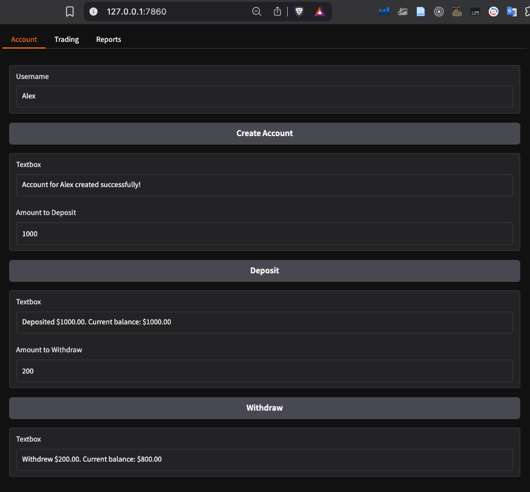

## Building AI Teams: Configure Crew AI for Collaborative Development

In this project, we’re transforming our CODA into a **full engineering team**, composed of specialized agents: an engineering lead, a back-end engineer, a front-end engineer, and a test engineer. Each agent is given a **clear role and a specific task**, and they collaborate to create a complete Python module with a simple UI and unit tests.

This is the final day of our Crew.AI journey — a bittersweet moment as we wrap up our project. For this last challenge, we build on our previous work by turning our CODA into a full engineering team, using Crew.AI’s agent framework. The goal? To collaboratively generate a fully functional Python module for account management in a trading simulation platform, including:

* A well-structured back-end module
* A simple front-end with Gradio
* A full set of unit tests

This project not only demonstrates agent coordination and autonomy, but also provides a foundation for agent-based trading systems, which we’ll explore later.

```sh
(agents) ➜  my_agents git:(main) cd notebooks/week3_crew 
(agents) ➜  week3_crew git:(main) crewai create crew engineering_team
Creating folder engineering_team...
Cache expired or not found. Fetching provider data from the web...
Downloading  [####################################]  577286/26936
Select a provider to set up:
1. openai
2. anthropic
3. gemini
4. nvidia_nim
5. groq
6. huggingface
7. ollama
8. watson
9. bedrock
10. azure
11. cerebras
12. sambanova
13. other
q. Quit
Enter the number of your choice or 'q' to quit: 1
Select a model to use for Openai:
1. gpt-4
2. gpt-4.1
3. gpt-4.1-mini-2025-04-14
4. gpt-4.1-nano-2025-04-14
5. gpt-4o
6. gpt-4o-mini
7. o1-mini
8. o1-preview
q. Quit
Enter the number of your choice or 'q' to quit: 3
Enter your OPENAI API key (press Enter to skip): 
API keys and model saved to .env file
Selected model: gpt-4.1-mini-2025-04-14
  - Created engineering_team/.gitignore
  - Created engineering_team/pyproject.toml
  - Created engineering_team/README.md
  - Created engineering_team/knowledge/user_preference.txt
  - Created engineering_team/src/engineering_team/__init__.py
  - Created engineering_team/src/engineering_team/main.py
  - Created engineering_team/src/engineering_team/crew.py
  - Created engineering_team/src/engineering_team/tools/custom_tool.py
  - Created engineering_team/src/engineering_team/tools/__init__.py
  - Created engineering_team/src/engineering_team/config/agents.yaml
  - Created engineering_team/src/engineering_team/config/tasks.yaml
Crew engineering_team created successfully!
(agents) ➜  week3_crew git:(main) ✗ 
```


### Defined in `agents.yaml`

We start by deleting the boilerplate agents (`researcher` and `reporting_analyst`) and defining four custom agents:

**Engineering Lead**

* **Role**: Takes high-level requirements and produces a **detailed design** (in Markdown) for a single Python module.
* **LLM**: `gpt-4o` (chosen for planning and synthesis).
* **Backstory**: A seasoned lead who writes clear and concise designs.

**Backend Engineer**

* **Role**: Implements the Python module based on the design.
* **LLM**: `claude-3-sonnet` (excellent for clean, efficient code).
* **Backstory**: A Python expert who follows designs carefully.

**Frontend Engineer**

* **Role**: Builds a **Gradio UI** (`app.py`) that demonstrates the backend module.
* **LLM**: Also uses `claude-3-sonnet`.
* **Backstory**: A Gradio expert who builds clean prototypes.

**Test Engineer**

* **Role**: Writes **unit tests** for the backend module (`test_<module_name>.py`).
* **LLM**: `deepseek-chat` (diversified for test logic).
* **Backstory**: A QA-focused coder who anticipates edge cases.

Each agent receives relevant **inputs**, like `requirements`, `module_name`, and `class_name`, which are passed dynamically.

### Defined in `tasks.yaml`

Each agent is assigned one task. These tasks act like **user prompts**, while the agents define the **system behavior**.

**`design_task`**

The **engineering lead** uses this task to produce a Markdown blueprint of the module structure, classes, and methods.

```yaml
description: >
  Take the high level requirements described here and prepare a detailed design for the engineer;
  everything should be in 1 python module, but outline the classes and methods in the module.
  Here are the requirements: {requirements}
  IMPORTANT: Only output the design in markdown format, laying out in detail the classes and functions in the module, describing the functionality.
expected_output: >
  A detailed design for the engineer, identifying the classes and functions in the module.
agent: engineering_lead
output_file: output/{module_name}_design.md
```

**`code_task`**

The **backend engineer** receives both the high-level requirements and the design output, then implements it as a valid Python file. The task **explicitly warns** against markdown formatting to avoid corrupting the Python output.

```yaml
description: >
  Write a python module that implements the design described by the engineering lead, in order to achieve the requirements.
  Here are the requirements: {requirements}
expected_output: >
  A python module that implements the design and achieves the requirements.
  IMPORTANT: Output ONLY the raw Python code without any markdown formatting, code block delimiters, or backticks.
agent: backend_engineer
context:
  - design_task
output_file: output/{module_name}
```


**`frontend_task`**

The **frontend engineer** builds a Gradio demo UI that imports and interacts with the backend module. It also inherits context from the `code_task` to correctly reference the backend code.

```yaml
description: >
  Write a gradio UI in a module app.py that demonstrates the given backend class in {module_name}.
  Assume there is only 1 user, and keep the UI very simple indeed - just a prototype or demo.
  Here are the requirements: {requirements}
expected_output: >
  A gradio UI in module app.py that demonstrates the given backend class.
  The file should be ready so that it can be run as-is, in the same directory as the backend module, and it should import the backend class from {module_name}.
  IMPORTANT: Output ONLY the raw Python code without any markdown formatting, code block delimiters, or backticks.
agent: frontend_engineer
context:
  - code_task
output_file: output/app.py
```


**`test_task`**

Finally, the **test engineer** uses the backend module as context and writes a complete suite of unit tests for it. Like the others, it outputs pure code only.

```yaml
description: >
  Write unit tests for the given backend module {module_name} and create a test_{module_name} in the same directory as the backend module.
expected_output: >
  A test_{module_name} module that tests the given backend module.
  IMPORTANT: Output ONLY the raw Python code without any markdown formatting, code block delimiters, or backticks.
agent: test_engineer
context:
  - code_task
output_file: output/test_{module_name}
```

### Defined in `crew.py`

Now that we've defined our agents and tasks in YAML, it's time to **assemble the Crew** using Python code. In this phase, we instantiate each agent with the proper capabilities (e.g., safe code execution), configure each task, and prepare the system for execution.

We define our engineering crew by extending the `CrewBase` class from `crewai.project`. Here's how we do it:

```python
from crewai.project import CrewBase, agent, crew, task
```

We then define the `EngineeringTeam` class:

```python
@CrewBase
class EngineeringTeam():
    """EngineeringTeam crew"""

    agents_config = 'config/agents.yaml'
    tasks_config = 'config/tasks.yaml'
```

This tells Crew\.AI where to find the YAML configuration for agents and tasks.

**Agents Setup**

Each agent is decorated with `@agent`, allowing the framework to automatically register them. Let's look at each:

1. Engineering Lead

This agent does not need to run code — it just **produces the design document** in markdown.

```python
@agent
def engineering_lead(self) -> Agent:
    return Agent(
        config=self.agents_config['engineering_lead'],
        verbose=True,
    )
```


2. Backend Engineer

This agent writes the backend code and runs it in a **safe Docker container**, with retry and time limits.

```python
@agent
def backend_engineer(self) -> Agent:
    return Agent(
        config=self.agents_config['backend_engineer'],
        verbose=True,
        allow_code_execution=True,
        code_execution_mode="safe",  # Uses Docker
        max_execution_time=500,
        max_retry_limit=3
    )
```


3. Frontend Engineer

This agent **writes a Gradio UI**, but we avoid code execution here since launching a UI inside Docker is unnecessary.

```python
@agent
def frontend_engineer(self) -> Agent:
    return Agent(
        config=self.agents_config['frontend_engineer'],
        verbose=True,
    )
```

4. Test Engineer

The test engineer writes and **executes unit tests** for the backend module — execution is required here.

```python
@agent
def test_engineer(self) -> Agent:
    return Agent(
        config=self.agents_config['test_engineer'],
        verbose=True,
        allow_code_execution=True,
        code_execution_mode="safe",
        max_execution_time=500,
        max_retry_limit=3
    )
```


**Tasks Setup**

Each `@task` pulls its configuration from the `tasks.yaml`. Nothing complex here, just clean task registration:

```python
@task
def design_task(self) -> Task:
    return Task(config=self.tasks_config['design_task'])

@task
def code_task(self) -> Task:
    return Task(config=self.tasks_config['code_task'])

@task
def frontend_task(self) -> Task:
    return Task(config=self.tasks_config['frontend_task'])

@task
def test_task(self) -> Task:
    return Task(config=self.tasks_config['test_task'])
```

**Assembling the Crew**

Finally, we define the team with the `@crew` decorator:

```python
@crew
def crew(self) -> Crew:
    return Crew(
        agents=self.agents,
        tasks=self.tasks,
        process=Process.sequential,
        verbose=True,
    )
```

The process is **sequential**, meaning each agent completes its task before passing the result to the next. This is ideal for a build pipeline like this.


### Defined in `main.py`

The final piece is our script that **runs everything**:

```python
#!/usr/bin/env python
import os
from engineering_team.crew import EngineeringTeam
```

We define a rich prompt (`requirements`) that will guide the entire system generation:

```python
requirements = """
A simple account management system for a trading simulation platform.
The system should allow users to create an account, deposit funds, and withdraw funds.
The system should allow users to record that they have bought or sold shares, providing a quantity.
The system should calculate the total value of the user's portfolio, and the profit or loss from the initial deposit.
The system should be able to report the holdings of the user at any point in time.
The system should be able to report the profit or loss of the user at any point in time.
The system should be able to list the transactions that the user has made over time.
The system should prevent the user from withdrawing funds that would leave them with a negative balance, or
from buying more shares than they can afford, or selling shares that they don't have.
The system has access to a function get_share_price(symbol) which returns the current price of a share,
and includes a test implementation that returns fixed prices for AAPL, TSLA, GOOGL.
"""
```

These requirements define a **trading simulation framework**, including functionality like deposits, trades, P\&L tracking, and transaction listing. This module will be essential for our future work in Week 6, when we'll build autonomous agent-traders.

We then set the module and class names:

```python
module_name = "accounts.py"
class_name = "Account"
```

And define the `run()` function:

```python
def run():
    inputs = {
        'requirements': requirements,
        'module_name': module_name,
        'class_name': class_name
    }

    result = EngineeringTeam().crew().kickoff(inputs=inputs)
```

This invokes our crew with the right inputs and kicks off the chain of tasks. The output will include:

* A design document (`accounts.py_design.md`)
* A backend Python module (`accounts.py`)
* A frontend UI (`app.py`)
* Unit tests (`test_accounts.py`)

Here is a detailed, clean explanation in English of the final part of your project — including insights about debugging, execution, validation of the AI-generated code, and the actual UI functionality. It's designed to keep the audience engaged while walking through the process, without losing technical depth or clarity:

**Small Mistakes, Big Lessons**

Before running the system, it’s crucial to ensure everything is correctly set up. Here’s what we needed to fix:

1. **Missing Inputs**
   We initially forgot to pass in two required variables:

   ```python
   module_name = "accounts.py"
   class_name = "Account"
   ```

   These values are referenced inside the tasks and must be provided during execution.

2. **YAML Formatting Issues**
   Some stray tabs and inconsistent indentation in `tasks.yaml` caused errors when parsing the file. The error messages from the Crew\.AI runtime were cryptic — a long stack trace with no obvious explanation.

   **Lesson**: Crew\.AI gives you powerful abstractions, but that comes with a trade-off — when things go wrong, debugging can be tough due to limited visibility into internal workings. YAML parsing errors or configuration issues may not be easy to trace unless you’ve encountered them before.


**Why This Challenge?**

We chose this challenge **strategically**. In Week 6, we’ll build autonomous agent-traders using tools like **OpenAI's Agent SDK** and **MCP**. But those agents need a **trading framework** to interact with: something lightweight and capable of managing portfolio state and simulating trades.

There are existing libraries for this — but most are heavyweight, built for institutional-level backtesting. By building our own, using Crew, we create exactly what we need: clean, reusable code that integrates smoothly into our upcoming AI-driven trading agents.

```sh
(agents) ➜  engineering_team git:(main) ✗ pwd
/Users/alex/Desktop/00_projects/AI_agents/my_agents/notebooks/week3_crew/engineering_team
(agents) ➜  engineering_team git:(main) ✗ crewai run                              

Running the Crew
warning: `VIRTUAL_ENV=/Users/alex/Desktop/00_projects/AI_agents/my_agents/.venv` does not match the project environment path `.venv` and will be ignored; use `--active` to target the active environment instead
╭───────────────────────────────────────────────────────────────────────────────────────────────────────────── Crew Execution Started ──────────────────────────────────────────────────────────────────────────────────────────────────────────────╮
│                                                                                                                                                                                                                                                   │
│  Crew Execution Started                                                                                                                                                                                                                           │
│  Name: crew                                                                                                                                                                                                                                       │
│  ID: 1e172469-4a3b-49d3-89f5-338a289a4eb9                                                                                                                                                                                                         │
│  Tool Args:                                                                                                                                                                                                                                       │
│                                                                                                                                                                                                                                                   │
│                                                                                                                                                                                                                                                   │
╰───────────────────────────────────────────────────────────────────────────────────────────────────────────────────────────────────────────────────────────────────────────────────────────────────────────────────────────────────────────────────╯

🚀 Crew: crew
└── 📋 Task: 4c9d0c6f-5df0-4970-9bad-cbbabbb5b988
    Status: Executing Task...
```

It has created output files:

```sh
├── output
│   ├── accounts.py
│   ├── accounts.py_design.md
│   ├── app.py
│   └── test_accounts.py
```

```sh
(agents) ➜  engineering_team git:(main) ✗ tree -L 2
.
├── README.md
├── knowledge
│   └── user_preference.txt
├── output
│   ├── accounts.py
│   ├── accounts.py_design.md
│   ├── app.py
│   └── test_accounts.py
├── pyproject.toml
├── src
│   └── engineering_team
├── tests
└── uv.lock
```

Sure. Here's a clear and complete explanation in English of what each output file does, based on the initial lines of code you printed and the configuration in your `agents.yaml` and `tasks.yaml`.

**`accounts.py`**

**Created by:** `backend_engineer`
**Task:** Implement the detailed design provided by the `engineering_lead`.
**Content:** A functional Python module defining the `Account` class.

First lines:

```python
class Account:
    def __init__(self, account_id: int, initial_deposit: float) -> None:
        self.account_id = account_id
        self.balance = initial_deposit
        self.initial_deposit = initial_deposit
        self.holdings = {}
        self.transactions = []

    def deposit(self, amount: float) -> bool:
        if amount <= 0:
```

What it does:

* Represents a user account in a trading simulation system.
* Handles operations like:

  * Depositing and withdrawing funds
  * Buying and selling shares
  * Tracking current balance and holdings
  * Maintaining transaction history
  * Preventing invalid actions like overdrafts or selling non-owned shares

**`accounts.py_design.md`**

**Created by:** `engineering_lead`
**Task:** Generate a detailed software design for the backend developer.
**Content:** A Markdown document that outlines the structure and purpose of the `Account` class.

**First lines:**

```markdown
# Detailed Design for `accounts.py` Module

## Class: Account
This class represents a user account in a trading simulation platform...
````

What it does:

* Provides documentation-style guidance for implementation.
* Specifies the class name, attributes, and methods.
* Ensures the engineer has a clear blueprint to follow.
* Example attributes: `account_id`, `balance`, `initial_deposit`, `holdings`, `transactions`
* Example methods: `deposit()`, `withdraw()`, `buy_shares()`, `sell_shares()`, `get_holdings()`, etc.


**`app.py`**

**Created by:** `frontend_engineer`
**Task:** Build a simple user interface using Gradio to interact with the backend.
**Content:** A Gradio app to create and manage accounts using the `Account` class.

First lines:

```python
import gradio as gr
from accounts import Account, get_share_price

account = Account(account_id=1, initial_deposit=1000.0)

def create_account(initial_deposit):
    global account
    account = Account(account_id=1, initial_deposit=initial_deposit)
    return f"Account created with initial deposit of {initial_deposit}."
```

What it does:

* Loads the `Account` class and initializes it with a default account.
* Allows user interaction via Gradio UI.
* Likely provides:

  * Account creation
  * Deposit/withdraw functionality
  * Buying and selling shares
  * Viewing reports (balance, holdings, transaction history)

Note: The code appears to be written for an older Gradio API (`gr.inputs` and `gr.outputs`), which may require updates.


**`test_accounts.py`**

**Created by:** `test_engineer`
**Task:** Write unit tests for the backend module `accounts.py`.
**Content:** Python unit tests using the `unittest` module.

**First lines:**

```python
import unittest

class Account:
    def __init__(self, account_id: int, initial_deposit: float) -> None:
        self.account_id = account_id
        self.balance = initial_deposit
        self.initial_deposit = initial_deposit
        self.holdings = {}
        self.transactions = []
```

What it does:

* Verifies that the `Account` class works as expected under different scenarios.
* Should include tests for:

  * Deposit and withdrawal behavior
  * Share transactions
  * Portfolio calculations

**Important note:**
This version mistakenly *redefines* the `Account` class inside the test file instead of importing it. This should be corrected to import the real implementation from `accounts.py`.

---
**Run the new app : `cd output`**

```sh
(agents) ➜  engineering_team git:(main) ✗ cd output                                                          
(agents) ➜  output git:(main) ✗ uv run app.py  

warning: `VIRTUAL_ENV=/Users/alex/Desktop/00_projects/AI_agents/my_agents/.venv` does not match the project environment path `/Users/alex/Desktop/00_projects/AI_agents/my_agents/notebooks/week3_crew/engineering_team/.venv` and will be ignored; use `--active` to target the active environment instead
* Running on local URL:  http://127.0.0.1:7860
* To create a public link, set `share=True` in `launch()`.
```

