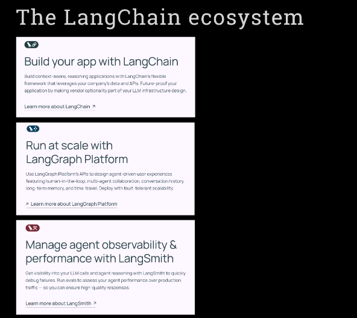
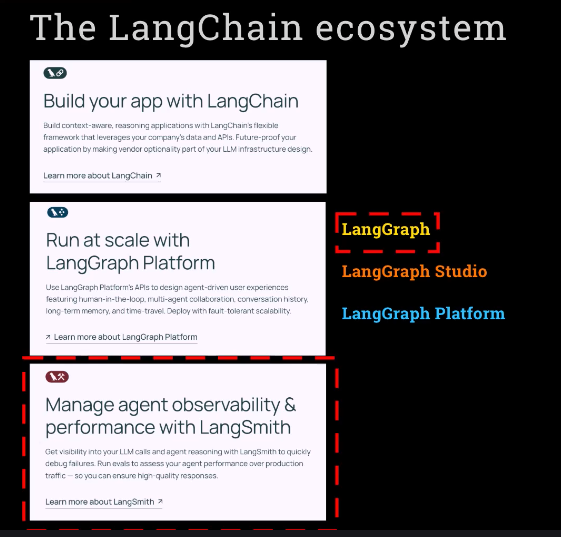
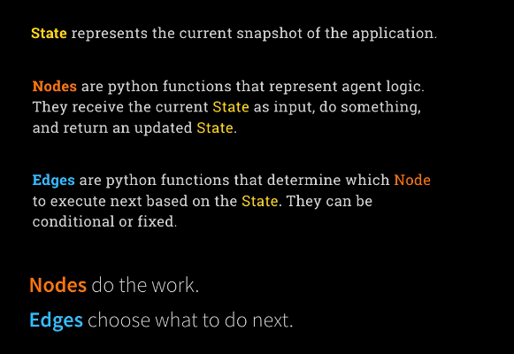
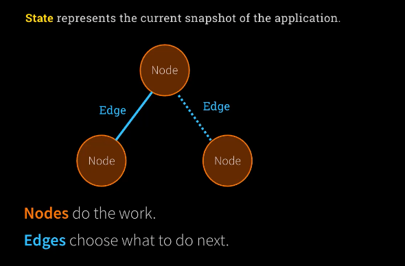
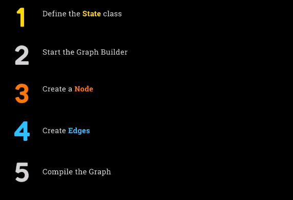
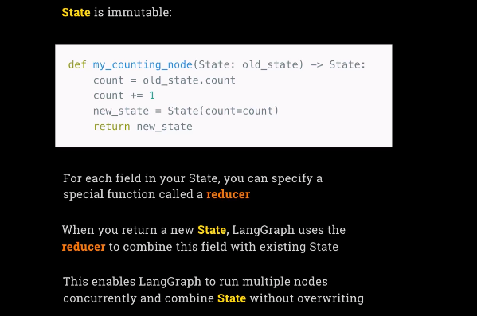
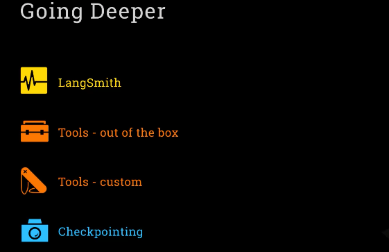
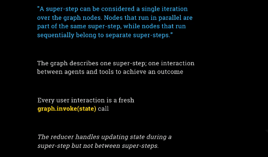
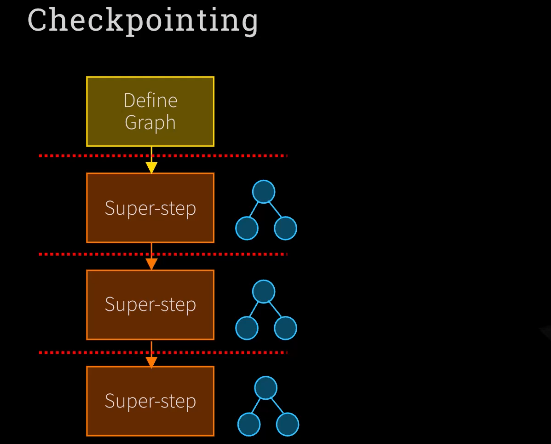
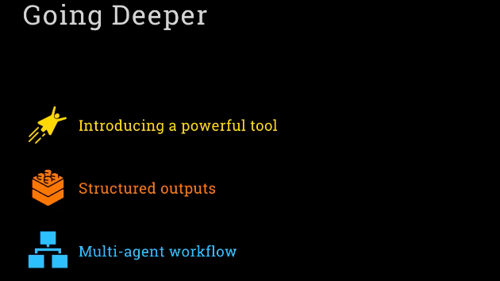

  - [LangGraph Explained](#langgraph-explained)
    - [Graph-Based Architecture for Robust AI Agents](#graph-based-architecture-for-robust-ai-agents)
    - [Core Components for Building Advanced Agent Systems](#core-components-for-building-advanced-agent-systems-)
  - [LangGraph Deep Dive](#langgraph-deep-dive)
    - [Managing State in Graph-Based Agent Workflows](#managing-state-in-graph-based-agent-workflows)
  - [Mastering LangGraph](#mastering-langgraph)
    - [How to Define State Objects & Use Reducers : 1_lab1](#how-to-define-state-objects--use-reducers)
    - [Super-Step & checkpoint explained](#super-step--checkpoint-explained)
    - [Setting Up Langsmith & Creating Custom Tools for LangGraph Applications](#setting-up-langsmith--creating-custom-tools-for-langgraph-applications)
    

## LangGraph Explained

### Graph-Based Architecture for Robust AI Agents

At the end of it, there's something really fun to show you with real business value. I've had business value from this already myself, from this project that we built. Generally, I want to say that this week, Week 4, is actually quite a short week. Because I feel like we've got deep into OpenAI, HSSDK, and CRU. And we've done a lot that's covered familiar ground. Now, the things that we do, both actually with Langroth and with Autogen, are going to have a lot in common. So we're not going to need to go into quite the same amount of detail. We'll be moving a bit more briskly through, but I'll be giving you plenty of the briefing, and giving you the ability to go off and build your own projects with Langroth, if it happens to tick the right boxes for you.

**Introducing the Ecosystem: Clarifying LangChain, Langroth, and LangSmith**

Alright, let's get into it. But before we even get into Langroth, I know what you're thinking. You're confused. You're confused about LangChain and Langroth. And maybe you're also confused about LangSmith, if you've heard of that. It is the trio of products offered by LangChain. And you may be unclear about how Langroth fits into it, and why aren't we going through LangChain. And it would be a great question, and it's one that I intend to clarify for you right now.

**1. LangChain: Background and Features**

This is the LangChain ecosystem. I could think of no better way of showing it than by taking little snapshots from their website. So, LangChain. LangChain is where it began. It's been around for many years now. It was one of the earliest of the abstraction frameworks that was there. Its initial kind of raison d'etre was that if you were building very bespoke integrations with different APIs, it was painful. If you needed to change, say, from using GPT to using Claude, you had to redo a lot of work. So they had the idea of building abstractions.

Then, when it turned out that a lot of people were writing applications which involved a call to an LLM, followed by another, followed by another, it sort of turned into this idea of chaining together your calls. And LangChain really took root and became something that's quite advanced and supports things like RAG. For people that do my LLM engineering course, we use LangChain for a RAG implementation.

It supports things like prompt templates—a sort of high-level construct built on top of prompting. It supports memory in a very robust way, allowing you to build memory that you keep in memory, or that you keep in RAM, or that you persist in a database. And it has various memory models, I guess not unlike the things that we saw from CRU. But there's a bit more stuff. There are a few more abstractions and things to learn about. They also have their own declarative language, L-C-E-L, as well. So there's a lot of depth to LangChain. And it's really building a kind of engineering discipline around the art of working with LLMs and putting some scaffolding and some templates and some well-solidified code with things like good prompt practices around calling LLMs. And it's been extremely successful in that regard.

It also allows you to do things like abstract using tools. And so from that point of view, it does in fact support building agentic infrastructure. So you can use LangChain, and you can use LangChain's workflows to build agent platforms. But it sort of predates the recent explosion and excitement with agents, so it's working at a more simplistic level. It's not their main agent platform offering. It's more of their glue code for building any application using LLMs.

You've probably heard me say that I have something of a love-hate relationship with LangChain. I definitely appreciate its power and the way that with very little code, indeed, you can get up and running with a lot of functionality, like building a RAG pipeline in like four lines of code. Having said that, I do also see some drawbacks. And it's very similar to the drawbacks I was talking about with the more opinionated aspects of CRU. It's that by signing up for a lot of the abstractions and a lot of the glue code that comes in the box with LangChain, you're signing up for their way of doing things, and you have a bit less visibility into the actual prompts going on behind the scenes.

And over time, the APIs into LLMs have become more and more similar. Anthropic is a little bit of an odd one out, but everybody else has really converged on OpenAI's endpoints and on their structure. So it's become extremely simple to interact directly with LLMs. Handling memory is something that is also very simple to do yourself, because memory is really just the JSON blob of the conversations that you've had with the model. You can handle that JSON yourself. You can persist it as you want. You can combine memory in different ways. So I see in some projects, there's less need to sign up for a big ecosystem around, say, persisting memory.

But, again, there are pros and cons. There's definitely strong benefits to working with LangChain, and with all of the significant engineering and problems that have already been solved that comes with it. Okay, so that's LangChain and my mini-van. Thank you for putting up with that.

**2. What Is Langroth (LandGraph)?**

Let's go on to talk about what is Landgraf, then. So on the website, this is how it's positioned: "Run at scale with Landgraf platform." As we'll talk about in a minute, Landgraf platform is actually one of the parts of Landgraf, but Landgraf itself is a bit bigger than that. It's confusing on the website that they really push Landgraf platform in this way. But let me tell you what I think Landgraf is.

Landgraf is a separate offering from the company LangChain, from the same people. It actually is independent from LangChain. So whilst when you're working with Landgraf, you can use LangChain code to actually call LLMs and to do various things with LLMs—you can do, it's optional—you can really use any framework, or you can just call LLMs directly with LandGraph.

LandGraph is all about a platform that focuses on stability, resiliency, and repeatability in worlds where you're solving problems that involve a lot of interconnected processes, like an agentic platform. It's an abstraction layer that allows you to organize your thinking around a workflow of different activities that could have feedback loops; it could have times when humans need to get involved; it could have moments when you need to keep memory. It allows you to organize all of that in a very repeatable and easily monitored and stable and scalable way.

That's what LandGraph is. And the word graph gives some of it away. It's all built around graphs—graphs being kind of tree structures of how to think about your workflow. It imagines all workflows, anything that you might have going between agents in the form of a tree: a tree of nodes which are connected together, which represent different things that can happen at different points in your agentic workflow. By thinking of it in this abstract way and by putting sort of belts and braces around each point in this graph, they're able to bring stability and resiliency to a world that is a bit unpredictable and has people have resiliency concerns about agentic AI.

So that's really their approach, that's the problem they're trying to solve, and you can see if you read the detail there, that they're saying: "We use this to design agent-driven user experiences featuring things like human-in-the-loop, multi-agent collaboration, conversation history, memory, and what they call time travel," which is all about being able to checkpoint where you are in the process and be able to step backwards if you need to, to restore where you were as of any point in time. Deploy with tolerant scalability, full tolerance and scalability, meaning that anything can go down and it will keep running, and that's a bit of the LandGraph platform thrown in there.

So that's what LandGraph is all about. It's not necessarily related to LangChain—it is a framework for robustly running complex agent workflows, giving you that kind of stability and monitoring.

**3. Monitoring: Introducing LangSmith**

Although I used the word "monitoring" there—and that was perhaps the wrong word to use—it gives the ability to monitor, but it doesn't actually do the monitoring itself, because LangChain has a third product called LangSmith, which is their kind of monitoring tooling. LandGraph connects with LangSmith, so you can use LangSmith to monitor what's going on in your LandGraph graph, but LangSmith is a separate offering, and LangSmith can be used when working with LangChain or with LandGraph. And we will use LangSmith, we will use that so that we can see things going on, and it gives you, as it says here, visibility into your calls and your reasoning to quickly debug failures.

**How the Products Line Up & Final Clarification**

So that is how the different products line up. It is a bit confusing, because you can use LangChain to build agent workflows, it has an abstraction layer over things like tool calling, but LandGraph is the core offering that's the modern offering that's designed to meet the excitement of today's agentic AI, and the particular thing that they're focused on is the kind of scaling in a resilient, robust, repeatable way.

**LangGraph: The Three Offerings**

| Name                      | What it is                                                                                                                           | Analogy (CrewAI)       | Purpose                                                   |
| ------------------------- | ------------------------------------------------------------------------------------------------------------------------------------ | ---------------------- | --------------------------------------------------------- |
| **LangGraph (Framework)** | The core open-source framework for building agentic workflows as graphs of nodes and edges.                                          | CrewAI framework       | Build and run agent workflows on your own infrastructure. |
| **LangGraph Studio**      | Visual builder UI for constructing graphs (drag-and-drop, visual workflow design).                                                   | CrewAI Studio (visual) | Makes building and connecting agents/nodes visual.        |
| **LangGraph Platform**    | The hosted/cloud commercial service for deploying and running LangGraph graphs at scale, with integrations and reliability features. | CrewAI Enterprise      | "Push-button" scalable, production hosting, and extras.   |

**Note:**

* **LangGraph Platform** is heavily promoted on their site because it’s their business model (hosted, paid, SaaS-style offering).
* For **Week 4**, you’ll be focusing on *LangGraph the framework* (just like with CrewAI’s open framework).

### **[Key Industry Perspective: Anthropic’s Blog Post](https://www.anthropic.com/engineering/building-effective-agents) :**

**Anthropic’s View on Agentic Frameworks:**

>*Frameworks* like LangGraph, CrewAI, Autogen, and OpenAI Agents SDK make getting started easier (abstractions for >tools, LLMs, memory, etc.). But… **Abstractions = Less Transparency:**
>
>  * More abstraction means less direct control and visibility into LLM prompts/responses.
>  * Can make debugging/troubleshooting harder.
>  * Can encourage unnecessary complexity (“just because you can chain it, should you?”).
>

**Anthropic’s Suggestion:**
>
>  * *Start simple.* Use direct LLM API calls. Memory can be just JSON. Most design patterns need only a few lines >of code.
>  * If you do use frameworks, make sure you understand what’s happening *under the hood*.
>

**Why This Matters**
>
>* **LangGraph’s Philosophy:**
>
>  * Build *structure*, robustness, and monitoring into complex, real-world agentic systems via formalized graphs, >nodes, checkpoints, etc.
>* **Anthropic’s Philosophy:**
>
>  * Start *lean*. Don’t overcomplicate. Favor transparency and direct code for clarity and control.
>
---

**TL;DR: Takeaways for You**

* **LangGraph is both a framework, a visual builder, and a hosted platform.**
  You’ll focus on the *framework* (the open-source code) in Week 4.
* **LangGraph Platform** is promoted heavily because it’s the commercial business model.
* **Industry wisdom (Anthropic):**
  Don’t get lost in layers of abstraction—understand the fundamentals, and use frameworks wisely, not blindly.

**Summary Sentence:**
> LangGraph is a robust toolkit for building agentic AI at scale (framework, UI, and platform), but always remember: while abstraction is powerful, the best practitioners keep the fundamentals and simplicity in view—*especially* when it comes to understanding, debugging, and controlling your AI systems.

Would you like:

* A diagram or table showing how these three “LangGraph” offerings relate to each other?
* A quick visual of the “start simple, add abstraction carefully” advice from Anthropic?
* Or a short hands-on LangGraph starter example?

### Core Components for Building Advanced Agent Systems :

**Setting the Stage: New Terminology and Concepts**

Before we dive into LangGraph, I want to set some expectations. With LangGraph, you’ll encounter new terminology and a few concepts that might seem unfamiliar at first. I realize it can feel jarring to put all the Crew AI ideas aside and switch gears into a new system, but don’t worry—this transition will go quickly. We’ll repeat the most important terms several times until they become second nature, and soon, you’ll find yourself thinking in LangGraph concepts without effort.

**Core Concepts: How LangGraph Describes Workflows**

Let’s get to the heart of LangGraph. In LangGraph, what you might think of as “agent workflows” are described as a graph. If you have a background in computer science, this might sound familiar: a graph is a structure a bit like a tree, where elements are connected to each other in a hierarchy, and each element can depend on others. This idea of representing your workflows as a graph is absolutely central to how LangGraph works.

**The Role of State**

Next, let’s talk about the idea of state. In LangGraph, “state” means the current snapshot of everything your application knows—the current situation, if you will. It’s an object that holds all the information about what’s happening, and it’s shared everywhere throughout your workflow. The concept of state is fundamental: it’s information, not a function. We’ll be talking about state constantly as you build with LangGraph. One key detail to remember is that state is immutable: rather than changing the existing state, every operation creates and returns a new state reflecting any updates. This is an important difference from simply editing a variable in place.

**Nodes: Functions That Do the Work**

Now let’s discuss nodes. In the context of graphs, you might expect nodes to be data, but in LangGraph, nodes are actually Python functions. Each node represents a piece of logic—an operation that your agent will perform. When a node runs, it receives the current state as input, does something (like calling an LLM, saving a file, or triggering a side effect), and then returns a new state as output. This can feel confusing at first if you’re used to thinking of nodes as data points, but in LangGraph, a node is where your business logic lives.

**Edges: Connecting the Dots**

Of course, a graph is more than just a collection of nodes—it’s about how they’re connected. In LangGraph, those connections are called edges, and they’re also represented as Python functions. An edge decides, based on the current state, which node should be executed next. Sometimes, the connection is straightforward—when one node finishes, the next one always runs. Other times, it’s conditional: maybe the workflow only moves to a certain node if a specific condition is met. In this way, edges act as the logic for what happens next, allowing for complex, branching workflows.

**Bringing It Together: How Workflows Progress**

So, to sum up so far: nodes perform the tasks, edges determine the flow, and state carries all the information through the process. When a node runs, it works with the current state and returns an updated state. The edge then decides what the next step should be, possibly based on the new state. This cycle repeats, moving through your workflow as defined by the graph.

**Visualizing the Flow**

It’s helpful to imagine this process visually. Picture several nodes, each representing an operation. They’re connected by edges—some unconditional, some conditional. As your workflow runs, state is passed from node to node along these edges, with each node performing its logic and each edge deciding what comes next. Sometimes, a node will simply lead to another, but in other cases, whether or not a path is taken will depend on the state.

**Building a Graph: The Five Key Steps**

Now that you understand the basic pieces, let’s look at the practical process of building a workflow in LangGraph. There are five main steps:

1. Define your state class—this is the blueprint for the state objects your workflow will use. You won’t create a single state object; instead, new state objects are created throughout the workflow as updates occur.

2. Start a graph builder—this is where you begin laying out all the nodes in your workflow. At this point, nothing is running; you’re just defining the structure.

3. Create nodes—for each action or piece of logic your workflow needs, you’ll define a node (as a Python function).

4. Create edges—these determine how nodes are connected and under what conditions the workflow should move from one node to another. You might repeat steps three and four multiple times as you build out your full workflow.

5. Compile and run the graph—once you’ve defined all nodes and edges, you compile the graph. Only then does your agent system come to life and begin running through your defined process.

Two-Phase Execution: Defining vs. Running
This introduces a pattern you might not be used to in Python programming. In LangGraph, running your application always involves two distinct phases. First, there’s a setup phase where you lay out the workflow—defining the graph, the state, nodes, and edges. After this “meta” phase, you enter the execution phase, where the system actually runs according to the structure you’ve defined. Both phases are essential parts of working with LangGraph.

## LangGraph Deep Dive

### Managing State in Graph-Based Agent Workflows

Now that you’ve had a moment to let the LineGraph concepts "marinate", it's time to **move from theory to practice**. But first, let’s revisit a few core ideas (repetition helps).

**LineGraph = Graph-Based Agentic Systems:**

In LineGraph, your **agent workflow** is structured as a **graph** — essentially a tree of decision-making logic.

* **Nodes and Edges**: These are Python functions.

  * A **node** performs some action using the current state and returns a new state.
  * An **edge** decides what comes next after a node executes.

* **State**: A state is a snapshot of the world at any one time, and is central to how everything flows.

**The 5-Step Graph Building Process:**

Before your agents even start running, LineGraph goes through a **five-step graph-building phase**. It’s like setting up a blueprint before execution begins:

1. **Define a State class** – this class stores all the information you'll be tracking.
2. **Start the Graph Builder** – this is the context for defining your graph.
3. **Create Node(s)** – functions that perform actions and return new states.
4. **Create Edge(s)** – links between nodes that decide the execution path.
5. **Compile the Graph** – finalize the structure, and now you’re ready to run the agent workflow.

This “pre-phase” runs *before* any actual agent is executed.

**The Concept of Immutable State:**

This part is **crucial**: State objects are **immutable**. That means:

* You **never** modify the state object directly.
* Instead, each node **returns a new state** object that reflects changes.

For example, a node called `myCountingNode`:

You take the `old_state`, read its `count`, increment it, and return a **brand-new** `State` with the new value. This avoids bugs, race conditions, and maintains clean historical snapshots.

**Why Reducers Matter:**

LineGraph lets you **add special functions to your state fields** called **reducers**.

* A **reducer** defines how to merge an **old value** and a **new value** for a particular field.
* This becomes useful when **multiple nodes run concurrently** and each returns a different new state.
* Instead of states conflicting or overwriting each other, LineGraph uses the reducer to **safely combine** the values.

**Why not just handle that logic inside the node?:**

Because **concurrency**. Imagine two nodes running in parallel. Without reducers, you'd have one node's output wipe out another’s. With reducers, LineGraph can **intelligently merge results** (e.g. summing counts or combining lists), keeping your graph safe and deterministic.

## Mastering LangGraph

### How to Define State Objects & Use Reducers

> [1_lab1](./1_lab1.ipynb)
---

### Super-Step & Checkpoint Explained

This is going to be the time that Landgraf is going to start to pay dividends. The investment that we've made in understanding the new terminology is going to come together, and we're going to see some real value. But first, as always, I have to give you a quick recap again. You're going to get bored of it, but it's better that you get bored of it and you understand it. So before you can call graph.invoke, which is how you kick off your graph, you have to define it. Defining it is these five steps. Define your state class, the graph builder, create a node, edges, and compile the graph. Just a quick refresher, I'm sure you've got this all committed to memory now.

**Going Deeper**

Okay, so what are we actually going to cover today? Well, there's going to be a few ways we're going to go deeper into the world of Landgraf. First of all, we're going to look at Landsmith and have a moment of understanding how information gets logged there. We're then going to look at tools, tool calling, something we've done many times now, using the out-of-the-box tools that come with Landgraf. And then we're going to build a custom tool, again, something we've done many times, so we'll see that working. And we'll finally end with checkpointing, which is a very important part of it indeed. And to tee that up, to motivate checkpointing, I want to talk for a moment about something called the super step. So what's a super step? 

**The Super-Step**

Well, a super step starts with a dox. The super step they define as a single iteration over the graph nodes. Nodes that run in parallel are part of the same super step. Nodes that run sequentially belong to a separate super step. So what does that mean exactly? Now this is super, super important. Super steps are super important. And it's something which you have to get your head around. And it definitely may not be what you're expecting. So a graph defines one set of interactions between agents and their use of tools and perhaps delegating to other agents, if you think back to the handoff of an OpenAI agent's SDK. So one invocation of the graph is just one kind of step. It's like when the user says one message. Putting that message to our LLM, that is one invocation of the entire graph all the way through from top to bottom. And if then it comes back to the user with a response, and the user types in another message, that's another invocation of the whole graph. And each of these invocations is a super step. Every time you invoke the graph, that is a super step. And so, yeah, it's important to get your head around it because you might initially think that maybe you could imagine that a node is like a human and a node is a chatbot. And that a graph is human and chatbot going backwards and forwards. But no, every time that there is that kind of human interaction, you should think of that as a whole invocation of the graph. Or in some situations, you might be resuming the graph from one point if it was paused for a human to respond. So there's various ways of doing it. But each of these interactions is considered an entire super step. Within a super step, one invocation of the graph belongs to activities which happen in parallel as part of that step. So, this is a bit of a passive, but yeah, the graph describes one full super step. An interaction between agents and tools and potentially multiple agents to achieve an outcome. Every user interaction, it's a fresh invoke call. It's a fresh time. You're calling graph.invoke. There's also a graph.resume. But the point remains, it's a fresh call. And the reducer that I talked about, the thing that is able to combine the state that comes out of a call with the original state, that applies during carrying out a single super step. That is how state is managed across the graph. That's how if multiple nodes update the same state, the state gets combined at the end. That's what the reducer is handling. But the reducer doesn't handle the separate super steps. A separate super step is an entirely fresh invocation of the graph. So, that's going to be a bit confusing. So what does that mean? 

**How it all fits together**

To show that visually, next I want to draw you a diagram. So with this diagram, it's now all going to become crystal clear. I'm confident. It all begins with defining the graph. As I keep saying, this is the five things you've got to do, including defining the nodes, the edges, and compiling the graph. And then you're set. The next thing you do is perhaps the user has a question. And that question is what you then use to invoke the graph. There you go. And that is called a super step. And out pops some kind of an answer after the agents and tools have done their thing. And then the user says something, a follow up question. Like something else. And that would be another super step. And then that might happen again with another follow up or with another external activity. Each of these are super steps. Complete invocations of the graph. So just to make that really obvious, I'm putting a little picture of a graph by each one. The whole graph is invoked each time. And that is what it means to have a super step. And why am I going on about this? Because when it comes to memory, when it comes to preserving context between these different calls, we need to involve something called checkpointing. Which is something that LandGraph makes available to us to be able to keep track, to sort of freeze a record of the state after each super step. So we've got that tracked. And then next time we call a super step, it can recall the state exactly as it was checkpointed. And that is one of the things that we could be doing in the lab right now.

* Setting Up Langsmith & Creating Custom Tools for LangGraph Applications
* LangGraph Tool Calling: Working with Conditional Edges & Tool Nodes
* LangGraph Checkpointing: How to Maintain Memory Between Conversations
* Building Persistent AI Memory with SQLite: LangGraph State Management

---
> [2_lab2](./2_lab2.ipynb)
---

## Playwright Integration with LangGraph: Creating Web-Browsing AI Agents

So look, I don't know if you're anything like me, but I'm having something of a change of heart. So, I started this week quite clearly with OpenAI, Agents SDK as my favorite, and obviously with Kuru as my second favorite, and being a little bit skeptical of Landgraf because you sign up for a lot. But I'm coming around. I'm having a really great time, and what I've got to show you today, I feel like you're going to be there right there with me. I'm actually becoming a serious fan of Landgraf, and there's some really cool stuff, so see what you think. I'm suddenly feeling treacherous against OpenAI, Agents SDK. So welcome to week 4, day 4, introducing a new project, Sidekick, and I can't wait to tell you about it. 

So what are we going to do today? How are we going to go deeper? You know, we always go a bit deeper with each of these. So first of all, I'm going to introduce, I'm going to unveil a new tool, which is going to be incredibly powerful, and which is going to allow us to do very different things. We're going to talk about structured outputs, something that's been a recurring theme we've done on each of these. We'll use it here, too. And we're also going to build a proper multi-agent workflow in Landgraf so that you see it really coming together, the equivalent of a handoff in OpenAI, Agents SDK, or having a crew of agents. So we will be doing that. 

And as a reminder on the diagram I did last time that brings it all together, remember the terminology, a super step is a complete invocation of the graph, and each super step represents like one user input coming in and then flowing through your graph of agents and tools, and then those blue diagrams are representing the graph that gets executed. The state is managed through that graph and reduces the calls to make sure that the state object, which is an immutable object, is maintained and managed through that. But between the super steps, you use checkpointing as your way of maintaining state, and checkpointing is very powerful and lets you do things like rewind the clock and put your state back to any prior point. So with that quick recap, let's go to the lab. All right, so we get started in week four, and we're going to go to lab number three, week four, day four, lab three, and it's, as I say, the start of an awesome project. I am super happy with this, I hope you will be too.

---
> [3_lab3](./3_lab3.ipynb)
--- 

