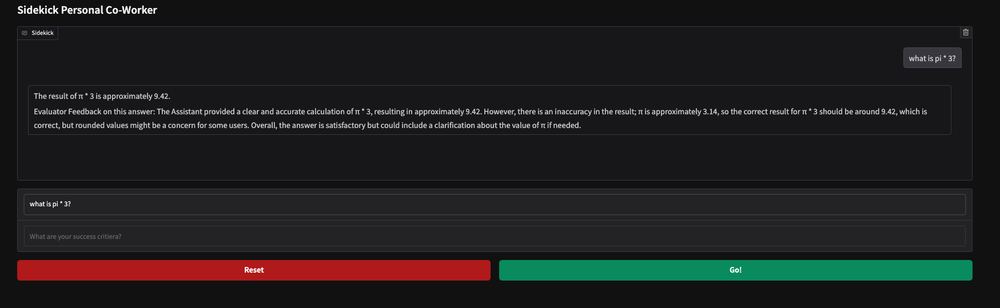
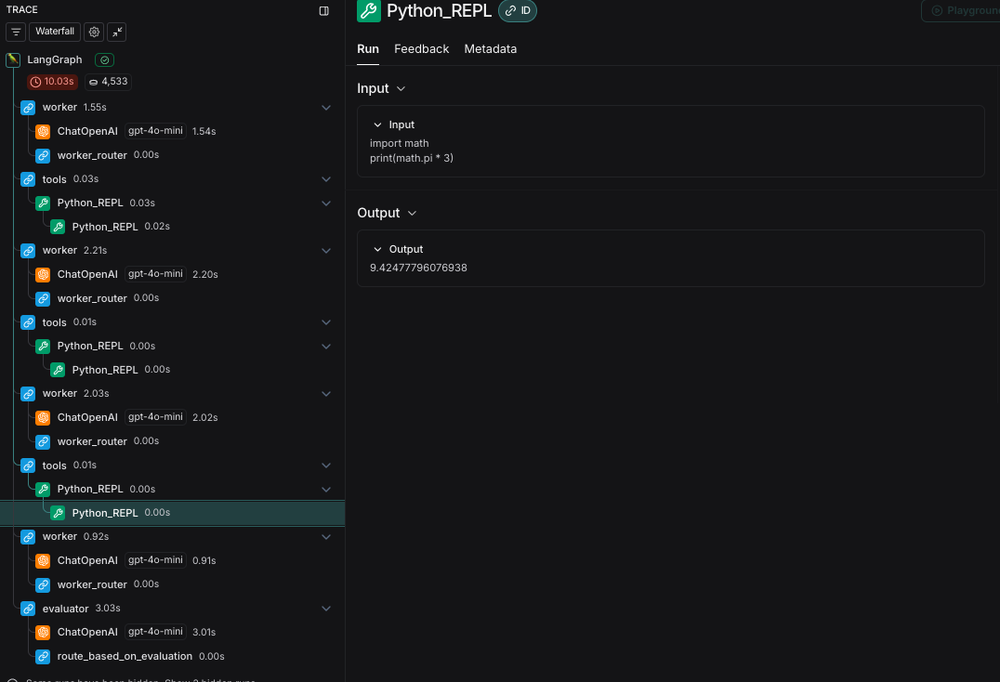
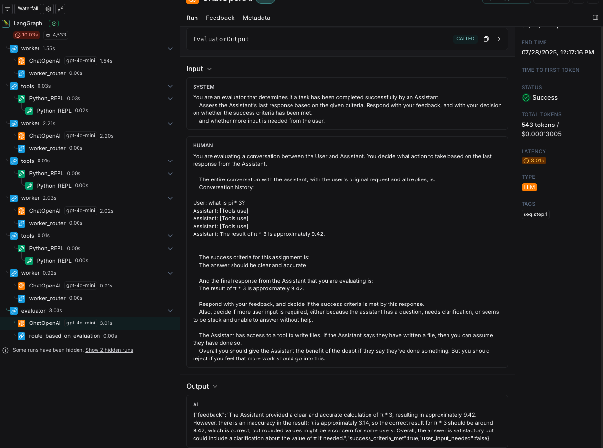
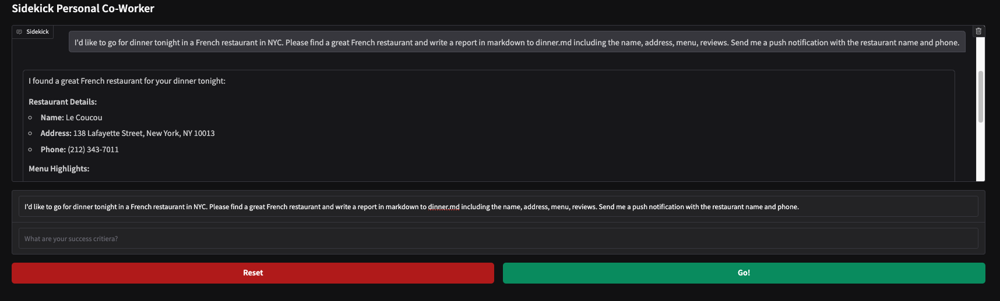
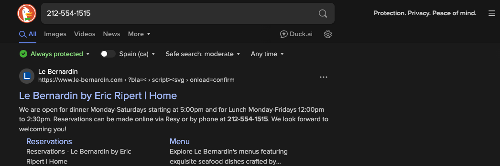
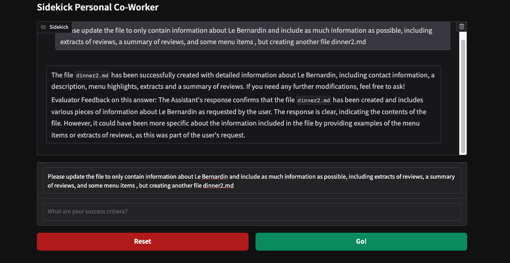

- [LangGraph Explained](#langgraph-explained)
  - [Graph-Based Architecture for Robust AI Agents](#graph-based-architecture-for-robust-ai-agents)
  - [Core Components for Building Advanced Agent Systems](#core-components-for-building-advanced-agent-systems-)
- [LangGraph Deep Dive](#langgraph-deep-dive)
  - [Managing State in Graph-Based Agent Workflows](#managing-state-in-graph-based-agent-workflows)
- [Mastering LangGraph](#mastering-langgraph)
  - [How to Define State Objects & Use Reducers : 1_lab1](#how-to-define-state-objects--use-reducers)
  - [Super-Step & checkpoint explained](#super-step--checkpoint-explained)
  - [Setting Up Langsmith & Creating Custom Tools for LangGraph Applications](#setting-up-langsmith--creating-custom-tools-for-langgraph-applications)
- [Playwright Integration with LangGraph: Creating Web-Browsing AI Agents](#playwright-integration-with-langgraph-creating-web-browsing-ai-agents)
- [Agentic AI: Add Web Search, File System & Python REPL to Your Assistant](#agentic-ai-add-web-search-file-system--python-repl-to-your-assistant)
- [1. sidekick tools](#1-sidekick_toolspy)
- [2. sidekick.py](#2-sidekickpy)
- [3. app](#3-apppy)
- [4. `sidekick.py` — The Agent Graph and Node Logic](#4-sidekickpy--the-agent-graph-and-node-logic)
- [5. App.py: The Gradio User Interface for Sidekick](#5-apppy-the-gradio-user-interface-for-sidekick)
- [From Tools Definition to Real Agent Feedback: The Complete Sidekick Walkthrough](#from-tools-definition-to-real-agent-feedback-the-complete-sidekick-walkthrough)
    

## LangGraph Explained

### Graph-Based Architecture for Robust AI Agents


At the end of it, there's something really fun to show you with real business value. I've had business value from this already myself, from this project that we built. Generally, I want to say that this week, Week 4, is actually quite a short week. Because I feel like we've got deep into OpenAI, HSSDK, and CRU. And we've done a lot that's covered familiar ground. Now, the things that we do, both actually with Langroth and with Autogen, are going to have a lot in common. So we're not going to need to go into quite the same amount of detail. We'll be moving a bit more briskly through, but I'll be giving you plenty of the briefing, and giving you the ability to go off and build your own projects with Langroth, if it happens to tick the right boxes for you.

**Introducing the Ecosystem: Clarifying LangChain, Langroth, and LangSmith**

Alright, let's get into it. But before we even get into Langroth, I know what you're thinking. You're confused. You're confused about LangChain and Langroth. And maybe you're also confused about LangSmith, if you've heard of that. It is the trio of products offered by LangChain. And you may be unclear about how Langroth fits into it, and why aren't we going through LangChain. And it would be a great question, and it's one that I intend to clarify for you right now.

**1. LangChain: Background and Features**

This is the LangChain ecosystem. I could think of no better way of showing it than by taking little snapshots from their website. So, LangChain. LangChain is where it began. It's been around for many years now. It was one of the earliest of the abstraction frameworks that was there. Its initial kind of raison d'etre was that if you were building very bespoke integrations with different APIs, it was painful. If you needed to change, say, from using GPT to using Claude, you had to redo a lot of work. So they had the idea of building abstractions.

Then, when it turned out that a lot of people were writing applications which involved a call to an LLM, followed by another, followed by another, it sort of turned into this idea of chaining together your calls. And LangChain really took root and became something that's quite advanced and supports things like RAG. For people that do my LLM engineering course, we use LangChain for a RAG implementation.

It supports things like prompt templates—a sort of high-level construct built on top of prompting. It supports memory in a very robust way, allowing you to build memory that you keep in memory, or that you keep in RAM, or that you persist in a database. And it has various memory models, I guess not unlike the things that we saw from CRU. But there's a bit more stuff. There are a few more abstractions and things to learn about. They also have their own declarative language, L-C-E-L, as well. So there's a lot of depth to LangChain. And it's really building a kind of engineering discipline around the art of working with LLMs and putting some scaffolding and some templates and some well-solidified code with things like good prompt practices around calling LLMs. And it's been extremely successful in that regard.

It also allows you to do things like abstract using tools. And so from that point of view, it does in fact support building agentic infrastructure. So you can use LangChain, and you can use LangChain's workflows to build agent platforms. But it sort of predates the recent explosion and excitement with agents, so it's working at a more simplistic level. It's not their main agent platform offering. It's more of their glue code for building any application using LLMs.

You've probably heard me say that I have something of a love-hate relationship with LangChain. I definitely appreciate its power and the way that with very little code, indeed, you can get up and running with a lot of functionality, like building a RAG pipeline in like four lines of code. Having said that, I do also see some drawbacks. And it's very similar to the drawbacks I was talking about with the more opinionated aspects of CRU. It's that by signing up for a lot of the abstractions and a lot of the glue code that comes in the box with LangChain, you're signing up for their way of doing things, and you have a bit less visibility into the actual prompts going on behind the scenes.

And over time, the APIs into LLMs have become more and more similar. Anthropic is a little bit of an odd one out, but everybody else has really converged on OpenAI's endpoints and on their structure. So it's become extremely simple to interact directly with LLMs. Handling memory is something that is also very simple to do yourself, because memory is really just the JSON blob of the conversations that you've had with the model. You can handle that JSON yourself. You can persist it as you want. You can combine memory in different ways. So I see in some projects, there's less need to sign up for a big ecosystem around, say, persisting memory.

But, again, there are pros and cons. There's definitely strong benefits to working with LangChain, and with all of the significant engineering and problems that have already been solved that comes with it. Okay, so that's LangChain and my mini-van. Thank you for putting up with that.

**2. What Is Langroth (LandGraph)?**

Let's go on to talk about what is Landgraf, then. So on the website, this is how it's positioned: "Run at scale with Landgraf platform." As we'll talk about in a minute, Landgraf platform is actually one of the parts of Landgraf, but Landgraf itself is a bit bigger than that. It's confusing on the website that they really push Landgraf platform in this way. But let me tell you what I think Landgraf is.

Landgraf is a separate offering from the company LangChain, from the same people. It actually is independent from LangChain. So whilst when you're working with Landgraf, you can use LangChain code to actually call LLMs and to do various things with LLMs—you can do, it's optional—you can really use any framework, or you can just call LLMs directly with LandGraph.

LandGraph is all about a platform that focuses on stability, resiliency, and repeatability in worlds where you're solving problems that involve a lot of interconnected processes, like an agentic platform. It's an abstraction layer that allows you to organize your thinking around a workflow of different activities that could have feedback loops; it could have times when humans need to get involved; it could have moments when you need to keep memory. It allows you to organize all of that in a very repeatable and easily monitored and stable and scalable way.

That's what LandGraph is. And the word graph gives some of it away. It's all built around graphs—graphs being kind of tree structures of how to think about your workflow. It imagines all workflows, anything that you might have going between agents in the form of a tree: a tree of nodes which are connected together, which represent different things that can happen at different points in your agentic workflow. By thinking of it in this abstract way and by putting sort of belts and braces around each point in this graph, they're able to bring stability and resiliency to a world that is a bit unpredictable and has people have resiliency concerns about agentic AI.

So that's really their approach, that's the problem they're trying to solve, and you can see if you read the detail there, that they're saying: "We use this to design agent-driven user experiences featuring things like human-in-the-loop, multi-agent collaboration, conversation history, memory, and what they call time travel," which is all about being able to checkpoint where you are in the process and be able to step backwards if you need to, to restore where you were as of any point in time. Deploy with tolerant scalability, full tolerance and scalability, meaning that anything can go down and it will keep running, and that's a bit of the LandGraph platform thrown in there.

So that's what LandGraph is all about. It's not necessarily related to LangChain—it is a framework for robustly running complex agent workflows, giving you that kind of stability and monitoring.

**3. Monitoring: Introducing LangSmith**

Although I used the word "monitoring" there—and that was perhaps the wrong word to use—it gives the ability to monitor, but it doesn't actually do the monitoring itself, because LangChain has a third product called LangSmith, which is their kind of monitoring tooling. LandGraph connects with LangSmith, so you can use LangSmith to monitor what's going on in your LandGraph graph, but LangSmith is a separate offering, and LangSmith can be used when working with LangChain or with LandGraph. And we will use LangSmith, we will use that so that we can see things going on, and it gives you, as it says here, visibility into your calls and your reasoning to quickly debug failures.

**How the Products Line Up & Final Clarification**

So that is how the different products line up. It is a bit confusing, because you can use LangChain to build agent workflows, it has an abstraction layer over things like tool calling, but LandGraph is the core offering that's the modern offering that's designed to meet the excitement of today's agentic AI, and the particular thing that they're focused on is the kind of scaling in a resilient, robust, repeatable way.


**LangGraph: The Three Offerings**


| Name                      | What it is                                                                                                                           | Analogy (CrewAI)       | Purpose                                                   |
| ------------------------- | ------------------------------------------------------------------------------------------------------------------------------------ | ---------------------- | --------------------------------------------------------- |
| **LangGraph (Framework)** | The core open-source framework for building agentic workflows as graphs of nodes and edges.                                          | CrewAI framework       | Build and run agent workflows on your own infrastructure. |
| **LangGraph Studio**      | Visual builder UI for constructing graphs (drag-and-drop, visual workflow design).                                                   | CrewAI Studio (visual) | Makes building and connecting agents/nodes visual.        |
| **LangGraph Platform**    | The hosted/cloud commercial service for deploying and running LangGraph graphs at scale, with integrations and reliability features. | CrewAI Enterprise      | "Push-button" scalable, production hosting, and extras.   |

**Note:**

* **LangGraph Platform** is heavily promoted on their site because it’s their business model (hosted, paid, SaaS-style offering).
* For **Week 4**, you’ll be focusing on *LangGraph the framework* (just like with CrewAI’s open framework).

### **[Key Industry Perspective: Anthropic’s Blog Post](https://www.anthropic.com/engineering/building-effective-agents) :**

**Anthropic’s View on Agentic Frameworks:**

>*Frameworks* like LangGraph, CrewAI, Autogen, and OpenAI Agents SDK make getting started easier (abstractions for >tools, LLMs, memory, etc.). But… **Abstractions = Less Transparency:**
>
>  * More abstraction means less direct control and visibility into LLM prompts/responses.
>  * Can make debugging/troubleshooting harder.
>  * Can encourage unnecessary complexity (“just because you can chain it, should you?”).
>

**Anthropic’s Suggestion:**
>
>  * *Start simple.* Use direct LLM API calls. Memory can be just JSON. Most design patterns need only a few lines >of code.
>  * If you do use frameworks, make sure you understand what’s happening *under the hood*.
>

**Why This Matters**
>
>* **LangGraph’s Philosophy:**
>
>  * Build *structure*, robustness, and monitoring into complex, real-world agentic systems via formalized graphs, >nodes, checkpoints, etc.
>* **Anthropic’s Philosophy:**
>
>  * Start *lean*. Don’t overcomplicate. Favor transparency and direct code for clarity and control.
>
---


**TL;DR: Takeaways for You**

* **LangGraph is both a framework, a visual builder, and a hosted platform.**
  You’ll focus on the *framework* (the open-source code) in Week 4.
* **LangGraph Platform** is promoted heavily because it’s the commercial business model.
* **Industry wisdom (Anthropic):**
  Don’t get lost in layers of abstraction—understand the fundamentals, and use frameworks wisely, not blindly.


**Summary Sentence:**
> LangGraph is a robust toolkit for building agentic AI at scale (framework, UI, and platform), but always remember: while abstraction is powerful, the best practitioners keep the fundamentals and simplicity in view—*especially* when it comes to understanding, debugging, and controlling your AI systems.

Would you like:

* A diagram or table showing how these three “LangGraph” offerings relate to each other?
* A quick visual of the “start simple, add abstraction carefully” advice from Anthropic?
* Or a short hands-on LangGraph starter example?


### Core Components for Building Advanced Agent Systems :


**Setting the Stage: New Terminology and Concepts**

Before we dive into LangGraph, I want to set some expectations. With LangGraph, you’ll encounter new terminology and a few concepts that might seem unfamiliar at first. I realize it can feel jarring to put all the Crew AI ideas aside and switch gears into a new system, but don’t worry—this transition will go quickly. We’ll repeat the most important terms several times until they become second nature, and soon, you’ll find yourself thinking in LangGraph concepts without effort.

**Core Concepts: How LangGraph Describes Workflows**

Let’s get to the heart of LangGraph. In LangGraph, what you might think of as “agent workflows” are described as a graph. If you have a background in computer science, this might sound familiar: a graph is a structure a bit like a tree, where elements are connected to each other in a hierarchy, and each element can depend on others. This idea of representing your workflows as a graph is absolutely central to how LangGraph works.

**The Role of State**

Next, let’s talk about the idea of state. In LangGraph, “state” means the current snapshot of everything your application knows—the current situation, if you will. It’s an object that holds all the information about what’s happening, and it’s shared everywhere throughout your workflow. The concept of state is fundamental: it’s information, not a function. We’ll be talking about state constantly as you build with LangGraph. One key detail to remember is that state is immutable: rather than changing the existing state, every operation creates and returns a new state reflecting any updates. This is an important difference from simply editing a variable in place.


**Nodes: Functions That Do the Work**

Now let’s discuss nodes. In the context of graphs, you might expect nodes to be data, but in LangGraph, nodes are actually Python functions. Each node represents a piece of logic—an operation that your agent will perform. When a node runs, it receives the current state as input, does something (like calling an LLM, saving a file, or triggering a side effect), and then returns a new state as output. This can feel confusing at first if you’re used to thinking of nodes as data points, but in LangGraph, a node is where your business logic lives.

**Edges: Connecting the Dots**

Of course, a graph is more than just a collection of nodes—it’s about how they’re connected. In LangGraph, those connections are called edges, and they’re also represented as Python functions. An edge decides, based on the current state, which node should be executed next. Sometimes, the connection is straightforward—when one node finishes, the next one always runs. Other times, it’s conditional: maybe the workflow only moves to a certain node if a specific condition is met. In this way, edges act as the logic for what happens next, allowing for complex, branching workflows.

**Bringing It Together: How Workflows Progress**

So, to sum up so far: nodes perform the tasks, edges determine the flow, and state carries all the information through the process. When a node runs, it works with the current state and returns an updated state. The edge then decides what the next step should be, possibly based on the new state. This cycle repeats, moving through your workflow as defined by the graph.


**Visualizing the Flow**

It’s helpful to imagine this process visually. Picture several nodes, each representing an operation. They’re connected by edges—some unconditional, some conditional. As your workflow runs, state is passed from node to node along these edges, with each node performing its logic and each edge deciding what comes next. Sometimes, a node will simply lead to another, but in other cases, whether or not a path is taken will depend on the state.


**Building a Graph: The Five Key Steps**

Now that you understand the basic pieces, let’s look at the practical process of building a workflow in LangGraph. There are five main steps:

1. Define your state class—this is the blueprint for the state objects your workflow will use. You won’t create a single state object; instead, new state objects are created throughout the workflow as updates occur.

2. Start a graph builder—this is where you begin laying out all the nodes in your workflow. At this point, nothing is running; you’re just defining the structure.

3. Create nodes—for each action or piece of logic your workflow needs, you’ll define a node (as a Python function).

4. Create edges—these determine how nodes are connected and under what conditions the workflow should move from one node to another. You might repeat steps three and four multiple times as you build out your full workflow.

5. Compile and run the graph—once you’ve defined all nodes and edges, you compile the graph. Only then does your agent system come to life and begin running through your defined process.

Two-Phase Execution: Defining vs. Running
This introduces a pattern you might not be used to in Python programming. In LangGraph, running your application always involves two distinct phases. First, there’s a setup phase where you lay out the workflow—defining the graph, the state, nodes, and edges. After this “meta” phase, you enter the execution phase, where the system actually runs according to the structure you’ve defined. Both phases are essential parts of working with LangGraph.

## LangGraph Deep Dive

### Managing State in Graph-Based Agent Workflows

Now that you’ve had a moment to let the LineGraph concepts "marinate", it's time to **move from theory to practice**. But first, let’s revisit a few core ideas (repetition helps).

**LineGraph = Graph-Based Agentic Systems:**

In LineGraph, your **agent workflow** is structured as a **graph** — essentially a tree of decision-making logic.

* **Nodes and Edges**: These are Python functions.

  * A **node** performs some action using the current state and returns a new state.
  * An **edge** decides what comes next after a node executes.

* **State**: A state is a snapshot of the world at any one time, and is central to how everything flows.

**The 5-Step Graph Building Process:**

Before your agents even start running, LineGraph goes through a **five-step graph-building phase**. It’s like setting up a blueprint before execution begins:

1. **Define a State class** – this class stores all the information you'll be tracking.
2. **Start the Graph Builder** – this is the context for defining your graph.
3. **Create Node(s)** – functions that perform actions and return new states.
4. **Create Edge(s)** – links between nodes that decide the execution path.
5. **Compile the Graph** – finalize the structure, and now you’re ready to run the agent workflow.

This “pre-phase” runs *before* any actual agent is executed.

**The Concept of Immutable State:**

This part is **crucial**: State objects are **immutable**. That means:

* You **never** modify the state object directly.
* Instead, each node **returns a new state** object that reflects changes.

For example, a node called `myCountingNode`:


You take the `old_state`, read its `count`, increment it, and return a **brand-new** `State` with the new value. This avoids bugs, race conditions, and maintains clean historical snapshots.

**Why Reducers Matter:**

LineGraph lets you **add special functions to your state fields** called **reducers**.

* A **reducer** defines how to merge an **old value** and a **new value** for a particular field.
* This becomes useful when **multiple nodes run concurrently** and each returns a different new state.
* Instead of states conflicting or overwriting each other, LineGraph uses the reducer to **safely combine** the values.

**Why not just handle that logic inside the node?:**

Because **concurrency**. Imagine two nodes running in parallel. Without reducers, you'd have one node's output wipe out another’s. With reducers, LineGraph can **intelligently merge results** (e.g. summing counts or combining lists), keeping your graph safe and deterministic.


## Mastering LangGraph

### How to Define State Objects & Use Reducers


> [1_lab1](./1_lab1.ipynb)
---

### Super-Step & Checkpoint Explained


This is going to be the time that Landgraf is going to start to pay dividends. The investment that we've made in understanding the new terminology is going to come together, and we're going to see some real value. But first, as always, I have to give you a quick recap again. You're going to get bored of it, but it's better that you get bored of it and you understand it. So before you can call graph.invoke, which is how you kick off your graph, you have to define it. Defining it is these five steps. Define your state class, the graph builder, create a node, edges, and compile the graph. Just a quick refresher, I'm sure you've got this all committed to memory now.

**Going Deeper**


Okay, so what are we actually going to cover today? Well, there's going to be a few ways we're going to go deeper into the world of Landgraf. First of all, we're going to look at Landsmith and have a moment of understanding how information gets logged there. We're then going to look at tools, tool calling, something we've done many times now, using the out-of-the-box tools that come with Landgraf. And then we're going to build a custom tool, again, something we've done many times, so we'll see that working. And we'll finally end with checkpointing, which is a very important part of it indeed. And to tee that up, to motivate checkpointing, I want to talk for a moment about something called the super step. So what's a super step? 

**The Super-Step**


Well, a super step starts with a dox. The super step they define as a single iteration over the graph nodes. Nodes that run in parallel are part of the same super step. Nodes that run sequentially belong to a separate super step. So what does that mean exactly? Now this is super, super important. Super steps are super important. And it's something which you have to get your head around. And it definitely may not be what you're expecting. So a graph defines one set of interactions between agents and their use of tools and perhaps delegating to other agents, if you think back to the handoff of an OpenAI agent's SDK. So one invocation of the graph is just one kind of step. It's like when the user says one message. Putting that message to our LLM, that is one invocation of the entire graph all the way through from top to bottom. And if then it comes back to the user with a response, and the user types in another message, that's another invocation of the whole graph. And each of these invocations is a super step. Every time you invoke the graph, that is a super step. And so, yeah, it's important to get your head around it because you might initially think that maybe you could imagine that a node is like a human and a node is a chatbot. And that a graph is human and chatbot going backwards and forwards. But no, every time that there is that kind of human interaction, you should think of that as a whole invocation of the graph. Or in some situations, you might be resuming the graph from one point if it was paused for a human to respond. So there's various ways of doing it. But each of these interactions is considered an entire super step. Within a super step, one invocation of the graph belongs to activities which happen in parallel as part of that step. So, this is a bit of a passive, but yeah, the graph describes one full super step. An interaction between agents and tools and potentially multiple agents to achieve an outcome. Every user interaction, it's a fresh invoke call. It's a fresh time. You're calling graph.invoke. There's also a graph.resume. But the point remains, it's a fresh call. And the reducer that I talked about, the thing that is able to combine the state that comes out of a call with the original state, that applies during carrying out a single super step. That is how state is managed across the graph. That's how if multiple nodes update the same state, the state gets combined at the end. That's what the reducer is handling. But the reducer doesn't handle the separate super steps. A separate super step is an entirely fresh invocation of the graph. So, that's going to be a bit confusing. So what does that mean? 

**How it all fits together**


To show that visually, next I want to draw you a diagram. So with this diagram, it's now all going to become crystal clear. I'm confident. It all begins with defining the graph. As I keep saying, this is the five things you've got to do, including defining the nodes, the edges, and compiling the graph. And then you're set. The next thing you do is perhaps the user has a question. And that question is what you then use to invoke the graph. There you go. And that is called a super step. And out pops some kind of an answer after the agents and tools have done their thing. And then the user says something, a follow up question. Like something else. And that would be another super step. And then that might happen again with another follow up or with another external activity. Each of these are super steps. Complete invocations of the graph. So just to make that really obvious, I'm putting a little picture of a graph by each one. The whole graph is invoked each time. And that is what it means to have a super step. And why am I going on about this? Because when it comes to memory, when it comes to preserving context between these different calls, we need to involve something called checkpointing. Which is something that LandGraph makes available to us to be able to keep track, to sort of freeze a record of the state after each super step. So we've got that tracked. And then next time we call a super step, it can recall the state exactly as it was checkpointed. And that is one of the things that we could be doing in the lab right now.

* Setting Up Langsmith & Creating Custom Tools for LangGraph Applications
* LangGraph Tool Calling: Working with Conditional Edges & Tool Nodes
* LangGraph Checkpointing: How to Maintain Memory Between Conversations
* Building Persistent AI Memory with SQLite: LangGraph State Management

---
> [2_lab2](./2_lab2.ipynb)
---

## Playwright Integration with LangGraph: Creating Web-Browsing AI Agents

So look, I don't know if you're anything like me, but I'm having something of a change of heart. So, I started this week quite clearly with OpenAI, Agents SDK as my favorite, and obviously with Kuru as my second favorite, and being a little bit skeptical of Landgraf because you sign up for a lot. But I'm coming around. I'm having a really great time, and what I've got to show you today, I feel like you're going to be there right there with me. I'm actually becoming a serious fan of Landgraf, and there's some really cool stuff, so see what you think. I'm suddenly feeling treacherous against OpenAI, Agents SDK. So welcome to week 4, day 4, introducing a new project, Sidekick, and I can't wait to tell you about it. 


So what are we going to do today? How are we going to go deeper? You know, we always go a bit deeper with each of these. So first of all, I'm going to introduce, I'm going to unveil a new tool, which is going to be incredibly powerful, and which is going to allow us to do very different things. We're going to talk about structured outputs, something that's been a recurring theme we've done on each of these. We'll use it here, too. And we're also going to build a proper multi-agent workflow in Landgraf so that you see it really coming together, the equivalent of a handoff in OpenAI, Agents SDK, or having a crew of agents. So we will be doing that. 


And as a reminder on the diagram I did last time that brings it all together, remember the terminology, a super step is a complete invocation of the graph, and each super step represents like one user input coming in and then flowing through your graph of agents and tools, and then those blue diagrams are representing the graph that gets executed. The state is managed through that graph and reduces the calls to make sure that the state object, which is an immutable object, is maintained and managed through that. But between the super steps, you use checkpointing as your way of maintaining state, and checkpointing is very powerful and lets you do things like rewind the clock and put your state back to any prior point. So with that quick recap, let's go to the lab. All right, so we get started in week four, and we're going to go to lab number three, week four, day four, lab three, and it's, as I say, the start of an awesome project. I am super happy with this, I hope you will be too.

---
> [3_lab3](./3_lab3.ipynb)
--- 
> [4_lab4](./4_lab4.ipynb)
--- 

### Agentic AI: Add Web Search, File System & Python REPL to Your Assistant


Today, we're going to focus on tools—lots of them. We'll be building in the same tools we already know and love for searching the web, though this time we’re not navigating a browser directly. Instead, we'll use the SERPA API for web searches, just as we have before. Sending push notifications? Absolutely—since we already know how.

But that's just the beginning. We're also adding a tool for interacting with the file system. Our operator agent—essentially our co-worker, our sidekick—will be able to read and write files, giving it the capability to access and update information locally. On top of that, we’ll let it consult Wikipedia, so it can look things up as needed. And to push things even further, we’re going to grant it the ability to run Python code directly. This time, however, it won’t be sandboxed in a Docker container like before; it will just have the ability to execute Python natively.


What this means is that we’re giving the agent broad, almost unrestricted, access to do things on our machine while we watch and supervise. And that leads to an important point: **the sidekick app we’re about to build is experimental.** It's meant for you to explore, monitor, and use for your own purposes—possibly even for commercial applications to help you get more done with an AI agent at your side.

However, there are no guardrails. This agent is essentially "open to the wild," and needs to be treated with caution. Use the sidekick app at your own risk. If you’re not comfortable, or if you’re unsure about any of the technologies behind it, I recommend you remove the Python REPL tool that we’ll be adding—or even remove the online navigation tools—until you feel confident in what's happening and can watch its actions closely. Remember, this is an agent we are allowing to roam freely.

Of course, when it uses the browser, it does so through Chromium, the open-source version of Chrome. It does not have access to your cookies, your password manager, or your credit card information. The file manager is restricted to a certain directory, so it can’t roam your entire computer. The Python REPL, on the other hand, is quite open and can run any Python code—which could potentially do damage. If this concerns you, remove the Python REPL until you’re comfortable. The risk is extremely small, but you must be aware and take responsibility for your own setup.

The other thing I want to emphasize is that this sidekick app is just a starting point—think of it as a **canvas.** I’ve built something up with some prompts and tools, and I’ve found it can accomplish real, even commercial, work. For example, it produced a report for me that I actually needed and used. So it works—it genuinely delivers value, and can act as your own sidekick (or be customized for others).

But you should approach it as something to shape and mold for yourself. Select the tools you want to include, and adjust the prompts to match your needs. In my experience, sometimes the agent veers off track, and I need to refine my prompts or tweak the configuration to keep it productive. It’s not a hands-off product—it requires experimentation, adjustment, and some ongoing attention. But if you invest the time and effort, the payoff can be substantial.

In short, this unleashes the power of agentic AI, but you’re building your own version—like the "Manus" agent from the Chinese startup that could hunt for rental apartments and build websites. With this, you can create something similarly powerful, but the results depend on the care and thought you put in. It’s a canvas, not a finished product—but the potential is enormous.

So, let’s get started. Here we are in Cursor, looking at week four. We're moving into Python modules, which I know some of you will appreciate. But don’t worry—I won’t be typing endlessly.

Let’s get started. We’re now in Cursor, and it’s week 4 of the project. This time, we’re going to focus on Python modules. I know some of you will appreciate digging into Python, but for now, I’m not going to be writing code live. Instead, I’ll just walk through the code, taking time to explain how everything fits together.

The `Sidekiq application` is structured into three main Python modules. I’ll give you a quick overview of each before we look more closely at them:

First, there’s [sidekick_tools.py](../week4_langgraph/sidekick_tools.py) . This module is where all the different tools are defined. By collecting them in one place, we make it easy to manage and expand the toolkit that our agent has access to. This is really the foundation for enabling the agent to interact with the outside world—web searches, file system access, notifications, and more. Everything the agent might need, tool-wise, is organized here.

Next, we have [sidekick.py](../week4_langgraph/sidekick.py)  . This module is a bit lengthy and, to be honest, could probably benefit from being split up. It contains the core class, `Sidekiq`, which is where the main logic resides. Here you’ll find the code that defines the worker agent, the evaluator, and the overall process for building and orchestrating the workflow graph. This is the “brain” of the application, tying everything together and managing how tasks are executed and evaluated.

Finally, there’s [app.py](../week4_langgraph/app.py) . This is where the Gradio app is set up—the part that handles the user interface. This module connects everything for the user, providing a way to interact with the agent and see results in real time.

Now that you have an idea of the overall structure, let’s spend a few minutes diving into each part to see how they work and what makes them tick.

---


### **1. [sidekick_tools.py](../week4_langgraph/sidekick_tools.py)**

This module centralizes all the tools available to our Sidekick agent, making it easy to expand its abilities over time.

**Commentary (with code structure):**

The tools module loads in everything we’ve worked with in the past.
It starts with loading in the `.env` file because we’ll need the API keys.
We set up a few constants for pushover.

```python
from dotenv import load_dotenv
import os
import requests

load_dotenv()
PUSHOVER_TOKEN = os.getenv("PUSHOVER_TOKEN")
PUSHOVER_USER = os.getenv("PUSHOVER_USER")
PUSHOVER_URL = "https://api.pushover.net/1/messages.json"
```

We create the Google server API wrapper so that we can use that API.
And then we have the Playwright tools.
This is the tools for navigating, for driving the browser, taken exactly from the notebook we were looking at before.
We use the async code to start the playwright instance, and we launch playwright's Chromium.
And then we get the toolkit, and then we return the tools from the toolkit.
We also return this browser and the playwright object itself. And we do that because we need to clean them up at the end of it when it's finished with resources.

```python
from langchain_community.agent_toolkits import PlayWrightBrowserToolkit
from langchain_community.tools.playwright.utils import create_async_playwright_browser

async def playwright_tools():
    browser = await create_async_playwright_browser()
    toolkit = PlayWrightBrowserToolkit.from_browser(browser=browser)
    tools = toolkit.get_tools()
    return tools, browser
```

And this is something that I'm not sure. It remains to be seen whether this is properly cleaning up resources.
I'm checking to see. Sometimes I see that the playwright, the Chromium browser hangs around for longer than I was expecting.
But I think it does close it down properly. But yeah, we'll see if it ever causes a leak of browser windows being left open.

All right, and then this you should recognize because this is the push notification that we've used many times.
It's just a simple function that sends a push notification using requests, using the pushover URL.

```python
def push(text: str):
    requests.post(PUSHOVER_URL, data={"token": PUSHOVER_TOKEN, "user": PUSHOVER_USER, "message": text})
```

And then there's also one here that's new.
This is get file tools. And this is using the file management toolkit, which is from right here, from Langchain Community.
And this is an example, again, of one of the things that is so amazing about the Langchain ecosystem.
It's so popular. So many people have used it that there are tons and tons of tools that you can tap into.

```python
from langchain_community.tools.file_management.toolkit import FileManagementToolkit

def get_file_tools():
    toolkit = FileManagementToolkit(root_dir="sandbox")
    return toolkit.get_tools()
```

Now, in week six, we're going to get very excited about MCP, which, of course, has taken the world by storm.
And MCP is so amazing because it's sort of unleashed the ability to connect together with different tools all over the place.
But already, people who are part of the Langchain ecosystem have had the advantage of a lot of tools that conform to Langchain's tools format, which in itself, it's like a sort of a mini MCP, but just for people in Langchain.
And so we can take advantage of this now. We'll have more in week six.
But for now, we have access to all of the ones that come in the Langchain toolkit, which includes this file management one, which will give tools for our LLM to be able to mess around in a directory that I'm setting, Sandbox.
And it will be forced to stay in that root directory. So that's good.

And then, so I'm going to put together these different tools into this collection of tools here.
So we're going to take a push tool. We're going to define a tool around that push notification.
So this is like a homegrown tool to do that.
There's file tools that we've just talked about.
There's a tool to run the SERPA search. So this is, again, us manually creating a tool around the search.
There's something called the Wikipedia tool. So we create a Wikipedia API wrapper.
We create that, and that needed me to install Wikipedia Python package in our environment, which I did.
And then this tool is able to call and collect Wikipedia pages using Wikipedia's API, which is freely available to everybody.
And so that gives our LLM expertise about stuff through Wikipedia.

```python
import wikipedia
def wikipedia_tool(query: str):
    return wikipedia.summary(query)
```

And then I also create here a Python replica tool. Maybe it would be nice to just show that separately. Python replica.
So this means, this is slightly nicer, this means that we are giving our LLM the ability to run Python code much as if you just typed Python at the command line in one of these kinds of interfaces where it can put in some code and get back the answer.
So we're giving it that power.
And this is something which isn't sandboxed. So it's unlike when we did this with CRU, where we ran Python code within a Docker container. So it was somewhat insulated from the world.
This is not insulated. And so this should be used with caution.
If you're not comfortable with it, then you should comment this out. Or just remove it from here.
I mean, remove it from these tools if you're not happy with your LLM being able to run Python code on your computer.

```python
def python_repl_tool(code: str):
    try:
        exec_globals = {}
        exec(code, exec_globals)
        return exec_globals
    except Exception as e:
        return str(e)
```

But for me, especially as I'm using GBC 4.0 Mini, I'm quite comfortable that it's going to be sensible. And besides, I'll monitor it and be careful with it.
So as long as you're careful, as long as you show caution, it should be completely fine.
But do be aware of what we're doing there.
And if you're not comfortable, if you have any doubts at all, then remove that tool from the list you have enrolled.
And you can also, of course, just remove the playwright tools if you don't like it.
Just have it return something empty there instead of returning those tools.

Okay, so that is our set of tools, all the tools that we want to arm our coworker, our sidekick with, and you can just add more tools to this other tools list, anything you put in there will just automatically get used by our sidekick.
You can just keep putting more and more and more things in there, and you can Google or ask ChatGPT about some of the tools that are in the Langchain tools and the community folders like community utilities and experimental tools and tools.
You can look at these or you can just look on Langchain's documentation, there's a lot to choose from, and you can just put them all in here, you can have a tool look in your Google calendar and attach it to Google so that it can schedule things for you.
You can have all sorts of tools, there's so many, and that's the beauty of this project that you can just keep giving more and more capabilities to your LLM, now to your agent. That's the idea.

---

### 2. [sidekick.py](../week4_langgraph/sidekick.py)

This module contains the core **Sidekick** class and manages state, workflow, and evaluation logic.

**Commentary (with code structure):**

All right, next up we're going to go to the big class, which is sidekick.
So now I've gone to the sidekick module, here it is, so the good news is this should all be familiar to you because it's just the same code we had in the lab, just moved into a Python module, which shows how, again, if I can do another pitch for using these notebooks, you can iterate on something in a notebook, you can prototype, iterate, perfect your prompts, and then move to a module.
And people from an engineering background will say, well, that's not the way that we write software, we have things like TDD, we have a very different kind of process.
The thing about this kind of work is that it is much more experimental by nature.
The mindset of an AI engineer is more about crafting prompts, trying different ideas, seeing how they work.
And so by its very nature, it is a bit more trial and error, and it means that it lends itself very well to a notebook interface initially, until you've got things bedded down, and then you move to sort of productionizing something in Python code like this.

So anyways, this is the module.
We define the state, the typed dict, that is our state.
It has the messages field, which is the annotated field that is a list that will use this reducer and messages.
We have success criteria, feedback, success criteria met, and user input needed. These are the things that we get back from our assessment.

```python
from typing import Annotated, List, Optional, Any
from typing_extensions import TypedDict
from langgraph.graph.message import add_messages

class State(TypedDict):
    messages: Annotated[List[Any], add_messages]
    success_criteria: str
    feedback_on_work: Optional[str]
    success_criteria_met: bool
    user_input_needed: bool
```

And talking about our assessment, our evaluation, here is the structured outputs schema, the schema for the output that we get from our LLM.
We want feedback, whether or not the success criteria is met, and whether or not user input is needed.
That's what we want back, and these descriptions are what will be provided to the LLM so that it populates the structured output well.

```python
from pydantic import BaseModel, Field

class EvaluatorOutput(BaseModel):
    feedback: str = Field(description="Feedback on the assistant's response")
    success_criteria_met: bool = Field(description="Whether the success criteria have been met")
    user_input_needed: bool = Field(description="Whether user input is needed")
```

Okay, and now we have a class called Sidekick, and it's quite a big one, and maybe this could warrant some refactoring, but it's basically everything we had in the notebook.
There's one fussy thing about working with async code, which is that the init method, when we create this, we don't want that to be async, but we need to be able to do some initialization that will be async, like setting up our graph.
And so we have to have a separate async, I couldn't say async method, but a code that is going to be handling that part of it, and we're going to need to make sure when we initialize a Sidekick that we can first instantiate it and then call this setup asynchronously.

```python
class Sidekick:
    def __init__(self):
        self.tools = None
        self.browser = None
        self.worker_llm = None
        self.evaluator_llm = None
        # ...otros atributos

    async def setup(self):
        # Inicialización async: cargar tools, browser, playwright, etc.
        self.tools, self.browser = await playwright_tools()
        # Añadir otras herramientas: push, file, wikipedia, repl...
        # Instanciar LLMs
        # Construir el grafo
        pass
```

So first, the first thing I do in this setup is I call that PlayWriteTools function, coroutine, that we saw in the Sidekick tools, and then I populate my tools, my browser, and PlayWrite.
And then I add into tools the other tools that we also put together in the other module.
Okay, and then I create my worker LLM, which is, in this case, gpt4many, but feel free to switch it up, and bind it to tools, and store that as an instance variable.
And then an evaluator LLM, and I also store that as an instance variable, and then I call build graph.
That's going to be the big part of, that's what we've always said is the five steps that need to happen before you can actually run your graph and do your super steps.

---

### 3. [app.py](../week4_langgraph/app.py)

This is the entry point for the user interface, typically using Gradio.
It loads the agent and presents a chat UI or similar frontend for user interaction.

```python
import gradio as gr
from sidekick import Sidekick

# Set up Gradio interface to interact with Sidekick agent
# ... (la implementación depende de tu UI y handlers específicos)
```

---

**Expand your agent by simply adding more tools in the tools module. Anything you drop in, from LangChain Community or your own code, becomes part of the agent’s arsenal. Prototyping is quick in notebooks; production is modularized in Python. This is the real power of agentic design.**

---


### 4. `sidekick.py` — The Agent Graph and Node Logic

What we have now is the worker node, defined right here in the code.
It's quite long, and doesn't even fit on one screen! I actually had to shrink my font to see it all. The worker is meaty: it starts with a carefully built **system message** that I’ve iterated on through lots of experiment, and you’ll need to do the same as you adapt the agent for your own use cases.

One thing I do is **insert the current date and time directly into the prompt**. I tried making it a tool, but realized that's overkill: just inject it into the prompt so the agent always has access, rather than making a tool that the prompt would then have to explicitly call.

```python
def worker(self, state: State) -> Dict[str, Any]:
    system_message = f"""You are a helpful assistant that can use tools to complete tasks.
    ...
    The current date and time is {datetime.now().strftime("%Y-%m-%d %H:%M:%S")}
    ...
    """
    # If there was feedback on the last attempt, add it in
    if state.get("feedback_on_work"):
        system_message += f"""
    Previously you thought you completed the assignment, but your reply was rejected because the success criteria was not met.
    Here is the feedback on why this was rejected:
    {state['feedback_on_work']}
    With this feedback, please continue the assignment, ensuring that you meet the success criteria or have a question for the user."""
    ...
    # Add the system message to the list of messages
    ...
    response = self.worker_llm_with_tools.invoke(messages)
    return {
        "messages": [response],
    }
```

I found through trial and error that, when using the Python tool, GPT-4o and Mini would sometimes misunderstand how the tool worked—they thought just putting code would return an output, but actually, *the code needs a `print()` statement* to return anything useful! Without it, the agent got stuck in a loop, so I made sure to **explicitly prompt: "You have a tool to run Python code, but note you need a print statement to receive output."** This fixed it instantly.
Maybe it's only a quirk of Mini; maybe with "big" GPT-4 it wouldn't happen. But this is a perfect example of the **experimental, adaptive nature** of agentic design: be ready to patch the prompt, tweak, and try again.

There are other similar cases—maybe you'll hit them too. This kind of hands-on prompt hacking is often essential.

Everything else is identical to what we had in the notebook, just more modular.

**Worker Routing and Tool Use**

The **worker\_router** node decides, after each worker response, whether to go to tools or to evaluator:

```python
def worker_router(self, state: State) -> str:
    last_message = state["messages"][-1]
    if hasattr(last_message, "tool_calls") and last_message.tool_calls:
        return "tools"
    else:
        return "evaluator"
```

If the message included a tool call, route to the tool node; otherwise, send it to evaluation.

**Conversation Formatting Utility**

There's also a small utility to **format the conversation** for evaluation, which makes it easy for the evaluator to see the whole history in a readable way.

```python
def format_conversation(self, messages: List[Any]) -> str:
    conversation = "Conversation history:\n\n"
    for message in messages:
        ...
    return conversation
```

**Evaluator Node**

The **evaluator** node has, again, a lot of carefully crafted prompting. This node decides if the agent’s answer meets the success criteria, and whether to end or return for more work.
My prompt includes hints for generosity ("if the assistant says they wrote a file, trust them") because I noticed that the evaluator was being overly strict, always doubting the agent’s claims. By instructing it to give the benefit of the doubt, but to reject if more work is truly needed, I found it much more practical in use.

```python
def evaluator(self, state: State) -> State:
    ...
    system_message = f"""You are an evaluator that determines if a task has been completed successfully by an Assistant.
    Assess the Assistant's last response based on the given criteria...
    The Assistant has access to a tool to write files. If the Assistant says they have written a file, then you can assume they have done so.
    Overall you should give the Assistant the benefit of the doubt if they say they've done something. But you should reject if you feel that more work should go into this.
    """
    ...
    eval_result = self.evaluator_llm_with_output.invoke(evaluator_messages)
    new_state = {
        "messages": [{"role": "assistant", "content": f"Evaluator Feedback on this answer: {eval_result.feedback}"}],
        ...
    }
    return new_state
```

Again, constant **tweaking and refinement** is needed as you discover where the evaluator is too lenient or too harsh. Giving *examples* in the prompt helps, but also makes the prompt longer, which sometimes hurts coherence—another trade-off.

**Route Based on Evaluation**

After evaluation, route either to END (if the answer is good or more user input is needed), or back to the worker (for another attempt).

```python
def route_based_on_evaluation(self, state: State) -> str:
    if state["success_criteria_met"] or state["user_input_needed"]:
        return "END"
    else:
        return "worker"
```

**Building the Graph**

Finally, `build_graph()` wires everything together, connecting all the nodes, tool logic, and routing:

```python
async def build_graph(self):
    graph_builder = StateGraph(State)
    graph_builder.add_node("worker", self.worker)
    graph_builder.add_node("tools", ToolNode(tools=self.tools))
    graph_builder.add_node("evaluator", self.evaluator)
    graph_builder.add_conditional_edges("worker", self.worker_router, {"tools": "tools", "evaluator": "evaluator"})
    graph_builder.add_edge("tools", "worker")
    graph_builder.add_conditional_edges("evaluator", self.route_based_on_evaluation, {"worker": "worker", "END": END})
    graph_builder.add_edge(START, "worker")
    self.graph = graph_builder.compile(checkpointer=self.memory)
```

This was daunting at first, but now, once you understand the logic, it’s *the easy part*.
You define the workflow as a state graph: worker → (tools/evaluator) → END or loop, all orchestrated via edges and conditional routing.

**Running the Agent / Superstep**

The actual run logic is in `run_superstep`, which configures the state, invokes the graph, and collects history for the UI.

```python
async def run_superstep(self, message, success_criteria, history):
    config = {"configurable": {"thread_id": self.sidekick_id}}
    state = {
        "messages": message,
        "success_criteria": success_criteria or "The answer should be clear and accurate",
        "feedback_on_work": None,
        "success_criteria_met": False,
        "user_input_needed": False
    }
    result = await self.graph.ainvoke(state, config=config)
    ...
    return history + [user, reply, feedback]
```

**Cleanup Logic**

Finally, there's a cleanup handler, especially important for closing browser resources.
Resource cleanup is tricky—sometimes a headless browser will stick around if not closed properly, so I keep an eye on this part and may update it as I refine the code.

```python
def cleanup(self):
    if self.browser:
        try:
            loop = asyncio.get_running_loop()
            loop.create_task(self.browser.close())
            if self.playwright:
                loop.create_task(self.playwright.stop())
        except RuntimeError:
            asyncio.run(self.browser.close())
            if self.playwright:
                asyncio.run(self.playwright.stop())
```

---

**This entire process reflects the core philosophy:
Tweak, experiment, adapt, and structure as you learn.
Use structured outputs and rigorous state to make your agent robust and inspectable, but be ready to adjust system and evaluator prompts as new edge cases emerge.**

If you want, I can walk through the UI (`app.py`) and explain how everything connects from the user’s perspective, or generate a more "literate" notebook version.
Just let me know!


Here’s your **App.py** explained in context, with **every bit of intuition, workflow, and code mechanics described**—and **nothing omitted from your original narration**.
This is a complete tour that’s both a technical reference and a real “mental model” for any reader, matching your voice and details.

---

### 5. App.py: The Gradio User Interface for Sidekick

We are looking at `app.py`, which is our Gradio app. The code starts very simply:
we import Gradio, and from `sidekick`, import the `Sidekick` class.
This module ties the whole workflow together, providing the user interface that connects people with the power of your agentic system.

**Gradio Blocks and UI Intuition**

Here’s the idea:
You build a Gradio app using the `gr.Blocks` API, where you declare UI elements—fields, chat displays, buttons, etc.—and wire them to the agent.
For example, you can add a `Chatbot` field for chat display, a textbox for user input (the “message”), another textbox for the “success criteria”, and “Go” and “Reset” buttons.

```python
with gr.Blocks(title="Sidekick", theme=gr.themes.Default(primary_hue="emerald")) as ui:
    gr.Markdown("## Sidekick Personal Co-Worker")
    sidekick = gr.State(delete_callback=free_resources)
    
    with gr.Row():
        chatbot = gr.Chatbot(label="Sidekick", height=300, type="messages")
    with gr.Group():
        with gr.Row():
            message = gr.Textbox(show_label=False, placeholder="Your request to the Sidekick")
        with gr.Row():
            success_criteria = gr.Textbox(show_label=False, placeholder="What are your success critiera?")
    with gr.Row():
        reset_button = gr.Button("Reset", variant="stop")
        go_button = gr.Button("Go!", variant="primary")
```

This code produces a UI with:

* A header,
* The `Sidekick` state (unique for each user/session),
* A chat history pane,
* Two textboxes (one for the user’s message/request, one for their success criteria),
* Two buttons ("Go!" to submit, "Reset" to start fresh).

**Callbacks: The Heart of Gradio**

The way Gradio works is all about **callbacks**:
Every interactive element (like a button) is hooked to a function you define.

* When the “Go” button is clicked, it calls `process_message` with the message, criteria, chat history, and Sidekick state.
* “Reset” calls `reset`.
* There’s a special `ui.load(setup, [], [sidekick])` to handle initialization—this runs when a new UI is brought up, creating a fresh Sidekick agent for that session/user.

Callbacks are called from the front end in the browser, but the actual work (model inference, graph running) happens server-side.

**Why use Gradio’s State?**

Notice that we use `gr.State(delete_callback=free_resources)`.
That’s critical:

* It ensures each session/user gets a *separate* agent instance (with its own tools and browser).
* It solves a common pitfall: if you just used global variables or didn’t use Gradio state, you’d get **cross-talk between users**—and anyone refreshing, opening a second tab, or even using the same browser would mess up each other’s sessions.
* The `delete_callback` is also important, because it’s where we free up resources (e.g., closing the Playwright browser when the UI session ends).

**The Setup and Reset Logic**

Initialization happens in `setup()`:

```python
async def setup():
    sidekick = Sidekick()
    await sidekick.setup()
    return sidekick
```

This callback is triggered when the UI loads.
It constructs a new Sidekick instance, calls its async setup (which initializes tools, builds the workflow graph, etc.), and stores the instance in state.

The `reset` function does the same thing—returns empty fields and a fresh Sidekick for a new session.

**Processing User Input**

The core of the interaction is `process_message`:

```python
async def process_message(sidekick, message, success_criteria, history):
    results = await sidekick.run_superstep(message, success_criteria, history)
    return results, sidekick
```

This takes all relevant info (current agent, user’s request, success criteria, chat history), calls the agent’s graph with those parameters, and returns the updated results and Sidekick state.
This keeps everything in sync for the next interaction.

The buttons and input fields are all wired up to this callback logic, ensuring that the chat UI is updated and the agent’s memory is preserved.

**Resource Cleanup**

Resource cleanup is critical when using browser automation or anything that uses external resources (like Playwright/Chromium).
The function:

```python
def free_resources(sidekick):
    print("Cleaning up")
    try:
        if sidekick:
            sidekick.free_resources()
    except Exception as e:
        print(f"Exception during cleanup: {e}")
```

…ensures that, when a session ends (or the app is refreshed), any browser instances or processes spawned by that user’s agent are properly shut down.
This avoids the “zombie browser” problem and resource leaks over time.

**Final Wiring**

All UI elements, callbacks, and state are connected:

```python
ui.load(setup, [], [sidekick])
message.submit(process_message, [sidekick, message, success_criteria, chatbot], [chatbot, sidekick])
success_criteria.submit(process_message, [sidekick, message, success_criteria, chatbot], [chatbot, sidekick])
go_button.click(process_message, [sidekick, message, success_criteria, chatbot], [chatbot, sidekick])
reset_button.click(reset, [], [message, success_criteria, chatbot, sidekick])
ui.launch(inbrowser=True)
```

So, when the app is launched, every user gets:

* Their own Sidekick agent
* Their own memory, resources, and browser
* The ability to reset and start over whenever they want

---
**With this setup, you can add new tools, swap in different LLMs, expand the workflow graph, and your Gradio UI will keep working for each user independently—ready for real-world, agentic AI experimentation.**

---


### From Tools Definition to Real Agent Feedback: The Complete Sidekick Walkthrough

Let’s review the **entire real workflow** using your actual code, your narrative, and the results of the experiment in LangSmith and Gradio, including commentary on evaluator feedback, tool usage, and execution errors.

**Tools Setup (Real Code)**

Your tools file includes something like this:

```python
from playwright.async_api import async_playwright
from langchain_community.agent_toolkits import PlayWrightBrowserToolkit
from dotenv import load_dotenv
import os
import requests
from langchain.agents import Tool
from langchain_community.agent_toolkits import FileManagementToolkit
from langchain_community.tools.wikipedia.tool import WikipediaQueryRun
from langchain_experimental.tools import PythonREPLTool
from langchain_community.utilities import GoogleSerperAPIWrapper
from langchain_community.utilities.wikipedia import WikipediaAPIWrapper

load_dotenv(override=True)
pushover_token = os.getenv("PUSHOVER_TOKEN")
pushover_user = os.getenv("PUSHOVER_USER")
pushover_url = "https://api.pushover.net/1/messages.json"
serper = GoogleSerperAPIWrapper()

async def playwright_tools():
    playwright = await async_playwright().start()
    browser = await playwright.chromium.launch(headless=False)
    toolkit = PlayWrightBrowserToolkit.from_browser(async_browser=browser)
    return toolkit.get_tools(), browser, playwright

def push(text: str):
    """Send a push notification to the user"""
    requests.post(pushover_url, data = {"token": pushover_token, "user": pushover_user, "message": text})
    return "success"

def get_file_tools():
    toolkit = FileManagementToolkit(root_dir="sandbox")
    return toolkit.get_tools()

async def other_tools():
    push_tool = Tool(name="send_push_notification", func=push, description="Use this tool when you want to send a push notification")
    file_tools = get_file_tools()
    tool_search = Tool(
        name="search",
        func=serper.run,
        description="Use this tool when you want to get the results of an online web search"
    )
    wikipedia = WikipediaAPIWrapper()
    wiki_tool = WikipediaQueryRun(api_wrapper=wikipedia)
    python_repl = PythonREPLTool()
    return file_tools + [push_tool, tool_search, python_repl, wiki_tool]
```

**The Classic Bracket Error**

Just before we take this thing for a drive, let me mention a classic coding error:
When I was changing the tools, I left off both brackets—and that caused the app to crash. Maybe you spotted that—in which case, you should have shouted!
Now I’ve fixed it, and I promise not to do that again.
Always remember: **when things stop working, your first suspicion should be, "what did I just change?"**

**Running the Application**

So, let’s run this.
Open your terminal, navigate into your project directory (the fourth one, in my case).
Instead of using `python app.py`, use `uvrun app.py` to start the application with hot reload.

And here it is—your Scikit personal co-worker, ready for action!

**Evolution and Continuous Improvement**

By the time you see this, your version of the project might look different—and that’s good!
I’m planning to keep working on it, improving its functionality and abilities.
So, don’t worry if your version doesn’t match the video or screenshots exactly—enjoy the fact that it will have more features and better performance over time.
And if you see something missing, **please help contribute**: build new tools, add new features, and push them to make the project better for everyone.


**First Challenge: How Does the Agent Respond?**

Let’s give it a challenge. For example:
**What is pi times 3?**
Let the agent think through the answer.




**What Do We See? (UI and LangSmith)**

* The assistant answers:
  **“The result of π \* 3 is approximately 9.42.”**

* Evaluator feedback (LangSmith, **see screenshot 1**):

  > "The Assistant provided a clear and accurate calculation of π \* 3, resulting in approximately 9.42. However, there is an inaccuracy in the result; π is approximately 3.14, so the correct result for π \* 3 should be around 9.42, which is correct, but rounded values might be a concern for some users. Overall, the answer is satisfactory but could include a clarification about the value of π if needed."

* In the Gradio UI (**see screenshot 3**):
  The chat window shows the answer and the evaluator feedback.
  The input fields for your message and success criteria are below, with "Go!" and "Reset" buttons.



**What Happened Under the Hood? (LangSmith/Trace, **see screenshot 2**)**

* The agent first searches online, then uses the Python REPL tool with:

  ```python
  import math
  print(math.pi * 3)
  ```

  Output: `9.42477796076938`
* The feedback mechanism checks if the result is rounded or accurate.
* If there’s an error (like a bracket error or an incorrectly rounded value), the evaluator points it out, and the agent may retry.
* The entire sequence is visible: Worker → Tools (Python REPL) → Worker → Evaluator.



**Learning and Iteration**

This is amazing.
So, the assistant gave an answer that was too imprecise (not enough decimal places), which annoyed the evaluator, who rejected it.
The assistant then decided to use the tool a second time.
But this time, there was a syntax error (it ended with a curly instead of a closed bracket).
After fixing the error, the agent tries again and finally produces a precise output, which is sent to the evaluator and approved.

The evaluator, of course, sees the entire conversation history, back and forth, which you don’t see in a simple chat window.
If you look at what the evaluator saw, it says:

* User: what is pi times 3?
* Assistant: \[Tools use]
* Assistant: \[Tools use]
* Assistant: The result of π \* 3 is approximately 9.42.

And the evaluator feedback might say, "That’s not good enough" (if it’s incorrect), then after retries, "Now the answer is correct."

This is truly fascinating—what a journey to watch unfold.
It all happens in a matter of seconds.
You wouldn’t know about the syntax errors or feedback unless you dig into the LangSmith trace.
But the agent arrives at the correct answer in the end.





Let’s try a real-world challenge for our agent:

“I'd like to go to dinner tonight in a French restaurant in New York. Please find a great French restaurant and write a report in Markdown to dinner.md, including the name, address, menu, and reviews. Send me a push notification with the restaurant name and phone. Actually, let's make that tomorrow.”

**Browser/Tool Choice: Agent Autonomy in Action**
* There’s a real risk here, and it’s exactly what’s cool about this workflow:
The agent might use the SERPA API (web search), or it could spin up a Playwright browser and drive it visually.
* In this run, the browser window did pop up—but it looks like the agent didn’t end up using it for the search. It could decide dynamically to switch tools.

**Push Notification: Real-World Automation**
* The agent finishes the task.
* You check your phone (which was on silent), and yes, you received a push notification.
* The push message was for “Le Bernardin”—one of the most acclaimed French restaurants in NYC.

**Report File: Multi-Modal Output**
* The agent compiled a report named dinner.md in the sandbox directory.
* The Markdown report includes detailed info about Le Bernardin, Balthazar, and Daniel—all top-tier French restaurants.
* Each entry contains name, address, menu highlights, and reviews. This is not just a simple search result, but a rich, multi-restaurant write-up.

```sh
(agents_env) ➜  week4_langgraph git:(main) ✗ cat sandbox/dinner.md 
# French Restaurant Report

## 1. Le Bernardin
**Address:** 155 W 51st St, New York, NY 10019  
**Phone:** (212) 554-1515  
**Executive Chef:** Eric Ripert  
**Description:** Three-Michelin star French seafood restaurant. Known for elegant dishes highlighting seafood.  
**Menu Highlights:**  
- Tuna Tartare  
- Poached Lobster  
- Chocolate Soufflé  

**Reviews:**  
- *"An exquisite experience! The seafood is always fresh and perfectly prepared."*  
- *"A bit pricey, but worth every penny for a special occasion."*  

## 2. Balthazar  
**Address:** 80 Spring St, New York, NY 10012  
**Phone:** (212) 965-1414  
**Owner:** Keith McNally  
**Description:** A French brasserie in SoHo since 1997. Offers a bustling atmosphere and a classic French menu.  
**Menu Highlights:**  
- French Onion Soup  
- Steak Frites  
- Quiche Lorraine  

**Reviews:**  
- *"A classic French Brasserie with an unmatched atmosphere!"*  
- *"Great for brunch – the pastries are to die for!"*  

## 3. Frenchette  
**Address:** 241 W Broadway, New York, NY 10013  
**Phone:** (646) 490-8560  
**Chefs:** Riad Nasr & Lee Hanson  
**Description:** Named after a song, it serves a mix of modern and traditional French cuisine.  
**Menu Highlights:**  
- Escargots  
- Spaghetti with Shaved Bottarga  
- Tortilla Espanola  

**Reviews:**  
- *"A vibrant spot with friendly service and delicious food!"*  
- *"Innovative takes on classic dishes – a must try!"*  

## Conclusion
Each restaurant provides its own unique take on French cuisine, making them all excellent options for a delightful dinner in New York City.%    
```
**Fact-Checking the Agent**



Let’s verify: does the push notification’s phone number for Le Bernardin match reality?
You Google “212-554-1515,” and yes—it’s Le Bernardin’s real number. Agent passed.

Next, you check the dinner.md file. Open it in preview mode.
The report is well-formatted and includes all required information.


**Memory and File Update: Testing Incremental Instructions**
Now, for an advanced follow-up:



> “Please update the file to only contain information about Le Bernardin and include as much information as possible, including extracts of reviews, a summary of reviews, and some menu items.”

* You rephrase, try again—this time emphasizing “Le Bernardin only” and “more detail.”
* The agent confirms that it has updated the file and sends you another push notification.
* You check the file in the sandbox—it now contains only Le Bernardin, with expanded sections:
  * Name, address, cuisine, menu highlights
  * Ambience description
  * Extracts from reviews
  * A summary section

This is important:  
* The agent was able to find and update the previously written file without you needing to specify the filename again.
* This is thanks to LandGraph’s checkpointing and memory—real contextual understanding.

**What’s Impressive?**  
* The agent didn’t just “append” but genuinely updated the file in-place.
* It followed high-level, open-ended instructions to increase detail and scope.
* It tied together web search, file management, notification, memory, and formatting.
* All results were visible in the Gradio UI, the local file system, and in push notifications.

**Final Thoughts: Extensibility and Real Work**  
* You could push the workflow further: Ask the agent to build more elaborate reports, scrape specific websites, or compare restaurants by ratings.
* Want PDF reports? You can add a tool to convert Markdown to PDF—easy, since LLMs are great at Markdown, but less so at direct PDF generation.
* The agent can do real work: Research, compilation, summary, formatting, and user notification.

**Bottom Line**
* The agent workflow you’ve built is powerful, extensible, and able to truly integrate web automation, LLM planning, and multi-modal output.
* If you want even more, contribute tools, experiment with new prompts, and challenge it with creative requests.
* This isn’t just a demo—it’s a real foundation for personal assistants, business research, and more.

```sh
(agents_env) ➜  week4_langgraph git:(main) ✗ cat sandbox/dinner2.md 
# Le Bernardin

## Contact Information
**Address:** 155 W 51st St, New York, NY 10019  
**Phone:** (212) 554-1515  
**Executive Chef:** Eric Ripert  

## Description
Three-Michelin star French seafood restaurant. Known for elegant dishes highlighting seafood.

## Menu Highlights
- Tuna Tartare  
- Poached Lobster  
- Chocolate Soufflé  

## Reviews
### Extracts of Reviews
- *"An exquisite experience! The seafood is always fresh and perfectly prepared."*  
- *"A bit pricey, but worth every penny for a special occasion."*  

### Summary of Reviews
Le Bernardin consistently garners praise for its exceptional seafood dishes and elegant atmosphere. Many reviewers highlight the freshness and quality of the ingredients, with comments about the fine dining experience justifying the higher price point. It's often recommended for special occasions due to the overall dining experience.

## Additional Information
Le Bernardin emphasizes a commitment to seafood, offering a refined dining experience that's considered one of the best in New York City. 
```