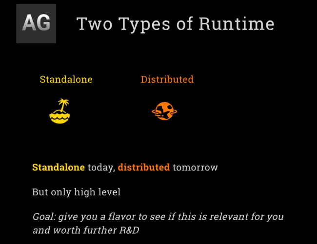

- [Microsoft Autogen 0.5.1: AI Agent Framework Explained for Beginners](#microsoft-autogen-051-ai-agent-framework-explained-for-beginners)
- [AutoGen vs Other Agent Frameworks: Features & Components Compared](#autogen-vs-other-agent-frameworks-features--components-compared)
- [What is Autogen](#what-is-autogen)
- [The Building Blocks of Autogen](#the-building-blocks-of-autogen)
- [AutoGen Agent Chat Tutorial: Creating Tools and Database Integration](#autogen-agent-chat-tutorial-creating-tools-and-database-integration)
- [Essential AI Components: Models, Messages & Agents Explained](#essential-ai-components-models-messages--agents-explained)
- [Advanced Autogen Agent Chat: Multimodal Features & Structured Outputs](#advanced-autogen-agent-chat-multimodal-features--structured-outputs)
- [AutoGen Core: The Backbone of Distributed Agent Communications](#autogen-core-the-backbone-of-distributed-agent-communications)

## Microsoft Autogen 0.5.1: AI Agent Framework Explained for Beginners

Now, I know exactly what you’re thinking. “Another framework? Another week, another reset, another new thing to learn. I just want to get to MCP—that’s what all the hype is about! That’s week six. Why are we doing another framework now?”

But I’ve got plenty of good news for you. First, this week’s framework—**AutoGen**—will actually be really quick and simple to pick up, because it shares a lot in common with the others we’ve used so far. We’re going to move through it at a brisk pace. Secondly, the whole week itself is going to be much faster. I know, I said that last time, but last week I got so caught up in LineGraph, I couldn’t help myself. This time, I really mean it: this week will be nice and brisk, setting us up for the pinnacle of the course in week six.

And here’s a third piece of good news: we’ll actually get a preview of MCP *this* week as well. So, not only are we covering AutoGen, we’re also going to dip our toes into what’s coming next. With that, welcome to week five: understanding AutoGen concepts—specifically, **AutoGen from Microsoft**. Let’s dive in.

So, introducing AutoGen. You’ll recognize it by that ‘AG’ logo. AutoGen is Microsoft’s open-source agent framework. The major rewrite—version 0.4—was released in January, and it represents a ground-up overhaul. This new version is based on an asynchronous, event-driven architecture, aimed at addressing prior criticisms about observability (can you really see what’s happening in agent interactions?), as well as offering more flexibility, control, and scalability. This is a complete replacement for the old AutoGen 0.2, with a very different architecture and feel.

So, naturally, I faced a decision: should we use AutoGen 0.4 or stick with 0.2? I decided to… stick with 0.2? No, of course not—I’m joking. We’re using 0.4. Or actually, not even that—we’re going with **0.5.1**, which is the current version as of right now. They’ve moved beyond 0.4, but 0.5.1 isn’t radically different from 0.4. So yes, we’re using the latest, refreshed version of AutoGen released this year.

However, a word of caution: if you search for documentation, you *must* check whether you’re looking at docs for 0.4+ or the older 0.2 version—they’re very different in structure and usage.

But wait, there’s more—a bit of drama in the AutoGen world. Late last year, the original creator and several key co-founders of AutoGen left Microsoft, where it was being developed as open source, and branched off to create a fork: a different, community-led version. The original creator is now at Google and working on this new fork, called **AG2** (short for AutoGen 2, also known as AgentOS 2). Here’s where it gets even more confusing: AG2 started from the 0.2 codebase, so it’s both compatible and somewhat consistent with the *old* version of AutoGen, but it diverges completely from the new Microsoft path (post-fork, post-0.4).

In other words, AG2 is like a “throwback” to what AutoGen used to be, and this has made things pretty confusing. The rationale for the fork was to allow faster, more flexible development, free from the bureaucracy of Microsoft. On the flip side, being part of Microsoft has obvious advantages: the mainline AutoGen (Microsoft’s) is widely used in enterprises, has major adoption, and remains highly visible.

This split created some bizarre situations. For example, Microsoft also lost control of the official AutoGen Discord group, which is now managed by the AG2/AgentOS 2 team. As a result, a lot of community discussion is about AG2, not Microsoft’s AutoGen. So newcomers can get very confused: if you search for AutoGen documentation, you might end up looking at AG2 (which is based on 0.2) instead of the Microsoft-supported track.

Microsoft, for their part, have made it absolutely clear they’re not slowing down development on their AutoGen, especially as seen in the new architecture from 0.4 onward. Meanwhile, the AG2 camp argues they can move faster and more flexibly, and they have been releasing new versions at a rapid pace—they’re already up to AG2 version 0.8. Version numbers don’t always tell the whole story, but it does create the perception of rapid progress, which was one of their main motivations for the fork.

There’s one more spicy twist: the AG2 team has control of the official AutoGen package on PyPI. So, if you do a simple `pip install autogen`, you’ll get AG2—not Microsoft’s official version! This is more than a little amusing, but also confusing (and arguably problematic) for newcomers, who expect that a Microsoft project would “own” the official PyPI install. Instead, a `pip install autogen` gets you a version built by a group of former maintainers—important renegades, so to speak, whose “rebellion” has created something impressive but very different from what Microsoft now maintains.

So, bottom line: we’re going with the Microsoft track for this course. That’s where the largest community and the greatest current traction is. But I want you to be aware of this split, and stay alert for confusion in documentation, examples, or community chat—especially around AG2.

Now, since we’re using UV as our environment, I’ve already set up the correct projects for you. What’s installed will be the official Microsoft AutoGen, currently at version 0.5.1 (though that will likely move forward quickly). They’re not at 0.8—yet!

That’s the full story. I hope it makes sense.

## AutoGen vs Other Agent Frameworks: Features & Components Compared

So with that, let’s move on to talk about what Autogen actually is.

Let’s first remind you where we are: these are the frameworks we’ve been going through. Autogen is the last of the frameworks—since MCP isn’t really a framework in the strict sense.

### What is Autogen

Like the others, **Autogen** is a collection of different components all bundled under one umbrella. Here’s how it’s structured:

* **AutoGen Core** is the foundation.
  * It is *agnostic* to which agents or LLMs you use.
  * Think of it as a **general framework for building scalable, multi-agent systems**.
  * It manages messaging between agents, even if they’re distributed in different places.
  * It acts as a *fabric* or *runtime* for agents to run together.
  * While it shares some conceptual ground with something like LandGraph, it’s much, much simpler.
  * In essence, **AutoGen Core is an agent runtime.**

* On top of Core is **AutoGen AgentChat**.
  * The name is a bit of a mouthful!
  * This layer will be very familiar to you—it’s much like OpenAI Agents SDK and Crew.
  * It provides a **lightweight, simple abstraction for combining LLMs in an agent construct**, so they can use tools and interact with each other.
  * **AgentChat** is built directly on Core, making it the main way to construct conversational, multi-agent applications.

* Built on top of AgentChat are:
  * **Studio**:
    * A low-code/no-code visual app builder for constructing agent workflows.
  * **Magentic One CLI**:
    * A product you use from the command line—a ready-to-use application that can run an agent framework out-of-the-box.

All of these components are open source and maintained by Microsoft Research, but they have contributions from all over the world. There’s a key difference from frameworks like Crew and LangChain: with Microsoft, **AutoGen is positioned as a research project for the community**. There’s no commercial “push” shaping the roadmap here. Things like Studio and Magentic One are considered research environments—not ready for production (as they say very clearly in the docs). So, it’s a different positioning: this is a large open-source contribution through and through.

Of course, no surprise—our focus will be on **AutoGen Core** and especially **AutoGen AgentChat**, as these are the most relevant parts for us as coders. The low-code/no-code options are less interesting for now, and Magentic One CLI is cool but essentially like a packaged version of what we built ourselves last week with our “sidekick” or “coworker”.

One more point to highlight: **AutoGen AgentChat** is the direct analogue of Crew, OpenAI Agents SDK, and the agent interaction layer in LandGraph. We’ll also dip into Core for some interesting experiments, but most of our time will be spent with AgentChat.

### The Building Blocks of Autogen

So, what are the core concepts in the Autogen framework—especially in AgentChat? Here’s where it gets even more familiar.

* **Models**
  * In Autogen, “models” correspond to language models (LLMs), exactly as we’ve seen in other platforms.

* **Messages**
  * A key concept in Autogen. Messages can represent:
    * Communication between agents,
    * Events that happen inside an agent (like calling a tool),
    * Results from a model.
  * Whether it’s an agent-to-agent communication, an internal action, or an interaction with a model—these are all considered “messages”.

* **Agents**
  * Just as we’re used to: an agent is something with a model behind it, able to carry out tasks on behalf of a user or another agent.

* **Teams**
  * This is like a “crew” in Crew: a group of agents collaborating to achieve a goal.

There are other advanced concepts, but these are the most important to introduce right now. For today, we’ll be focusing on the first three—**models, messages, and agents**—as we quickly set up an example. And to make it even more practical, we’ll include some SQL in the example, since I know that’s valuable for many.

Let’s jump in!

###  AutoGen Agent Chat Tutorial: Creating Tools and Database Integration

---
> [1_autogen_agent_Chat](../week5_autogen/1_lab1_autogen_agentchat.ipynb)
--- 

## Essential AI Components: Models, Messages & Agents Explained

And so with that, we've covered models, messages, and agents, and we'll do teams another time. And that wraps up the first day of Week 5. And next time, we'll get a bit deeper into AgentChat. See you then. And welcome to Week 5, Day 2, when we get deeper into AutoML.

### Advanced Autogen Agent Chat: Multimodal Features & Structured Outputs

So, as a reminder, I'd like to show you these things a couple of times. Autogen, which is multiple different things. There's Autogen Core, which is the kind of infrastructure for agents interacting. There is Autogen Agent Chat, which is the thing that's quite like CRU and OpenAI Agents SDK. And built on top of that are things we will not be looking at, the no-code, low-code platform studio, and that particular tool, Magentic One. 

But we are going to be talking about Autogen, and today it's more on Autogen Agent Chat. And you remember we talked about the core concepts of models, messages, and agents, and we got to see them all, and we didn't actually talk about teams. Today, we're going to take it a little bit deeper. I always like to take it one more step deeper, but most of this is going to be concepts pretty familiar to you. We're going to talk about going multi-modal. That's, I guess, new. We haven't really done that before, so that's going to be a new one to try out. We're going to talk about structured outputs, which is an old chestnut that you know well. We're going to look at something interesting. We can actually wrap tools in langchain so that we can call langchain tools from Autogen, which is going to be super convenient, especially as we're quite experienced with langchain tools now, and because there's an enormous ecosystem of so many tools to choose from. So this is quite a luxury to have access to this. And then since we put teams up there, we better look at teams, so we're going to give that a quick whirl as well. And then there's a special guest entry as well. Something else just to put out there that I will show you that might entertain you. All right, that's enough. 

---
> [2_lab2_autogen_agentchat](../week5_autogen/2_lab2_autogen_agentchat.ipynb)
--- 

### AutoGen Core: The Backbone of Distributed Agent Communications

So here’s the core idea behind AutoGenCore—and I’ve already alluded to this—it’s all about decoupling the logic of an agent from what it actually does. Welcome to our ongoing exploration of AutoGen as we move into day three of week five and dive into AutoGenCore.

Just as a reminder, here’s where AutoGenCore fits in: it serves as the foundation, the underlying infrastructure for AutoGen AgentChat. It’s the base layer, the engine behind it all—which is exciting.

One other thing to highlight while we’re on this topic: you might have heard of Microsoft’s Semantic Kernel and wondered where it fits in this landscape. Isn’t that also an agentic framework? How does it relate to all these others? The answer is that Semantic Kernel is actually quite different. It’s more akin to something like LangChain. Semantic Kernel is a relatively heavyweight layer of “glue code” that wraps LLM calls, manages memory, and provides its own framework for tool calling, plugins, structured outputs, and more. It even has its own prompt templating system for building and populating prompts. In that sense, it’s very analogous to LangChain.

Of course, there is some overlap: you can use Semantic Kernel to manage tools and agent calls, and it does include some agent functionality. Microsoft is aware of this overlap, but they see Semantic Kernel as a distinct offering. AutoGen, by contrast, is much more focused on building autonomous agentic applications; everything about it is agent-centric. Semantic Kernel is about stitching together LLM calls, typically for business use cases. That’s why we’re not focusing on Semantic Kernel in this course—it’s more relevant if you’re looking at something like LangChain.

So, what exactly is AutoGenCore? In short, it’s an agent interaction framework. That’s how it’s described, and that’s what it is. It’s agnostic: it doesn’t care about the platform, the products you use to code your agents, or the abstraction layers you use. You could be calling LLMs directly, or using another framework or layer of glue code. AutoGenCore is simply about enabling agents to interact.

If you want to use the AgentChat framework as your agent abstraction, that works well—and that’s what we’ll do here. The two are clearly designed to work together, with AgentChat built directly on top of AutoGenCore. But it’s not a requirement, just as LangGraph doesn’t require LangChain (though they work well together, given their shared concepts). In some ways, AutoGenCore’s positioning is similar to LangGraph: both are about orchestrating interactions between agents or operations. LangGraph focuses on the graph of operations and dependencies—the node graph we now know well. AutoGenCore, meanwhile, is focused on the interactions between operations, independent of the agent implementation.

That said, there are key differences. LangGraph is designed around robustness and repeatability, enabling you to replay and trace workflows. Everything about LangGraph is built for that purpose. In contrast, AutoGenCore’s driving force is to create an environment where agents can interact—regardless of where they are, how they’re written, or what abstractions they use. Agents could be distributed across different locations, written in different languages (one in JavaScript, another in Python), and they can all work together in the AutoGenCore world. AutoGenCore handles their creation, messaging, and coordination.

That’s the thesis behind AutoGenCore: supporting robust, flexible interactions between diverse agents. LangGraph touches on similar themes, but with a different emphasis. For AutoGenCore, the core focus is on interaction and interoperability among agents.

Here's the core idea behind Autogencore. And I've already alluded to this idea. And it's that it's all about decoupling the logic of an agent, what it actually does, from how messages get delivered to it, from the interplay between them. The framework deals with creating and communicating. It deals with creating agents, the whole life cycle of an agent, and the messages, the communication between them. And the agents themselves, or us as the people coding the agents, we're responsible for the logic. It's not the mandate of Autogencore. It just deals with letting them play. 

And there's two ways that it lets them play. Two types of runtime. The runtime is the kind of Autogencore world in which agents interact. And the two types, one of them is called standalone, which basically essentially means it sort of runs on your box in a simple way. And the other, distributed, is that it runs in a way that could allow remote agents to interact with each other. So these are the two kinds, and you code them both a bit differently. We are going to look at the standalone one today, and we're going to go to the distributed one tomorrow. And look, I have to tell you, I'm only going to do this at a high level. We're going to breeze through this quite quickly, and the examples will be somewhat superficial. And there's a reason for this. I feel like we've done enough detail in lots of frameworks and actually building agents. I'm not sure how applicable this is going to be to your use case. I think it's good for you to get a feel for it, and to get a good sense of how this is positioned and where it might be useful. And that's my goal, give you a flavor, give you that kind of sense of where it fits in the ecosystem. And if it's relevant for you, if this is something that you do want to put into practice, then you should carry out more R&D and work on this a bit more yourself. And I'll give you plenty of starting points for that. But I'm not going to go so deep into this as some of the other frameworks, it's like Langroth last time. But in the unlocks, you get a feel for it. And then we move on, because I know you're anxious to get to MCP. All right, let's do all that. So here we are in good old cursor, going to the fifth.

---
> [3_lab3_autogen_core](../week5_autogen/3_lab3_autogen_core.ipynb)
--- 

