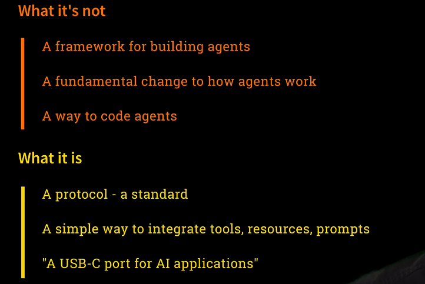
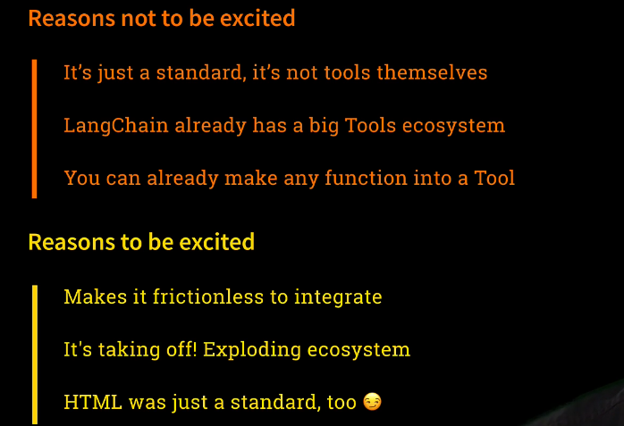
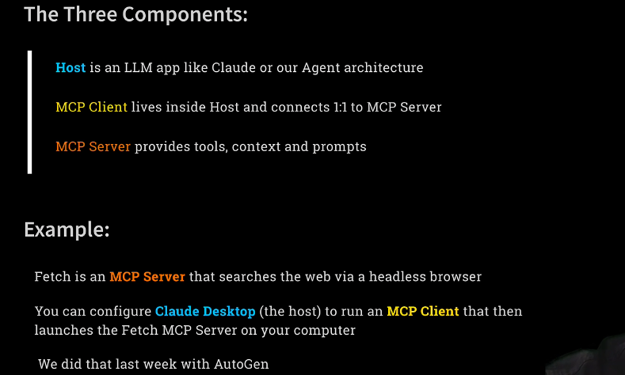
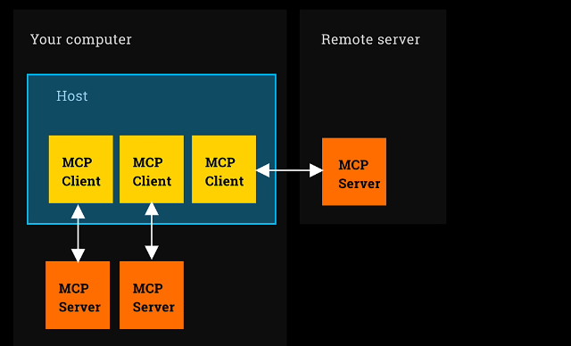
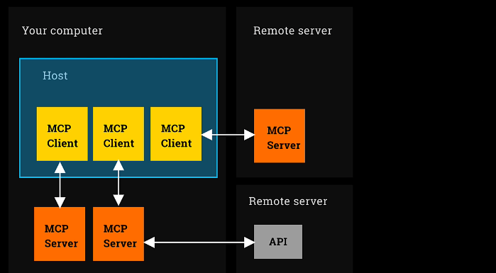

## MCP
- [Intro to MCP: The USB-C of Agentic AI](#intro-to-mcp-the-usb-c-of-agentic-ai)
- [Understanding MCP Hosts, Clients, and Servers](#understanding-mcp-hosts-clients-and-servers)
- [Using MCP Servers with OpenAI Agents SDK](#using-mcp-servers-with-openai-agents-sdk)

**This is what it's all about**

Welcome to the epic finale week of the Complete Agentic AI course. This is the week when we introduce MCP, the Model Context Protocol for Anthropic, and we build our flagship project, our capstone project, an equity trading floor. Let's get into it.

**Agentic AI Frameworks**

So during this course, we've covered a number of different agent frameworks. We've covered, of course, my favorite OpenAI Agents SDK. We've covered Crew, LangGraph, and most recently, AutoGen. And this time, we're coming back to look at MCP, which is, of course, not really a framework at all. It's a protocol, as we will discuss. And this is where it comes together. At the end of the week, I'm also going to talk generally retrospectively about the different frameworks we've covered. I'll talk about some of the other frameworks we didn't directly cover, and we'll bring it all together there. But for now, let's get going with MCP.

**Before We Start**

But wait, I see that there are some people here who perhaps don't belong here. There are some people here who have skipped straight to week six. You are busted. I found you. You've jumped to week six because you're excited about MCP, and you can't wait to hear about it and get into it. And look, of course, it's open for you. I'm not going to stop you from doing that. But I do just want to say, if you are just joining us, you've missed out on some really great stuff. And a lot of it prepares you to get here. And I know you're impatient for MCP. I know that's what you want. But there's good stuff, particularly in weeks one and two. And so if you have skipped straight to this, then I do just want to say, in week one, we cover natively understanding what it means to connect with different LLMs and to orchestrate them using tools. We look at different design patterns for agent models, and we understand what it means for a model to be autonomous. And then in week two, we introduce the OpenAI Agents SDK. And that is what we're going to be using to take advantage of MCP this week. And so it's really great foundational stuff. Now, look, you can just keep going with MCP if you really wish. But I would suggest that you at least take a quick peek at weeks one and two and see if you're willing to do that. And for those of you here that did go through the whole thing, then fabulous. We are in great shape.

**Intro to MCP: The USB-C of Agentic AI**

And so, introducing then the Model Context Protocol from Anthropic. First announced late last year, but it really took off in January, February, March, April of this year. And what is it? Well, Anthropic themselves describe it as the USB-C of agentic AI. And that term has taken off. And we'll explain what that means in a second. I should point out that I'm aware that this picture that I generated is in fact showing a USB-A, not a USB-C. And MCP is decidedly not the USB-A of agentic AI. It is the USB-C of agentic AI. And that is what we're going to discover right now.

**What MCP is not**

So there are a lot of misconceptions about MCP. And I'm going to start by just dispelling some of them. Let me tell you first what MCP is not. Obviously, it's not actually like an agent framework. It's not got anything to do with building agents. And it's also not some sort of fundamental change to anything. Anthropic didn't invent something completely new that changes the way we do stuff. It's also not a way to code agents either.

**What MCP is**

So what is it? Well, it's a protocol. It's a standard. It's a way to do things consistently and simply. And what that is, is it's a simple way to integrate your agents with tools or resources or prompts that have been written by other people so that you can easily share things like tools. And I should say that, first and foremost, it's about tools. That's where the greatest excitement has taken off. The idea of being able to share resources, like being able to use RAG sources from other people, is also fairly popular. And then prompts, I don't think, have particularly taken off—the idea that you'd be able to share prompts. But it's available. But it's tools. That's what people are really excited about. It's a way to easily share tools so that one person can build a useful tool that can do something helpful, and then other people can easily take advantage of that tool in their products. And that's why it's known as a USB-C for AI applications, for agentic AI. It's about connectivity. It's about easily connecting your agent app with other people's tools.

**Reasons not to be excited**

So with this in mind, there are a few things that are reasons that one should be really quite excited about this technology. But first, there are a few things that aren't particularly exciting about it that are worth stressing. So first of all, MCP is just the standard. It's just the approach for being able to integrate with other people's tools. It's not the tools themselves. So MCP from Anthropic isn't particularly the tools, although they have built a few, but that's not what makes it exciting. LangChain, for example, as we discovered, already has a massive tools ecosystem. So with the LangChain community, you've already got access to lots and lots of tools that people have written. So it's not like that isn't available. And we've already discovered that it's easy to turn any function into a tool just with a decorator in OpenAI Agents SDK. So with a quick function tool decorator, any function you write can be a tool for your agent. So if you're writing your own tools, equipping your agent to take advantage of them is easy. And MCP doesn't help you with that. In fact, it makes that harder. It's all about being able to use other people's tools.

**Reasons to be excited**

And so that's the reason to be excited. It makes it frictionless to connect with someone else's tool and to immediately have a description of what the tool does, what the parameters need to be, and to be able to have it running. It's really about the ecosystem. So many people have gotten on board with MCP that there are thousands of these MCP-based tools available for you. So you can do a quick search and be quickly integrated with so many different capabilities, making your agent more powerful. And, you know, maybe this is a silly point, but standards can be really exciting if they get adopted. It's all about the adoption. And obviously, the Internet, the World Wide Web was successful because people coalesced around HTML. It became such a standard protocol. And so I'm just making the point that this is exciting because of the adoption. That's what's driven this ecosystem of tools and what's allowed you so easily to equip your agents with more functionality.

### Understanding MCP Hosts, Clients, and Servers

**The Three Core Components of MCP**

There are three core concepts behind MCP that I need to explain to you. First of all is what's known as the MCP host. The MCP host is the overall application in which you're going to be equipping an agent with tools. The host could be something like Claude Desktop, the piece of software that runs on your computer that manages Claude, the LLM, and lets you chat with Claude. It could also be our agent architecture, a piece of software we've written using perhaps the OpenAI Agents SDK, that will run agents and tools. That overall application—the piece of software running this agentic framework—is what we call the MCP host. An MCP client is a small piece of software, like a plug-in, that runs inside the host. Each MCP client connects one-to-one with something I'm about to explain: an MCP server. So if you're running Claude Desktop and using multiple MCP servers, you're going to have a small MCP client running for each one. The MCP client lives inside the host and connects to an external server. That server runs outside the host. So what is this server? The MCP server is the actual piece of code that provides tools, context, and prompts—these extra capabilities—for your agent. And again, tools are the main focus, the most exciting part. But in addition to equipping an agent with tools, it can also provide extra context for information lookup, and it can provide prompt templates. All of that is delivered by an MCP server running outside the host.

**Example: The Fetch MCP Server**

Let me give you a concrete example: the Fetch MCP server. Fetch is an MCP server that searches the internet and fetches a web page. The way it works is clever—it launches a headless browser, specifically Headless Chrome, which means you don't see the browser window. It uses Microsoft’s Playwright to control that browser, navigate to the page, read its contents, and return the data. That browsing and reading capability is implemented as a tool and wrapped inside an MCP server. You can run that MCP server on your machine. You can also configure Claude Desktop—the host—to run an MCP client that connects to the Fetch MCP server. This means that when you're chatting with Claude, it can now read live web pages because it’s connected behind the scenes to that Fetch server. In this example, the MCP server is running on your computer, outside the host, and the host uses the client to talk to it. So Claude Desktop is able to talk to the Fetch server, run a headless browser, collect a page, and answer questions about it. We already did that with AutoGen last week. Hopefully, you didn’t skip last week—it was fun—and we used that same Fetch MCP server via AutoGen. That’s exactly what it was doing.

**Architecture Overview: Local and Remote**

Now let’s clarify how all this fits together with a diagram. Imagine a box representing your machine. Inside your machine, you have a host running—Claude Desktop or something written with OpenAI Agents SDK. On your computer, you might have multiple MCP servers running. One of them could access your local file system, another could provide weather information. Within the host, you have one MCP client per server. Each client connects to a different MCP server, all running on your local machine.

There’s also an alternative architecture where you connect to a remote server. You can have an MCP server running on a remote machine and connect to it from your host via an MCP client. But this setup is rare. People often hear the word "MCP server" and assume it refers to something remote. That’s a common misconception. In practice, most MCP servers run locally, outside the host, but still on your own machine. You may have downloaded them from somewhere public, but once they’re installed, they run locally. For example, we got the Fetch MCP server from Anthropic’s repository, installed it on our machine, and connected to it from AutoGen, which served as our host. We wrote some code that acted as an MCP client, connecting to the local Fetch MCP server. Remote MCP servers are possible. It’s technically supported. Sometimes they’re referred to as "hosted" or "managed" MCP servers. But again, they’re rare. That’s an important clarification I want to make: in nearly all real-world cases, MCP servers are downloaded and executed locally. They run on your box, outside the host.

**Remote APIs vs Remote Servers**

There’s another configuration that’s worth mentioning. Your locally running MCP server might only handle purely local tasks—like writing to the file system. But many MCP servers use online functionality. The Fetch server does that: it opens a browser, visits web pages online. Others query APIs like weather services. These are MCP servers running on your machine that make internet requests. And this pattern—local server making remote calls—is the most common of all. Still, it’s important to distinguish that from the less common case of having an MCP client connecting to a remote server.

**MCP Servers Run Locally**

So let me repeat it clearly once again. If I haven’t stressed it enough already, MCP servers mostly run on your machine. You typically download them, install them, and run them locally. And I keep repeating this because people really do get confused. The terminology is misleading. But that’s how it works. When we look at MCP marketplaces, you’ll see thousands of MCP servers, and almost all of them run locally. It’s not easy to find one that you connect to remotely.

**MCP Transport Mechanisms: STUDIO and SSE**

Now let’s turn to the two different technical mechanisms that MCP servers can use. These are called "transport mechanisms" in the official Anthropic spec. The first, and by far the most common, is called STUDIO—spelled like that—which stands for Standard Input Output. Some people call it STDIO, but I prefer STUDIO. This is the simplest setup. When using STUDIO, the MCP client spawns a separate process on your computer and communicates with it through standard input and output—hence the name. This is the most widely used transport mechanism, and when we build our own MCP server later, we’ll use this one. The second method is called SSE—Server-Side Events. SSE uses an HTTPS connection and streams back results, much like how LLMs stream their responses. That’s also built on SSE. If you’re connecting to a remote MCP server, like a hosted or managed server, you must use SSE. STUDIO won’t work for remote connections—it has to be SSE. On the other hand, if you’re running local MCP servers, you can use either STUDIO or SSE, though STUDIO is by far the most common.

**Conclusion and Transition to Lab**

So take a moment to let that all sink in. The host, the MCP client, the MCP server—these are consistent across configurations. The key variation is the transport mechanism: STUDIO or SSE. And now, with all of that in mind, it’s time for our lab. Let’s go and make use of MCP servers in the fabulous OpenAI Agents SDK.

### Using MCP Servers with OpenAI Agents SDK

I'm going to open up Week 6, and you'll see there's quite a lot going on here. We've got a lot of work to do this week, and we're going to start with the first lab: Lab 1. 

---
> [1_lab1](../week6_mcp/1_lab1.ipynb)  
> [1_lab1 : without notes](../week6_mcp/1_lab1.ipynb)
--- 

