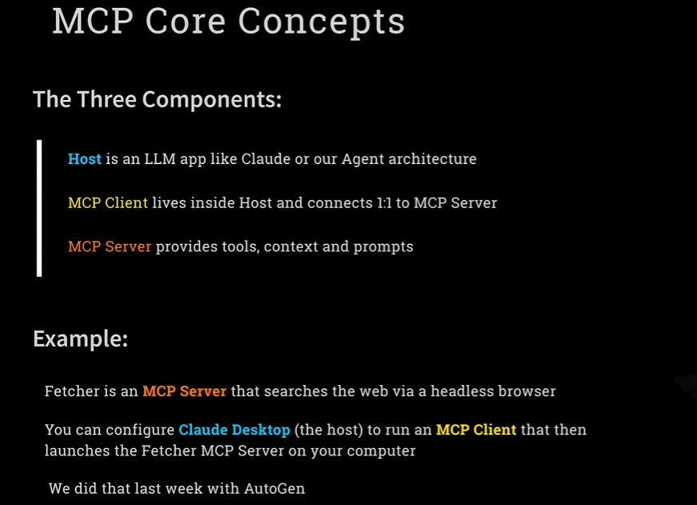
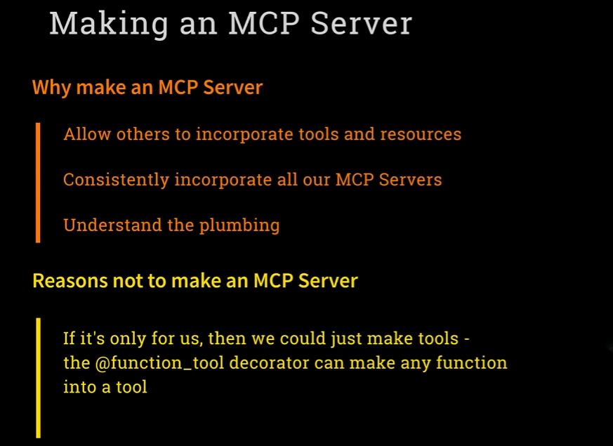
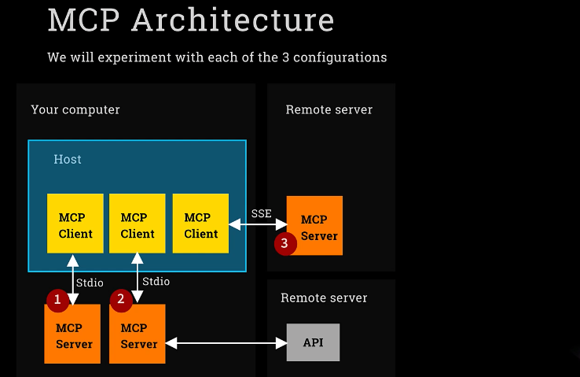
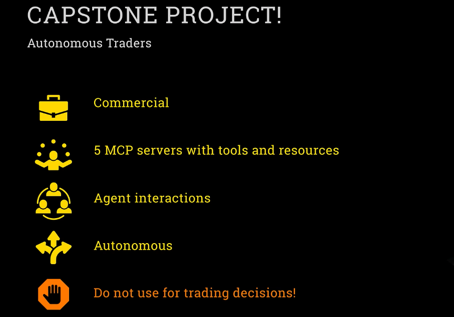
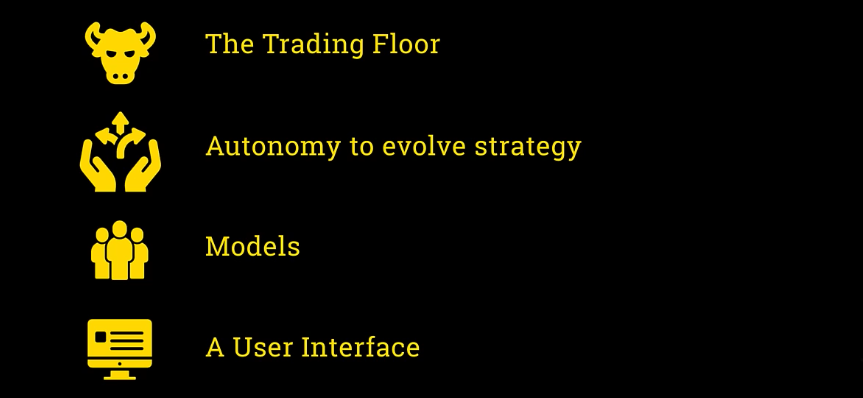
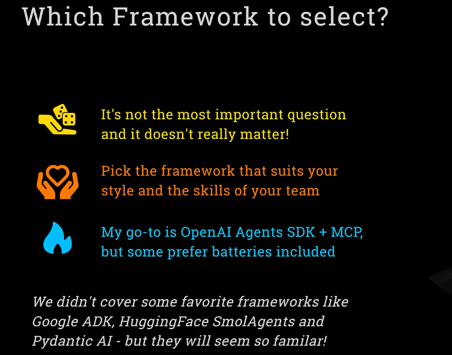
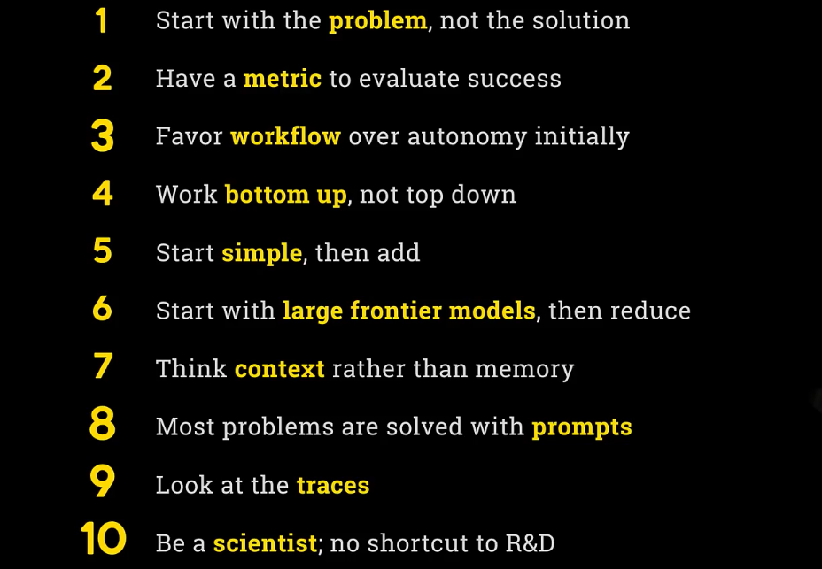

## MCP
- [Intro to MCP: The USB-C of Agentic AI](#intro-to-mcp-the-usb-c-of-agentic-ai)
- [Understanding MCP Hosts, Clients, and Servers](#understanding-mcp-hosts-clients-and-servers)
- [Using MCP Servers with OpenAI Agents SDK](#using-mcp-servers-with-openai-agents-sdk)

**This is what it's all about**

Welcome to the epic finale week of the Complete Agentic AI course. This is the week when we introduce MCP, the Model Context Protocol for Anthropic, and we build our flagship project, our capstone project, an equity trading floor. Let's get into it.

**Agentic AI Frameworks**

So during this course, we've covered a number of different agent frameworks. We've covered, of course, my favorite OpenAI Agents SDK. We've covered Crew, LangGraph, and most recently, AutoGen. And this time, we're coming back to look at MCP, which is, of course, not really a framework at all. It's a protocol, as we will discuss. And this is where it comes together. At the end of the week, I'm also going to talk generally retrospectively about the different frameworks we've covered. I'll talk about some of the other frameworks we didn't directly cover, and we'll bring it all together there. But for now, let's get going with MCP.

**Before We Start**

But wait, I see that there are some people here who perhaps don't belong here. There are some people here who have skipped straight to week six. You are busted. I found you. You've jumped to week six because you're excited about MCP, and you can't wait to hear about it and get into it. And look, of course, it's open for you. I'm not going to stop you from doing that. But I do just want to say, if you are just joining us, you've missed out on some really great stuff. And a lot of it prepares you to get here. And I know you're impatient for MCP. I know that's what you want. But there's good stuff, particularly in weeks one and two. And so if you have skipped straight to this, then I do just want to say, in week one, we cover natively understanding what it means to connect with different LLMs and to orchestrate them using tools. We look at different design patterns for agent models, and we understand what it means for a model to be autonomous. And then in week two, we introduce the OpenAI Agents SDK. And that is what we're going to be using to take advantage of MCP this week. And so it's really great foundational stuff. Now, look, you can just keep going with MCP if you really wish. But I would suggest that you at least take a quick peek at weeks one and two and see if you're willing to do that. And for those of you here that did go through the whole thing, then fabulous. We are in great shape.

**Intro to MCP: The USB-C of Agentic AI**

And so, introducing then the Model Context Protocol from Anthropic. First announced late last year, but it really took off in January, February, March, April of this year. And what is it? Well, Anthropic themselves describe it as the USB-C of agentic AI. And that term has taken off. And we'll explain what that means in a second. I should point out that I'm aware that this picture that I generated is in fact showing a USB-A, not a USB-C. And MCP is decidedly not the USB-A of agentic AI. It is the USB-C of agentic AI. And that is what we're going to discover right now.

**What MCP is not**

So there are a lot of misconceptions about MCP. And I'm going to start by just dispelling some of them. Let me tell you first what MCP is not. Obviously, it's not actually like an agent framework. It's not got anything to do with building agents. And it's also not some sort of fundamental change to anything. Anthropic didn't invent something completely new that changes the way we do stuff. It's also not a way to code agents either.

**What MCP is**

So what is it? Well, it's a protocol. It's a standard. It's a way to do things consistently and simply. And what that is, is it's a simple way to integrate your agents with tools or resources or prompts that have been written by other people so that you can easily share things like tools. And I should say that, first and foremost, it's about tools. That's where the greatest excitement has taken off. The idea of being able to share resources, like being able to use RAG sources from other people, is also fairly popular. And then prompts, I don't think, have particularly taken off—the idea that you'd be able to share prompts. But it's available. But it's tools. That's what people are really excited about. It's a way to easily share tools so that one person can build a useful tool that can do something helpful, and then other people can easily take advantage of that tool in their products. And that's why it's known as a USB-C for AI applications, for agentic AI. It's about connectivity. It's about easily connecting your agent app with other people's tools.

**Reasons not to be excited**

So with this in mind, there are a few things that are reasons that one should be really quite excited about this technology. But first, there are a few things that aren't particularly exciting about it that are worth stressing. So first of all, MCP is just the standard. It's just the approach for being able to integrate with other people's tools. It's not the tools themselves. So MCP from Anthropic isn't particularly the tools, although they have built a few, but that's not what makes it exciting. LangChain, for example, as we discovered, already has a massive tools ecosystem. So with the LangChain community, you've already got access to lots and lots of tools that people have written. So it's not like that isn't available. And we've already discovered that it's easy to turn any function into a tool just with a decorator in OpenAI Agents SDK. So with a quick function tool decorator, any function you write can be a tool for your agent. So if you're writing your own tools, equipping your agent to take advantage of them is easy. And MCP doesn't help you with that. In fact, it makes that harder. It's all about being able to use other people's tools.

**Reasons to be excited**

And so that's the reason to be excited. It makes it frictionless to connect with someone else's tool and to immediately have a description of what the tool does, what the parameters need to be, and to be able to have it running. It's really about the ecosystem. So many people have gotten on board with MCP that there are thousands of these MCP-based tools available for you. So you can do a quick search and be quickly integrated with so many different capabilities, making your agent more powerful. And, you know, maybe this is a silly point, but standards can be really exciting if they get adopted. It's all about the adoption. And obviously, the Internet, the World Wide Web was successful because people coalesced around HTML. It became such a standard protocol. And so I'm just making the point that this is exciting because of the adoption. That's what's driven this ecosystem of tools and what's allowed you so easily to equip your agents with more functionality.

### Understanding MCP Hosts, Clients, and Servers

**The Three Core Components of MCP**

There are three core concepts behind MCP that I need to explain to you. First of all is what's known as the MCP host. The MCP host is the overall application in which you're going to be equipping an agent with tools. The host could be something like Claude Desktop, the piece of software that runs on your computer that manages Claude, the LLM, and lets you chat with Claude. It could also be our agent architecture, a piece of software we've written using perhaps the OpenAI Agents SDK, that will run agents and tools. That overall application—the piece of software running this agentic framework—is what we call the MCP host. An MCP client is a small piece of software, like a plug-in, that runs inside the host. Each MCP client connects one-to-one with something I'm about to explain: an MCP server. So if you're running Claude Desktop and using multiple MCP servers, you're going to have a small MCP client running for each one. The MCP client lives inside the host and connects to an external server. That server runs outside the host. So what is this server? The MCP server is the actual piece of code that provides tools, context, and prompts—these extra capabilities—for your agent. And again, tools are the main focus, the most exciting part. But in addition to equipping an agent with tools, it can also provide extra context for information lookup, and it can provide prompt templates. All of that is delivered by an MCP server running outside the host.

**Example: The Fetch MCP Server**

Let me give you a concrete example: the Fetch MCP server. Fetch is an MCP server that searches the internet and fetches a web page. The way it works is clever—it launches a headless browser, specifically Headless Chrome, which means you don't see the browser window. It uses Microsoft’s Playwright to control that browser, navigate to the page, read its contents, and return the data. That browsing and reading capability is implemented as a tool and wrapped inside an MCP server. You can run that MCP server on your machine. You can also configure Claude Desktop—the host—to run an MCP client that connects to the Fetch MCP server. This means that when you're chatting with Claude, it can now read live web pages because it’s connected behind the scenes to that Fetch server. In this example, the MCP server is running on your computer, outside the host, and the host uses the client to talk to it. So Claude Desktop is able to talk to the Fetch server, run a headless browser, collect a page, and answer questions about it. We already did that with AutoGen last week. Hopefully, you didn’t skip last week—it was fun—and we used that same Fetch MCP server via AutoGen. That’s exactly what it was doing.

**Architecture Overview: Local and Remote**

Now let’s clarify how all this fits together with a diagram. Imagine a box representing your machine. Inside your machine, you have a host running—Claude Desktop or something written with OpenAI Agents SDK. On your computer, you might have multiple MCP servers running. One of them could access your local file system, another could provide weather information. Within the host, you have one MCP client per server. Each client connects to a different MCP server, all running on your local machine.

There’s also an alternative architecture where you connect to a remote server. You can have an MCP server running on a remote machine and connect to it from your host via an MCP client. But this setup is rare. People often hear the word "MCP server" and assume it refers to something remote. That’s a common misconception. In practice, most MCP servers run locally, outside the host, but still on your own machine. You may have downloaded them from somewhere public, but once they’re installed, they run locally. For example, we got the Fetch MCP server from Anthropic’s repository, installed it on our machine, and connected to it from AutoGen, which served as our host. We wrote some code that acted as an MCP client, connecting to the local Fetch MCP server. Remote MCP servers are possible. It’s technically supported. Sometimes they’re referred to as "hosted" or "managed" MCP servers. But again, they’re rare. That’s an important clarification I want to make: in nearly all real-world cases, MCP servers are downloaded and executed locally. They run on your box, outside the host.

**Remote APIs vs Remote Servers**

There’s another configuration that’s worth mentioning. Your locally running MCP server might only handle purely local tasks—like writing to the file system. But many MCP servers use online functionality. The Fetch server does that: it opens a browser, visits web pages online. Others query APIs like weather services. These are MCP servers running on your machine that make internet requests. And this pattern—local server making remote calls—is the most common of all. Still, it’s important to distinguish that from the less common case of having an MCP client connecting to a remote server.

**MCP Servers Run Locally**

So let me repeat it clearly once again. If I haven’t stressed it enough already, MCP servers mostly run on your machine. You typically download them, install them, and run them locally. And I keep repeating this because people really do get confused. The terminology is misleading. But that’s how it works. When we look at MCP marketplaces, you’ll see thousands of MCP servers, and almost all of them run locally. It’s not easy to find one that you connect to remotely.

**MCP Transport Mechanisms: STUDIO and SSE**

Now let’s turn to the two different technical mechanisms that MCP servers can use. These are called "transport mechanisms" in the official Anthropic spec. The first, and by far the most common, is called STUDIO—spelled like that—which stands for Standard Input Output. Some people call it STDIO, but I prefer STUDIO. This is the simplest setup. When using STUDIO, the MCP client spawns a separate process on your computer and communicates with it through standard input and output—hence the name. This is the most widely used transport mechanism, and when we build our own MCP server later, we’ll use this one. The second method is called SSE—Server-Side Events. SSE uses an HTTPS connection and streams back results, much like how LLMs stream their responses. That’s also built on SSE. If you’re connecting to a remote MCP server, like a hosted or managed server, you must use SSE. STUDIO won’t work for remote connections—it has to be SSE. On the other hand, if you’re running local MCP servers, you can use either STUDIO or SSE, though STUDIO is by far the most common.

**Conclusion and Transition to Lab**

So take a moment to let that all sink in. The host, the MCP client, the MCP server—these are consistent across configurations. The key variation is the transport mechanism: STUDIO or SSE. And now, with all of that in mind, it’s time for our lab. Let’s go and make use of MCP servers in the fabulous OpenAI Agents SDK.

### Using MCP Servers with OpenAI Agents SDK

I'm going to open up Week 6, and you'll see there's quite a lot going on here. We've got a lot of work to do this week, and we're going to start with the first lab: Lab 1. 

---
> [1_lab1](../week6_mcp/1_lab1.ipynb)  
> [1_lab1 : without notes](../week6_mcp/1_lab1.ipynb)
--- 

## Building your own MCP Server

And welcome to Day 2 of Week 6 as we get more into MCP. And this is the time we build our own MCP client and MCP server. Remember, today we're making our own. We're not making a USB-A of HNTG-AI. We're making a USB-C of HNTG-AI.

**Core MCP Concepts**
A reminder of these core concepts that probably now you're getting this. The host is the overall application, like Cloud Desktop or our agent architecture. The client lives inside the host and has a one-on-one connection, like over input-output, to an MCP server, which is a separate process, running outside and providing the tools, the context, and the prompts to your MCP client, to your host. And most of the time we're talking about tools, although briefly we'll use context as well in our journey. And that's the example of Fetch that we've used before.

**MCP Architecture Reminder**
And a reminder of the architecture, again, on the bottom left is the idea that you can have an MCP server that connects to an MCP server running on your computer and it does everything locally, like the file writer that we had when we wrote BanoffeePi. The second one along is an MCP client that connects to an MCP server running on your box that then calls out to some sort of remote internet service. And I guess the PlayWrite and Fetch are both examples of that. And then less common, that third one, sometimes known as a hosted MCP server or a managed MCP server, is when you have an MCP client that connects remotely to the MCP server running on another machine. And that would need to be using the SSE transport mechanism, whereas ones running locally could be either STDIO or SSE, and they're usually STDIO. And maybe it's also worth mentioning on this diagram that these MCP servers can be written in Python or JavaScript, in which case typically the parameters that describe them have ubx as the command to run or mpx. They can actually also just be creating a Docker container. There's various other ways, but ubx and mpx are by far the most common.

**Why Build an MCP Server?**
So with that, we're going to go and create our own MCP server. But just before we do, I want to quickly take a moment to ask, why do we want to make an MCP server? What's the advantage of doing it? Well, the number one advantage is you make an MCP server if you want to share it. You build something which you want other people to be able to use with their agents, because you're going to be describing it in a way, you're going to be working on the prompts and the information around your tool, and people will be able to integrate it with their agents so simply. That's the number one reason. And also if it has resources, which is a bit like a RAG context, and then prompt templates too, although that's not used so often. Also, I suppose there is a small benefit. If we're building an agent system and we're using a bunch of MCP servers, it might be nice for us to treat our own tools consistently so that everything is packaged as MCP servers. This is a bit tenuous, but it's one reason we're going to do it this way, because we only want to use MCP servers. And it's also useful, if you're doing it, just so you can understand the plumbing, just so you can really build the nuts and bolts and do it yourself.

**When Not to Build an MCP Server**
Now, you probably realize the reason I'm belaboring this point is because I want to say, why don't you want to make an MCP server? What are the reasons against? And there's one really important one, and it's this. If you're only building a tool for you to use yourself, if we're writing a function and we want to equip our LLM with that function, then there's no point in building an MCP server. That's wasting time. You can simply decorate that function tool and then equip your LLM just by putting in tools. You can just immediately provide it through the OpenAI Agents SDK or using the JSON approach from week one. And then that function will be called in your current Python process. It will just be called as a tool, and that's easy. Building an MCP server, which means that it gets spawned and runs as a separate process and communicates over standard input output and is provided as an MCP server, that's a whole lot of extra plumbing and scaffolding that's not needed if it's just to call your own tool. So it's important to have that clarity that MCP doesn't help with building your own tools. That's already easy, and you should just do it. MCP is about sharing tools. That's the benefit.

---
> [2_lab2](../week6_mcp/2_lab2.ipynb)  
> [2_lab2: without notes](../week6_mcp/2_lab2%20copy.ipynb)
--- 
**Wrap-Up: Capabilities of Your Custom MCP Server**

Well, I hope you enjoyed our adventure into the plumbings and internals of MCP servers and clients. Next time, we are going to now do what MCP is famous for. We are going to explore tons of MCP servers out there and just have fun equipping our agents with these new capabilities. I will see you then.

## Exploring Types of MCP Servers and Agent Memory

I'm going to be exploring what MCP has to offer. First, as usual, a quick recap of the core concepts behind MCP, looking at the architecture diagram that we've got here. We're going to be looking at the three different configurations of MCP servers. First of all, and the simplest of all, is when you use an MCP server that simply is created, runs on your local computer, only uses stuff on your computer, and is something that you're using right there. Just like the accounts MCP server that we just used, which is actually one that we hand-wrote ourselves, and also one like the local file system. Okay, and then secondly, and this is perhaps the most common of all, we're going to look at MCP servers that run locally on a computer, but make remote calls to APIs that take advantage of stuff that can be available online. And that's number two on this diagram, and that is, of course, super common. And then thirdly, and we're not going to do this too much, we're just going to have a look at what it means to have a managed MCP server, or a hosted MCP server, which is running remotely. As I say, not a common architecture, but we'll just look at it and see some examples and understand it. And it's worth pointing out that even numbers one and two, while it's possible to write your own, most of the time when we're talking about MCP, these are MCP servers that have been made available online, and that through commands like uvx, you are downloading it from an online public place, and you are then running it locally on your box. So it's running on your box, but it's still something that's been shared online, made available for everyone to use. All right, that's enough intro. Let's go for that. Here we are back in Cursor, and we're going into the week six.

---
> [3_lab3](../week6_mcp/3_lab3.ipynb)   
> [3_lab3: without notes](../week6_mcp/3_lab3%20copy.ipynb)
--- 

## Launching Our Agent Trading Floor

**Introduction and Context**
It feels like just a second ago that we were starting this thing, and somehow we're already on week 6, day 4. We are heading into the final, final section with the Capstone Project, and let's make sure that we end this thing in style. This is going to be a great project. Welcome. Welcome to the Capstone Project. Welcome to Autonomous Trading.

**Project Goal**
We are going to build agents that can make their own decisions about analyzing financial markets, and that can make trades in a synthetic account that we have created ourselves in week 3 with our other team of agents.

**Commercial Focus**
Let me tell you a few things about the project that I have in store for you. First of all, it's something that is commercial. One of the things that I've noticed about a lot of the modern agentic AI projects is that they're quite technical in nature. Because they're so open to possibilities, one tends to build things like teams of coders and stuff like that. I really wanted our Capstone Project to be something that showed how you could apply it to a true commercial problem like analyzing and understanding financial markets, and that's where I've gone in that direction.

**Resources and Agent Autonomy**
It's going to involve having five different MCP servers with tools and resources, and we will count them up — and there's going to be a lot of them. Look forward to it. There's going to be interactions between agents, and there's also going to be autonomy in this. We're going to allow our agents to choose their own adventure. They're going to be given the freedom to make various decisions themselves.

**Important Disclaimer**
Most importantly — and this is something that I may say once or twice — please don't use this for actual trading decisions. This is something which, yes, I don't want to get in trouble if you go and put all of your life savings into this. This is, of course, an experimental project and nothing more than that. Having said that, of course, if you make a massive fortune on this and you're off sailing in New York, then I do expect an invitation. No — do not, do not, do not use it. Do not get your yacht this way. Get your yacht by building autonomous agentic solutions for people, not by having your traders run amok with financial markets.

**Next Steps**
Anyway, with that introduction, we're going to spend most of our time sleeves rolled up in code. And let's get started now. OK, here we go. Back in Cursor, we're going into the folder for six and we're going into...

>
> [4_lab4](../week6_mcp/4_lab4.ipynb)  
> [4_lab4 : without notes](../week6_mcp/4_lab4_fixed.ipynb)  
>  

---

## Which Agent Framework Should You Pick?

Welcome to the grand finale, the conclusion of our capstone project, and also the time when we wrap up and answer the question of, okay, so which agent framework should I use for my project? But first, the capstone project, autonomous trading. We have some ingredients to add to the mix. We're going to turn it into a trading floor of four traders. We're going to give the traders autonomy to evolve their strategy. We're going to expand the number of models. You've already seen a little teaser of this, and we're going to build a user interface, which is going to have a surprise extra component, which is a super important piece of functionality extensibility that we can get through OpenAI Agents SDK. So without further ado, let's go back to the lab for the final time.

>
> [5_lab5](../week6_mcp/5_lab5.ipynb)  
> [5_lab5 : without notes](../week6_mcp/5_lab5_fixed.ipynb)  
>  

## Advice for Selecting Agentic Frameworks

Well, as you can probably tell, I'm quite chuffed about that project. I think it came together so nicely, and I really do hope that there's a lot to learn from it, and seeing it together like that. And I love the fact that it is actually a nod to a commercial use of agents.

So, a question that I get quite often at this point, that people that have got to this point in the course, is that people feel a bit frazzled by everything that we've covered, by thinking back to the different variety of projects and frameworks, and left with the question: OK, so now that I'm embarking on my own project, which of these frameworks do I select? What do I choose?

And I'm here to give you that answer. I'm going to tell you exactly which framework you should select. **And the answer is, the framework you should select doesn't actually matter. It's not the most important question.**

And in a minute, I'm going to take you through what I think does matter, and the sorts of things you should be thinking about when you embark on your project. Look, the different frameworks have different pros and cons, and you should pick the one that just suits you, the one that you jive with the most, that suits your kinds of strengths, and the places where you need help. And also, the skills and capabilities of your team as well.

I find that, as you probably know, I like OpenAI HSSDK, because it's lightweight, it stays out of the way, and it gives you a level of flexibility and control that I like to be able to code with. But I fully recognize that there are other frameworks, like CRU, that are much more batteries-included, where you get a lot in the box. You just write your YAMLs, and you can focus on your YAMLs, and a lot comes along for the ride. And that can be super convenient and really attractive. And they even come with some of the low-code tools that let you visualize this, too.

So there are lots of benefits to using the other frameworks, too. But you can build an agent solution in any of them. So really, you should pick the one that works for you the best, that you enjoy using, and that you have the best experience with.

Sure, my go-to is to use OpenAI HSSDK. I've used it a lot. I've used it to build projects which are live, and I also use NCP as well to bring in other tooling. But I totally get that the batteries-included ones work better for others, and that there are pros and cons. LandGraph, of course, is famous for the way that it's so very repeatable, reproducible, and so tightly integrated with the LAN chain for your system, and with things like Landsmith for monitoring. So plenty of pros and cons. And there are also other frameworks, too.

Now, I feel a bit like a DJ that is up there, trying to play the favorite tracks that everyone's going to like, and I always miss one that's someone's favorite. And I've had some people message me and say, why didn't you cover whatever? And they're hurt by this, and I'm sorry. I had to pick a selection.

Some of the other, the ones that have almost made it, Google Agent workflows to take things step by step. Now, Google Agent Development Kit, ADK, that's becoming increasingly popular. It's very new, and it was still in its infancy even a few weeks ago, but it just released what they're calling the version one that's ready for production for the first time, and it's starting to get more traction. We've got a lot of companies involved.

ADK also comes with a protocol that Google has announced called A2A, Agent to Agent, which is meant to be a sort of companion protocol to MCP. But while MCP lets you connect to other tools, A2A would allow different agents to discover each other, to be able to exchange information about what they can do, and agents to be able to call each other, even if they're running on different hardware in a completely different setting.

Now, that second part of it, this connectivity piece, that's a bit similar to AutoGenCore, if you remember that. Same kind of idea. So it's got that AutoGenCore angle to it, allow different heterogeneous agents to interact, and it's also got this discoverability idea that agents will be able to ask each other, okay, what are you capable of doing through a sort of agent card, which is a bit like a model card, but for agents.

But this is also still in its infancy. It hasn't yet got community traction, so it's a bit too early to call whether this is going to be as popular as something like MCP that has more immediate, more obvious role to play. So that's Google Agents Development Kit, which is somewhere in between OpenAI Agents and also it's got some shades of CRU, because it's got a little bit more batteries and it's got some user interface stuff as well.

Hugging for small agents, very popular. It was more popular a while ago, and it's super simplistic. It's very much, again, shades of OpenAI Agents SDK. Keep it simple, keep out of your way, which is great.

Pydantic AI has a big following. It's really fun to work with. It's also very similar to OpenAI Agents SDK. In fact, OpenAI Agents SDK said that they were inspired by some of the Pydantic AI work, and they gave a shout-out to Pydantic AI in their announcements. And Pydantic AI also has some elements of Landgraf in there too.

But here's the thing. I chose the frameworks that I chose because I felt that it gives you a great flavor of the gamut of different kinds of techniques that are used in an agentic framework. And I feel like it prepares you really well to adopt any of these.

If you just bring up Google ADK and go through their tutorial on how-to, you'll see so many familiar concepts. It'll be like, okay, sure. And in fact, you'll see that already a student has contributed in the community contributions a Google ADK solution for one of the weeks, which is so cool. And so you can see that it's just very, very similar to the same kind of techniques.

And so I do encourage you, if one of these is one that you really want to explore as well, then go and take a look at it. But I think you'll find it super easy to pick up. Same kinds of concepts as we've used. Tools, structured outputs, and so on.

But the overall message is **don't get bogged down in framework selection. They all have their pros and cons. You can focus on the one that lands well for you. It's not the most important stuff. Let's talk about the important stuff. So I'm going to give you 10 pieces of advice. 10 things that I think matter.**

## 10 Essential Lessons for Building Agent Solutions

If you disagree with me, reject this, this is not. This is advice. Ten things that I think matters. And this is personal advice, so you can feel free to disagree with me and reject this. This is not necessarily, you know, the gospel. This is simply my experiences, my advice as a practitioner in the field.

**1. Start with the problem, not the solution**
First things first, and this is a general advice in a lot of cases, I do find, and perhaps particularly in agentic AI, that a lot of people come into this space with the solution in mind. They come in and say, I want to use agents for X. And it's super important to say that that is a bad way of thinking about it. You should really never, you should always catch yourself with a little red flag if you're coming into building something. And the starting point is, I want agents to do X.

First of all, focus on the problem you're solving, on what is X, what is wrong. And go with an agent solution if you realize that that is in fact the right way to solve that problem. Start with the problem, go to the solution, not the other way around. I know it's the kind of thing that everyone says, you've probably heard that a million times, but particularly with agents, there's so many people because of the agentic hype that are just jumping on, I need an agent for this, I need an agent for that. Start with the problem.

**2. Have a metric to evaluate success**
Second piece of advice is that once you've got a problem, identify the metric that you will use to measure whether you have successfully solved that problem. This is like a standard piece of data science advice. But this can be your north star as you're working to see whether you're getting closer or further from solving the problem.

And finding that metric can be really difficult. And that's something which is an important part of the task, which you have to start with. And associated with that, it's not one of the ten, but along with the metric, you have to be able to curate the data that will allow you to measure that metric. So understanding the data that you've got, the data that you need, and making sure that you curate that data in order to measure that metric.

This is all pretty standard data science stuff. But often, again, I think particularly with agentic solutions, people sometimes bypass this because it's so focused on, I want my agents to do blah.

**3. Favor workflow over autonomy initially**
Moving on to the third piece of SAGE advice from me. It is to favor workflows over autonomy to start with. So when you're embarking on a new agent solution, it's tempting to rush into a fully autonomous solution. It's better to start by building something which is using simple workflows to take things step by step.

Now when you're working with OpenAI Agents SDK, there are a number of different ways to do this. You remember you can use tools as a way to have one agent call out to another. And you can also use handoffs as a way that an agent can pass control to a different one. But actually, I would suggest starting using a third approach. You might wonder, what's the third approach? I don't remember that. Well, this is actually what we did with our deep research agent. The third approach is simply to use Python code to make each agent call in isolation. Call runner.run, make a call to an agent, get an output, and then call runner.run again. And do things step by step in this organized way with Python code.

Later, you can turn this into handoffs or tools, and you can add autonomy and give more activities to one agent, more responsibility. But start simple with hard-coded or Python-coded workflows.

**4. Work bottom up, not top down**
So my fourth piece of advice is super important, particularly to people from a software engineering background such as myself. It's common to come into building agent solutions with a blank sheet of paper and draw some big agent architecture diagram. And in my view, that's not the best approach. It's better to work on these things bottoms up. Start with a simple agent. Take a small part of your problem and solve it well with one simple agent, one LLM call. And work on that until you've got that working well. And then add another agent and work bottoms up, building your platform as you discover what works well and what doesn't.

Now, sometimes it's good to actually approach it from both angles, do a bit of top-down and a bit of bottoms up. But out of the two, I would favor bottoms up in the case of agentic workflows because you need to first discover what's going to perform well with your LLMs.

**5. Start simple, then add**
And the next one is very similar, which is to say it's best to always start simple and then make your platform more complicated when the simple solution is working. I can't tell you how many people have sent me these massive, great solutions, hundreds of lines of code, and it's not giving them the outcome that they want. And they're saying, I don't know. It's broken. Why? Help improve this. Fix it. And the answer is it doesn't work that way. You can't do that. It's too hard. You have to start small and simple, solve a simple problem and do it really well, and then gradually expand.

And with each of the building blocks, as you solve each problem, you put them together and you see the bigger agent workflow working well. That that's the right approach because if you build everything and get complex and the answer doesn't match what you're looking for, it's impossible to know where to look. And so the simple key, start simple.

**6. Start with large frontier models, then reduce**
And a sort of opposite point to that, interestingly, is I recommend when starting out, begin by using the highest end models to start with, with small data sets, such as using the GPT-4-1 or using Claude-4 right now, Claude-4-Sonic. Maybe not Claude-4-Opus. That might be a little bit too expensive. But start with the expensive ones so that you can make sure that in theory what you're trying to accomplish will work.

And then once you've got that working, you can then look to move to cheaper models like Claude-4-Sonic or GPT-4-1-Mini or maybe GPT-4-1-Nano. And as you make your prompts more and more instructive and precise, you may be able to achieve similar performance with lighter models. But as you start with your simple solutions, start with the high-powered models so you can prove out what works and what doesn't.

**7. Think context rather than memory**
And then the next piece of advice for you, this is a subtle one. So I see a lot of people getting caught up in trying to figure out different types of memory, which is a construct that I feel is like overworked. There's like short-term memory, some people call it, which is usually just looking at the conversation so far. And then there's longer-term memory, which is usually other words for looking up like a rag retrieval in a database or using the kind of knowledge graph that we used in the trading project.

The thing to keep in mind is that all of these different memory techniques are in fact just different ways of finding relevant context and shoving it in the prompt. It's all about what goes in the prompt at the end of the day. And so keep a clear mind about that and make sure that whilst you might use various tools and techniques for memory, at the end of the day, all you're doing is trying to find the right relevant material for the prompts.

So look at the prompts, see what's being included there, look at the tools you're using, and see what information is being retrieved. And make sure that you're giving the LLM the right context to be able to answer its question. And so rather than getting too bogged down in what kinds of memory you're using, focus on what kind of information does the LLM needs to answer the question and are you providing that information in the prompts.

**8. Most problems are solved with prompts**
Okay, I'm almost done with this preachy advice for you. Let's go to number eight. It's a very similar point again, which is that look, most of the difficulties that you come up against working with agent systems and with LLMs generally are fixed by better prompting. And by experimenting with your prompts.

People often message me and say, can I use fine tuning for this? Can I use a different encoder LLM for my rag? All sorts of sophisticated stuff when often the right answer is just focus on the prompts. Make something a bit simpler, a bit more directive, a bit more instructive. If it's outputting one thing, then try and tell it not to. Give it some examples of what a good output looks like. You can get so far just by working on your prompts.

**9. Look at the traces**
And similar point again is also look at the traces. Of course, this is a great discipline to get into. Even if your agent seems to be working well and they're giving the answers that you expect, you should still be disciplined to go and check that everything is just as you want in the traces. Just in case there's extra tool cool happening, there's some weird stuff happening.

Now, I'm often guilty of not going back and looking at the traces, particularly if they seem to be working. And often when I do, I discover that there is something in there, there is a gotcha that I can fix. And so it is so important, even if I don't take my own advice on this always, that you should go in and check the traces always as you're building your agent system. Make sure things are behaving the way that you expect.

**10. Be a scientist; no shortcut to R\&D**
And I've left the most important piece of advice to the very end. And here it is. Look, being an AI engineer, being an LLM engineer involves wearing two hats, a software engineering hat and a data scientist's hat. And when you're beginning your project, when you're at the starting point of building a new system, you need to be taking firmly off the software engineering hat and putting on that scientist hat and be a scientist. That means be comfortable with experimentation and R\&D.

People often come to me and say, which model should I pick, A, B or C? Which technique should I use, this, this or this? Which tools should I use? And the answer is you should try them all. Try them, experiment, look at your overall business metric that you're using to gauge success and use that to judge which of the different techniques is working better for you and embrace the experimentation. It's absolutely key.

I put a whole guide about this. If you look at the guide, you'll see one, I think it's one of the last ones, is about how to build your own projects. I talk a lot about this. There's no shortcut to R\&D. Embrace being a scientist and researching and exploring and understanding what works well.

I often have an instinct about the right way to go and build. It's my instinct. But instead, experiment, and it is often wrong. So don't trust my instinct, but instead experiment and discover for yourself.

